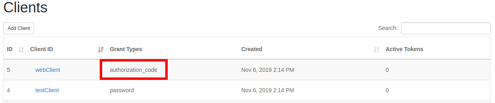
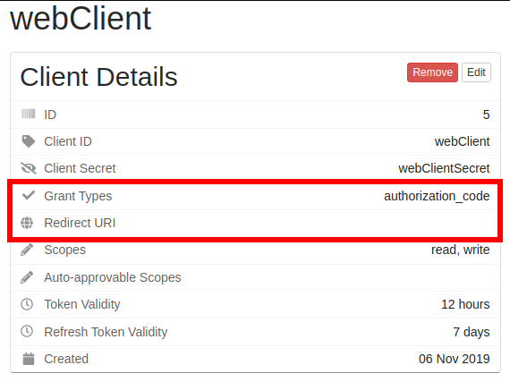
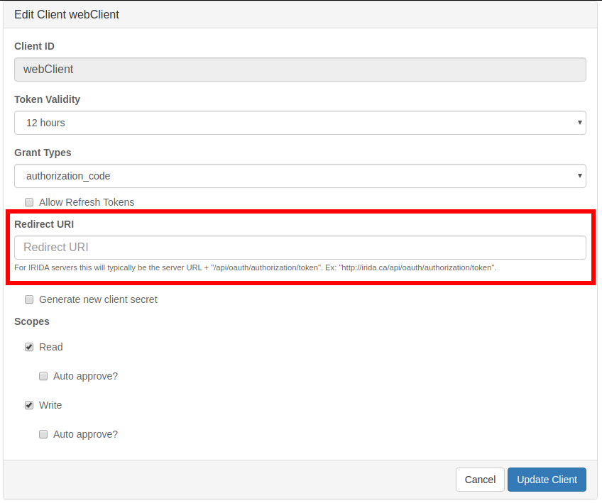

# Upgrade Notes
{:.no_toc}
* This comment becomes a toc.
{:toc}

The majority of IRIDA's upgrade notes can be seen at <https://github.com/phac-nml/irida/blob/master/UPGRADING.md>.  When there are more significant upgrades to the IRIDA system, database, deployment, etc. this page will go further in depth about how to properly back up your system, perform the upgrade, and recover from problems.

# 21.01
## Sample metadata audit record updates

This upgrade contains some changes to how sample-metadata records are stored in IRIDA's database.  The intent of this update is to simplify the relationships between samples and metadata records to help with database performance and future developments.  It will also remove some redundancy in the database structure and remove any "dangling" metadata entries which have been removed from a sample, but not fully deleted from the database.

While investigating how these updates will be applied to IRIDA databases, we noticed some irregularities in the audit records for some existing metadata.  Because of this we're recommending additional backup procedures be taken before completing this upgrade.  

To skip straight to the backup procedure, [click here](#metadata-linking-script) For a full technical description of the issue, keep reading below.

### Database structure
{:.no_toc}

To fully understand this problem, we'll first describe the structure of our metadata system and relevant database tables.  Given the following example of a basic line-list:

|         | Organism   |
|---------|------------|
| sample1 | Salmonella |

The tables involved are the following:


* `sample` - A record of a sample which contains its name, creation date, and some fixed metadata (ex: "sample1").
* `metadata_field` - The header of a line-list column.  This table contains the field's name & datatype (ex: "Organism").
* `metadata_entry` - The value of a cell in the line-list (ex: "Salmonella").
* `sample_metadata_entry` - The relationship between the above 3 tables (ex: for "sample1", the "Organism" is "Salmonella").

In addition to the above, there is a matching `_AUD` (audit) table for each of these tables which captures any changes to the data and the user & time which the change occurred.  This auditing is managed by [Hibernate Envers](https://hibernate.org/orm/envers/).

In general data will be populated into these tables in the following order:

1. `sample` entry is created as sequencing data is uploaded (ex: "sample1"),
2. Someone uploads a set of sample metadata, which will first get a `metadata_field` (ex: "Organism")
  a. Find an existing `metadata_field` for a column header,
  b. Or create a new `metadata_field` for a header,
3. `metadata_entry` is created with the appropriate value (ex: "Salmonella"),
4. `sample_metadata_entry` is created linking the above 3 items together (ex: for "sample1" the "Organism" is "Salmonella").

Note items 2, 3, and 4 will generally be done at the same time.  As soon as the metadata values are committed to the database, Envers should create `_AUD` entries for all of the above records.

### The problem
{:.no_toc}

The issue we noticed is that while Envers seemed to create `_AUD` records for all the above tables when metadata is first added to a sample, subsequent updates of those values *may* not create records for the `sample_metadata_entry_AUD` table, though it properly creates records for the `metadata_entry_AUD` and `sample_AUD` tables.  We found this to be most prevalent when data is synchronized from remote IRIDA installations, but also occurred in some cases where pipelines were re-run and metadata being re-saved to samples.  Most of these records were duplicate entries that were saving the same metadata values back to the sample, but creating new rows in the database.  We are still investigating why this issue was occurring.  Due to the complex nature of the above database tables it appears that Envers was failing to properly audit the relationship between those entities/tables.

Note that we have found **no evidence of missing live data**.  It appears that all metadata records were written to the live database tables as expected.  This issue only appears to effect the `sample_metadata_entry_AUD` table.

### The fix
{:.no_toc}

Solving this issue involved a refactor of the database structure to remove the `sample_metadata_entry` table.  The new database structure is as follows:

* `sample` - A record of a sample which contains its name, creation date, and some fixed metadata (ex: "sample1").
* `metadata_field` - The header of a line-list column.  This table contains the field's name & datatype (ex: "Organism").
* `metadata_entry` - The value of a cell in the line-list and its relationship to the `metadata_field` and `sample` (ex: for "sample1", the "Organism" is "Salmonella").

This results in a cleaner database structure with less redundancy, and allowed us to refactor IRIDA's codebase to ensure Envers can properly capture any changes to a sample's metadata.  In the long-term this should also allow us to more efficiently build extensions to IRIDA's metadata system.

As with most other database updates, we use [Liquibase](https://www.liquibase.org/) to manage this update.  After the 21.01 upgrade is complete, our Liquibase changeset will also remove any "dangling" `metadata_entry` records to improve performance and the integrity of metadata in the IRIDA system.

### What about old data?
{:.no_toc}

Since Envers was writing audit records for the `sample_AUD` and `metadata_entry_AUD` tables, we can re-connect many of the disconnected `metadata_entry_AUD` records with their samples.  In places where there is a clear connection between a `metadata_entry_AUD` record and a `sample_AUD` record, we are automatically re-connecting the entries to the appropriate sample and field using Liquibase.  In other cases where the connection is not as clear, we chose not to update the disconnected records in the database to ensure integrity of the existing audit records.  

#### Metadata linking script
{:.no_toc}

In addition to re-linking old data as described above, we've included a small utility script which can be run before the upgrade to generate a report of all disconnected `sample_metadata_entry_AUD` records and their connections to their parent samples where available.  While we do not expect that this report will be needed in the future, we recommend running this utility and saving the report alongside your backups to ensure the history of these samples is maintained.  **This script must be run before you perform the 21.01 update**.

This script will output a CSV file of the following data:

| `metadata_entry` database id | `metadata_entry` text value | Envers revision number of the entry | User ID of the user that made the change | `sample` database id associated with the metadata | Name of the sample |
|---|---|---|---|---|---|

You can download this script at <https://github.com/phac-nml/irida/tree/development/src/main/resources/scripts/metadata-mappings>.  This script requires the `Text::CSV`, `DBI`, and `DBD::mysql` perl packages to be installed (available in CPAN and various other package managers).  To run this script:

```bash
$ perl metadata-mappings.pl -u [database username] -p [database password] -d [irida database name] -h [database host] > [outputfile.csv]
```
Note if your database is running on `localhost` you may need to specify the host by IP (`127.0.0.1`).

## Plugin version updates

Due to the updates described above regarding IRIDA's metadata storage refactors, the way that IRIDA analysis plugins interact with a sample's metadata will change as well.  If you are the developer of an IRIDA analysis plugin, you will need to perform the updates below and release a new plugin version for your pipeline to be compatible with new versions of IRIDA.  This guide makes some assumptions that your plugin is structured similarly to IRIDA's example plugin <https://github.com/phac-nml/irida-plugin-example>.

There are 2 files that must be updated:

* The plugin's `AnalysisSampleUpdater` implementation.  You will need to change any methods interacting with sample metadata to use the new service methods.
* The `pom.xml` file.  You will need to tell your IRIDA plugin to target the `21.01` version of IRIDA's code in order to take advantage of the new features.  You will also need to increment your plugin version number in this file to tell IRIDA to use your new version.

Examples of how to update these files is shown below.  After these updates are complete you can re-compile your plugin and push a new release to your plugin's GitHub repository.

### Preparing your development environment
{:.no_toc}

Before building your updated plugin, you must pull and install the new version of IRIDA to your local Maven repository.  Follow the instructions at <https://irida.corefacility.ca/documentation/developer/tools/pipelines/#321-install-irida-to-local-maven-repository>.  Ensure you've checked out the `21.01` IRIDA version.  Note if you are preparing your plugin prior to the `21.01` release, you can install IRIDA's `development` branch.  In that case you will use the `21.01-SNAPSHOT` version for IRIDA version references below.

### `AnalysisSampleUpdater` class
{:.no_toc}

See the relevant section in IRIDA's example plugin where the plugin class is updating a sample's metadata <https://github.com/phac-nml/irida-plugin-example/blob/0.1.0/src/main/java/ca/corefacility/bioinformatics/irida/plugins/ExamplePluginUpdater.java#L120-L127>.

The relevant portion of the code is pasted below.  **This is the section of code that must be updated:**
```java
Map<MetadataTemplateField, MetadataEntry> metadataMap = metadataTemplateService.getMetadataMap(metadataEntries);

// merges with existing sample metadata
sample.mergeMetadata(metadataMap);

// does an update of the sample metadata
sampleService.updateFields(sample.getId(), ImmutableMap.of("metadata", sample.getMetadata()));
```

This code will need to be converted to use IRIDA's new service-based metadata methods.  In the case of the example plugin, the following code can be dropped in to replace the above snippet.

```java
//convert the string/entry Map to a Set of MetadataEntry.  This has the same function as the old metadataTemplateService.getMetadataMap
Set<MetadataEntry> metadataSet = metadataTemplateService.convertMetadataStringsToSet(metadataEntries);

// merges with existing sample metadata and does an update of the sample metadata.  This has the function of the old sample.mergeMetadata and sampleService.updateFields
sampleService.mergeSampleMetadata(sample,metadataSet);
```

### `pom.xml` file

Updates to the `pom.xml` file will be required to indicate to IRIDA that this plugin conforms to IRIDA's 1.1.0 plugin spec.  It's recommended to update the following lines:

* The `<version>` tag for your plugin should be incremented <https://github.com/phac-nml/irida-plugin-example/blob/0.1.0/pom.xml#L9>
* The `<plugin.version>` property should be incremented <https://github.com/phac-nml/irida-plugin-example/blob/0.1.0/pom.xml#L16>
* The `<plugin.requires.runtime>` property should be updated to be `1.1.0` <https://github.com/phac-nml/irida-plugin-example/blob/0.1.0/pom.xml#L19>
* The `<irida.version.compiletime>` property should be set to `21.01` <https://github.com/phac-nml/irida-plugin-example/blob/0.1.0/pom.xml#L22>.  Note if you are preparing your plugin prior to the `21.01` release and you have installed IRIDA's development version, you can set this to `21.01-SNAPSHOT`.

IRIDA's newer versions have also moved to using Java 11.  Since you're already editing this file, you can update your Java version to 11 for the plugin as well.  Set the following properties:

```xml
<java.version>11</java.version>
<maven.compiler.release>11</maven.compiler.release>
```
Example at <https://github.com/phac-nml/irida-plugin-example/blob/0.1.0/pom.xml#L28>

# 20.05
## Assemblies data

The 20.05 version of IRIDA includes support for uploading your own assemblies along with storing assembly results from analysis pipelines.  Uploaded assemblies are expected to be of `.fasta` format.  Current support for .`fastq` assembly files includes data storage and REST API support.  REST API support includes uploading assemblies, exporting to Galaxy, and command line export via the NGSArchive Linker.  Currently IRIDA does not support running analyses with assembly data. 

See more about working with assemblies in the IRIDA UI in our [sample management guide](https://irida.corefacility.ca/documentation/user/user/samples/#sequence-files--assemblies).

## FAST5 data

The 20.05 version of IRIDA includes beta support for FAST5 data.  At the moment, IRIDA accepts both single `.fast5` files, and directories of `.fast5.tar.gz` files.  Support is stronger for the individual `.fast5` files and are recommended for use, but this will be reviewed in future IRIDA versions.  Current support for FAST5 files includes data storage and REST API support.   REST API support includes uploading files, exporting to Galaxy, and command line export via the NGSArchive Linker.  Currently IRIDA does not support running analyses with FAST5 data.

Uploads of `.fast5` files will be treated similar to an unpaired sequence file, including FastQC analysis.

Uploads of `.fast5.tar.gz` files are currently for storage only.  FastQC results will not be available.

See more about working with FAST5 data in the IRIDA UI in our [sample management guide](https://irida.corefacility.ca/documentation/user/user/samples/#sequence-files--assemblies).

# 20.01
## Configured redirect token in REST API client details

The 20.01 version of IRIDA includes some significant upgrades to some of the key software libraries used to build the application including [Spring](https://spring.io/) & [Spring Security](https://spring.io/projects/spring-security).  Part of the REST API security changes included enforcing a good practice in setting up a configured redirect URI for OAuth2 `authorization_code` clients.  This means that for any web application that will be connecting to IRIDA via the REST API, IRIDA must know the address of the website that is going to be requesting data.  This is a good security practice to ensure that client credentials are only being used for the appropriate web applications.

### Performing the changes
{:.no_toc}

The downside of this change is that it will require IRIDA system administrators to register a redirect URI for all `authorization_code` clients.  This is a manual change and must be performed through the IRIDA user interface.  In order to update these clients, an admin must go into the clients list under the ⚙ icon, and click `Clients`.  This will list all the system clients for your IRIDA installation.

The clients which must be edited in this list will have `authorization_code` listed in the "Grant Types" column.



After clicking on an authorization code client, you can verify it needs updated by viewing the details panel.  The client should have `authorization_code` listed under "Grant Types", and should have no entry in the "Redirect URI".



To update the redirect URI, click the "Edit" button.  On this edit page you can fill in the appropriate redirect URI for the client.  For IRIDA servers this will typically be the server URL + `/api/oauth/authorization/token`. Ex: `http://irida.ca/irida/api/oauth/authorization/token`.  Note that this is **not the address of your IRIDA server**.  This will be the address of the IRIDA server using this client to synchronize data from your server.

For non-IRIDA applications, you must refer to the application's API documentation for what to use for a redirect URI.  After entering the URI, click the "Update Client" button.



After completing this process, you should see the redirect URI listed in the client details page.  To test that this process was completed successfully, you can follow the instructions on the [Remote API](http://localhost:4000/user/administrator/#adding-a-remote-irida-installation) page to test a remote connection.

Note that if this process is not completed correctly for a Remote API, data will no longer synchronize and will result in an error.

See the section under "authorization code" in our documentation for more details about entering the redirect URI at <https://irida.corefacility.ca/documentation/user/administrator/#grant-types>.

### Updating Galaxy importer clients
{:.no_toc}

Clients for the [Galaxy IRIDA importer](https://github.com/phac-nml/irida-galaxy-importer) must undergo a similar process, but with slightly different values.  The Galaxy importer targets your local IRIDA installation so the redirect URL points at your own IRIDA.  Redirect URLs for Galaxy will be the following:

Your IRIDA server URL + `/galaxy/auth_code`.  Ex: `http://irida.ca/irida/galaxy/auth_code`.

To test this change, try importing some data from Galaxy.  If it works, you've updated everything correctly!

# 19.05
## FastQC translation to filesystem

This upgrade was built to greatly reduce the size of IRIDA's database (and database backups).  Before this upgrade, any time FastQC was run the output files were saved in the database `analysis_fastqc` table as `longblob` objects.  This worked fine when IRIDA had a smaller number of files, but as some installations are growing larger this is increasing the database size at an alarming rate.  The upgrade will move the FastQC images out of the database and store them in the configured `output.file.base.directory` alongside the other analysis output files.

We do not expect issues with this upgrade, but out of an abundance of caution recovery notes are listed below.

### Precautions to take before undertaking this update
{:.no_toc}

* Back up your database.  The FastQC images will be permanently removed from the database during this update so a backup should be performed in case anything goes wrong.
* The update will add a large number of small image files to your `output.file.base.directory`.  For each sequence file in your database, 3 files totaling approximately 50KB will be created.  Ensure your filesystem will be able to handle this increase in files.
* If you want to be extra cautious, you can backup your configured `output.file.base.directory`.

### Performing the upgrade
{:.no_toc}

This upgrade will proceed as a normal database upgrade handled by Liquibase.  You shouldn't need to do anything special, just ensure you've taken your database backups.

### In case of an error
{:.no_toc}

First step in case of an error should always be to stop Tomcat.

This database upgrade works in 2 stages:

1. Copy all the FastQC images into a temporary directory within your `output.file.base.directory`.
2. Move all the images from the temporary directory to their final resting spot inside `output.file.base.directory`.

What to do for recovery if something goes wrong will be different depending on the stage.

#### Stage 1 - Creating temporary files
{:.no_toc}

If a problem occurs during stage 1 you're probably going to see the following error message:

> There was a problem moving the FastQC images from the database to the filesystem.  The directory (**YOUR TEMP DIRECTORY**) contains the temporary FastQC images that should have been moved to the analysis output directory.  In order to re-apply this update, please restore the database from a backup, and then re-start IRIDA.  You do *not* have to cleanup existing FastQC images on the filesystem as they will be re-written.  Once your upgrade has completed successfully, you can safely remove the temp directory.

As the error message states, this means there was a problem while creating the temporary files.  If you look inside (**YOUR TEMP DIRECTORY**) you should see a directory with lots of numbered subdirectories with some `.png` files with the FastQC images inside.  To recover from this point:

1. Restore your database backup
2. Remove the temporary directory created during the upgrade.  It will be included in the error message.
3. Retry the upgrade by starting Tomcat again.

#### Stage 2 - Moving files to output directory
{:.no_toc}

Issues with this step will be much more rare, but If a problem occurs here it's a bit more of a process to clean up.  You'll see the following message:

> There was a problem moving the FastQC images from the temporary file location (**YOUR TEMP DIRECTORY**) to their final output file location.  This is going to involve some manual cleanup.  We recommend first creating a backup of (**YOUR OUTPUT DIRECTORY**).  The previous max file ID was (**PREVIOUS MAX ID**).  Any files in (**YOUR OUTPUT DIRECTORY**) with an ID greater than (**PREVIOUS MAX ID**) were created during this process and can be deleted.  The directory (**YOUR TEMP DIRECTORY**) contains the temporary FastQC images that should have been moved to the analysis output directory.  In order to re-apply this update, please restore the database from a backup, and then re-start IRIDA.  Once your upgrade has completed successfully, you can safely remove the temp directory.

What's happened at this point is an error occurred while moving the temporary files to their output location.  As stated in the message above you'll need to manually delete some files to clean up from here.

1. (optional but recommended) Back up your analysis output files directory `output.file.base.directory`.
2. Restore your database backup.
3. Check the error message.  It will note the pre-upgrade largest output file id "The previous max file ID was (**PREVIOUS MAX ID**)".
4. Remove all directories from your `output.file.base.directory` with an ID **GREATER THAN** the above noted ID.  These files were created as part of the upgrade process.
5. Retry the upgrade by starting Tomcat again.
6. Remove the temporary directory created during the failed upgrade.  It will be included in the error message. "... temporary file location (**YOUR TEMP DIRECTORY**)".

#### Database timeout error

If you have lots of sequence files stored in IRIDA, this upgrade can take a while to write all the FastQC results to the filesystem. This could lead to database connection timeout issues (the default timeout is 8 hours for MySQL/MariaDB). You should see a message in your log like below if this error were to occur:

```
Error: The last packet successfully received from the server was 38,881,098 milliseconds ago.  The last packet sent successfully to the server was 38,885,372 milliseconds ago. is longer than the server configured value of 'wait_timeout'. You should consider either expiring and/or testing connection validity before use in your application, increasing the server configured values for client timeouts, or using the Connector/J connection property 'autoReconnect=true' to avoid this problem. [Failed SQL: ALTER TABLE irida_prod_test.analysis_output_file MODIFY file_path VARCHAR(255) NOT NULL]
```

If you encounter this error, you can increase the database `wait_timeout` value by modifying the database connection string in `/etc/irida/irida.conf` by appending `?sessionVariables=wait_timeout=57600` like below:

```
jdbc.url=jdbc:mysql://localhost:3306/irida_prod_test?sessionVariables=wait_timeout=57600
```

Modify `57600` to some appropriate timeout value (in seconds). Once you've made this modification, you will have to go through the instructions above on recovering from an error before restarting the upgrade. Once the upgrade is complete, you can remove this variable from the connection string and restart IRIDA to reset to the default database timeout value.
