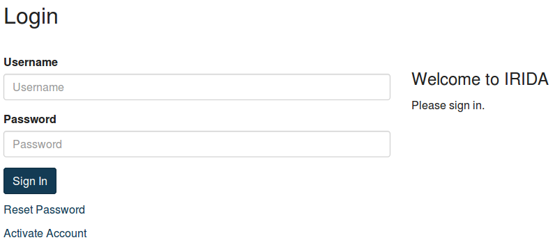

This document describes how to install the IRIDA web interface. We assume that you have completed [installing and configuring Galaxy](../galaxy).

* This comment becomes the table of contents
{:toc}

The IRIDA platform currently consists of three, separate components:

1. The web interfaces: User interface and API,
2. Galaxy, and
3. Command-line clients.

The IRIDA Web interfaces are intended to be deployed in a Servlet container, supporting Servlet 3.0 or higher. You can download IRIDA as a pre-packaged `WAR` file at <https://irida.corefacility.ca/downloads/webapp/irida-latest.war>.

Prerequisites
=============

The following prerequisites are required for running the IRIDA web interfaces:

* [Java](http://www.oracle.com/technetwork/java/index.html) 8 or higher.
* A working servlet container supporting Servlet 3.0 ([Tomcat](https://tomcat.apache.org/), version 7 or higher, for example)
* A working database server (the application is tested on [MySQL](https://www.mysql.com/) or [MariaDB](https://mariadb.org/)).
* A working install of Galaxy (we recommend that you run Galaxy and the IRIDA web interface on separate machines).
The install guide assumes that you are using [Bash](https://www.gnu.org/software/bash/manual/bashref.html)

Prerequisite install instructions
---------------------------------

We provide *some* instructions for installing and setting up your production environment. If you are comfortable installing and configuring a servlet container, or if your production environment has already been configured, you can safely skip this section.

* [CentOS](centos/)
* [Ubuntu](ubuntu/)
* **Windows**: Since the IRIDA Platform web interfaces are written in Java, they can, in theory, be deployed on a Windows host. We do not officially support or test deployment on Windows servers, so no instructions are provided.

Deploying IRIDA
===============
Deploying IRIDA mainly involves deploying the `WAR` file into your Servlet container, but does also require some configuration outside of your Servlet container.

Servlet Container Configuration
-------------------------------
Two environment variables needs to be set in your Servlet container for IRIDA to function correctly: `spring.profiles.active=prod` and `irida.db.profile=prod`.

You can adjust these variables in Tomcat by editing (depending on your distribution) `/etc/tomcat/tomcat.conf` (CentOS) or `/etc/default/tomcat7` (Ubuntu), and finding the `JAVA_OPTS` variable and setting the variables as shown below:

```
JAVA_OPTS="-Dspring.profiles.active=prod -Dirida.db.profile=prod"
```

The `irida.db.profile=prod` option sets a number of recommended database settings for IRIDA such as JDBC, Hibernate, and Liquibase options.  See the [jdbc.prod.properties file](https://github.com/phac-nml/irida/blob/master/src/main/resources/ca/corefacility/bioinformatics/irida/config/jdbc.prod.properties) for what gets set.  All these options can be overridden in your `/etc/irida/irida.conf` file.

The `spring.profiles.active=prod` option will enable all the production features of IRIDA (web server, project synchronization, email announcements, NCBI uploads, analysis engine).

For high usage or high load installations of IRIDA, you may consider deploying these features to multiple servers.  For more on this feature, see the [Multi Web Server Configuration](#multi-web-server-configuration) section.

Core Configuration
------------------
All IRIDA configuration files are stored in `/etc/irida/`. The main IRIDA configuration file should be written to `/etc/irida/irida.conf`. `irida.conf` is a plain, Java `properties` file (so a key-value pair file). You can download the file from [config/irida.conf](config/irida.conf), or you can find an example below:





If this file does not exist, the platform will use internal configuration values. The internal configuration values point at a local instance of the database server. The likelihood of the internal configuration values correspond to your production environment is alarmingly low (or at least, should be).

The main configuration parameters you will need to change are:

1. **Directories to store files managed by IRIDA:**
  * `sequence.file.base.directory=/opt/irida/data/sequence` - Sequence files managed by IRIDA.
  * `reference.file.base.directory=/opt/irida/data/reference` - Reference files assigned to projects in IRIDA.
  * `output.file.base.directory=/opt/irida/data/output` - Results of analysis pipelines.
2. **Threads used for file processing (FastQC, GZip, etc):**
  * `file.processing.core.size=4` - The initial number of threads available for file processing.
  * `file.processing.max.size=8` - The maximum number of available threads for file processing.  This number should not exceed the configured maximum number of JDBC threads.
  * `file.processing.queue.capacity=512` - The maximum number of file processing jobs that can be queued.
  * `file.processing.process=true` - Whether to run the file processors on the current machine.  This can be set to false if you're running multiple IRIDA servers and want to improve UI performance on a machine.
2. **Database connection information:**
  * `jdbc.url=jdbc:mysql://localhost:3306/irida_test`
  * `jdbc.username=test`
  * `jdbc.password=test`
3. **Galaxy connection information for executing pipelines:**
  * `galaxy.execution.url=http://localhost/`
  * `galaxy.execution.apiKey=xxxx`
  * `galaxy.execution.email=user@localhost`
  * `irida.workflow.max-running=4` - The maximum number of running workflows.  For larger installations this number can be increased.
  * `irida.workflow.analysis.threads` - The number of threads to use for handling analysis/workflow tasks. For larger installations this number can be increased. Increasing beyond `irida.workflow.max-running` is unlikely to give any additional performance boost.
4. **NCBI SRA export configuration** - An SRA bulk upload user account must be created with NCBI to allow automated SRA uploads.  See [NCBI SRA Handbook](http://www.ncbi.nlm.nih.gov/books/NBK47529/#_SRA_Quick_Sub_BK_Establishing_a_Center_A_) for details.
  * `ncbi.upload.host` - FTP host to upload ncbi exports
  * `ncbi.upload.user` - FTP Username
  * `ncbi.upload.password` - FTP password
  * `ncbi.upload.baseDirectory` - base directory in which to create SRA submissions
  * `ncbi.upload.namespace` - Prefix for file upload identifiers to NCBI. The namespace is used to guarantee upload IDs are unique.  This configuration option is used as a placeholder and may still be set by the user.
5. **Security configuration**
 * `security.password.expiry` - The number of days a password is valid for in IRIDA.  After a password expires the user will be required to create a new one.  Passwords cannot be reused.

Web Configuration
-----------------
The IRIDA platform also looks for a web application configuration file at `/etc/irida/web.conf`.  Similar to the irida.conf file, this file is a plain Java configuration file.  The properties in this file will be used to configure parameters of the web application component of the IRIDA platform.  You can download the file from [config/web.conf](config/web.conf), or you can find an example below:





If this file does not exist the platform will use internal configuration values which will probably not correspond to your production environment.

To add new internationalization to your IRIDA server, see the [internationalization guide](../../developer/interface/i18n/).

The `mail.server.*` configuration parameters will need to correspond to a configured mail server, such as [Postfix][].  This will be used by IRIDA to send email notifications to users on the creation of an account or on password resets.

Analytics
---------
The IRIDA platform supports web analytics.  Include the analytic snippet inside a file in `/etc/irida/analytics/`.  The snippet will be injected into the page.

E.g. In `/etc/irida/analytics/google-analytics.html`.


<script type="text/javascript">

  var _gaq = _gaq || [];
  _gaq.push(['_setAccount', 'UA-XXXXX-X']);
  _gaq.push(['_trackPageview']);

  (function() {
    var ga = document.createElement('script'); ga.type = 'text/javascript'; ga.async = true;
    ga.src = ('https:' == document.location.protocol ? 'https://ssl' : 'http://www') + '.google-analytics.com/ga.js';
    var s = document.getElementsByTagName('script')[0]; s.parentNode.insertBefore(ga, s);
  })();

</script>


Deploy the `WAR` File
---------------------
Once you have adjusted the configuration files to your environment, you can deploy the `WAR` file to your servlet container.

You can download the `WAR` file from: <https://irida.corefacility.ca/downloads/webapp/irida-latest.war>

Tomcat's deployment directory is typically some variation of `/var/lib/tomcat/webapps/`. Deploying the `WAR` file in Tomcat is as simple as moving the `WAR` file you downloaded into that directory.

On startup, IRIDA will:

1. Automatically prepare the database on your system (using [Liquibase](http://liquibase.org)) using the database connection details you specified in [Core Configuration](#core-configuration).
2. Install any internally configured workflows.
3. Configure the connection to Galaxy.

If IRIDA has successfully been deployed, you should be able to use your web browser to navigate to <http://localhost:8080/irida-latest/> (assuming you're deploying to the local machine, and also assuming that you've left the `WAR` file named `irida-latest.war`).

Logging in for the first time
-----------------------------

The first time IRIDA is run, it will add a default administrator user account to the database. Launch your web browser and navigate to the context where you've deployed IRIDA.

If everything has been configured correctly, you should see the IRIDA log-in page:



The default administrator username and password are:

* **Username**: admin
* **Password**: password1

You will be required to change the password the first time you log-in with these credentials.

Once you've logged in for the first time, you will probably want to create some user accounts. User account creation is outlined in our [Administrative User Guide]({{ site.url }}/user/administrator).

Multi Web Server Configuration
-------------------------------
When IRIDA is deployed in a higher load environment, it may be preferable to deploy multiple IRIDA web application servers to handle all web requests, processing, and scheduled tasks.  IRIDA has the ability to run in a multi-server mode which will distribute these tasks among multiple servers.  This is achieved through the use of Spring profiles.  Deploying IRIDA in this fashion allows IRIDA administrators to maintain good performance for users of the IRIDA web application, while offloading some of the more resource-hungry processing tasks to additional servers.  Multiple profiles may be applied to individual servers to group some of the tasks onto one machine.  

Note: The `prod`, `dev` profiles and multi server configuration profiles below **cannot be used at the same time**.  Doing so may result in corrupt analysis data sets.

The different application profiles and their functions are the following:

* `web` - The IRIDA user interface and REST API web application servers.  This is the portal for user interactions.  If using more than 1 `web` server, users & REST API clients must somehow be routed to the other servers.  Minimum number of servers: 1, Recommended: 1, max: unlimited.
* `email` - Run the email subscription service.  This will send email digests out to users on a scheduled basis.   Required to be active on exactly 1 server.
* `analysis` - Run the IRIDA analysis engine.  This profile launches and monitors progress of all analysis pipelines in IRIDA.  Required to be active on exactly 1 server.
* `processing` - File processing pipeline for uploaded sequencing data.  This is the highest load profile as it performs all file management for uploaded sequencing data.  Adding additional servers for this profile will speed up file processing for higher load installations.  Minimum number of servers: 1, recommended: 2, max: unlimited but diminishing returns with higher numbers of servers.
* `sync` - Synchronizing remote projects.  This profile performs the remote api project synchronization task to pull remote sequencing data and metadata to a local installation.  Required to be active on exactly 1 server.
* `ncbi` - Uploading data to NCBI.  This profile runs the NCBI SRA uploader task to send project and sample data to NCBI's SRA.  Required to be active on exactly 1 server.

To launch an IRIDA application server with one (or more) of these profiles, you must enable the profile with the `spring.profiles.active` variable in your Tomcat configuration.  For example to run an IRIDA server with the `web` and `analysis` profiles active, you would set the following configuration:

```
spring.profiles.active=web,analysis
```

See the [Servlet Container Configuration](#servlet-container-configuration) section for more on setting the `spring.profiles.active` and `irida.db.profile` variables for Tomcat.

#### Example moderate load deployment:

* Server 1 - `web`, `email`, `sync`, `ncbi`, `analysis`
* Server 2 - `processing`

A deployment of this style provides an additional server for file processing, while maintaining high performance for users of the web server.

#### Example high load deployment:

* Server 1 - `web`, `email`
* Server 2 - `processing`
* Server 3 - `processing`
* Server 4 - `sync`, `ncbi`, `analysis`

A deployment of this style provides multiple servers for file processing, while maintaining high performance for users of the web server.  It also offloads any networking lag introduced by synchronization jobs, uploading to NCBI, or analysis jobs.

Deployment Tips
---------------
Since IRIDA often deals with large sequence files, you can occasionally run into issues with file upload sizes being too large for the server IRIDA is running on.  There are 2 directories where Tomcat stores temporary files as they're being uploaded which can be configured to run on some larger shared storage.

First is Tomcat's "temp" directory.  You can configure Tomcat to use another directory by setting the `CATALINA_TMPDIR` variable in `tomcat.conf` (on Centos this can be found in `/etc/tomcat`):

```
CATALINA_TMPDIR=/Some/Larger/Shared/Storage/temp
```

The second is Tomcat's "work" directory.  This can be configured in `server.xml` (on Centos this can be found in `/etc/tomcat`).  You can set the `workDir` variable in the `<Host>` section.  Be careful not to modify any other variables:

```xml
<Host ... workDir="/Some/Larger/Shared/Storage/work">
...
</Host>
```

[Postfix]: http://www.postfix.org/
