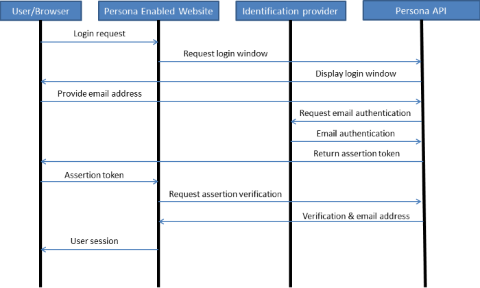

Mozilla Persona
===============
{:.no_toc}

Background
----------
Persona is a decentralized login platform used to identify users by their email addresses easily across websites.  This allows users to log in to any Persona enabled website without having to remember individual usernames and passwords for the sites.  It also makes it easy for a website to create a login system without having to worry about managing authentication, passwords, and password security.

* this comment becomes the toc
{:toc}

Login Process
----------

#### User process
On a website with Persona login, the login flow for a user is as follows:

1. The user goes to their favourite Persona enabled website.
2. A user clicks login (usually branded with some Mozilla Persona theming).
3. A login window pops up where the user enters their email address (and not a password).
4. The user proves they own that email address in some way.  For many addresses (such as @gmail.com or @hotmail.com) this is done by ensuring the user is logged in to their email.  For others, they may be prompted to create a password for Persona login.
5. The user is notified that they have logged in, the login window closes, and they begin using the website.

#### Web application process
First the web applicaition has to include a javascript library on their website and call a couple javascript functions from that library to watch for login requests.  When the user clicks login:

1. The javascript watching for the login call pops up a persona login window.
2. Once the user authenticates their email address, a token string called an **assertion** is passed back to the calling javascript function in the web application.
3. In a javascript callback, the web application front end should pass the assertion to the web application back-end.
4. The web application back-end sends the assertion string to the Persona API to verify that it is a valid login request.
5. The Persona API returns json data verifying (or denying) the login, the email address that was used, and the service used to issue the assertion and verify the email address.
6. The web application creates a session based on that email address.

Persona also implements aspects of public/private key cryptography to enhance the security of their service.  When a user first attempts to log in using Persona, a signed certificate is created by their identity provider (usually their email provider) to assist in verifying a user's login credentials.



#### Persona API Requests and Returns

Once the web application server-side receives the assertion, it sends the assertion to the Persona API in the following format:

    assertion=[token]&audience=http://irida.ca

In a usual login the *audience* parameter will be the domain of the application the user is trying to log in to.  When the assertion is generated it encodes the domain name the user is trying to login to.  When the server passes the audience to the API it is verifying the assertion was made for its hosted website.

The return data from the Persona API is in the following format:

```json
{"audience":"http://irida.ca", "expires":1385483533706, "issuer":"gmail.login.persona.org", "email":"someone@gmail.com", "status":"okay"}
```

The return parameters are:

* *audience* - The website domain that this assertion is valid for. 
* *expires* - The time the assertion expires in milliseconds passed the epoch.
* *issuer* - The service used to verify the user's email address and generate the assertion.
* *email* - The email address of the user wanting to login.
* *status* - Whether the login should succeed.  Will return "okay" or "failure"
* (on failure) *reason* - If the login should fail, this will say the reason the assertion was not valid.

Advanced Usage
--------------
When logging in to Persona, you provide the site with a *username* similar to an email address.  Indeed, in most cases it will be an email address.  If you provide a common email address domain like tom@gmail.com, Persona checks with gmail.com to ensure that you are actually "tom" and you have already logged in to your email.  The login credentials a user provides doesn't have to be an email address, it just needs to be formatted as such.  For an email address like tom@gmail.com, the persona service asks gmail.com if the current user "tom" has the ability to prove they own that address.  Similarly, a username of tom@irida.ca will ask irida.ca if the user can login as "tom" to irida.ca.  To enable this functionality a domain can become an identity provider.

#### Becoming an Identity Provider
For a website to become an identity provider, they need to provide the following:

* A json document at http://domain.ca/.well-known/browserid containing
    * A public key to sign users credentials.
    * The URL where a user can login to the domain (called the authentication page).
    * The URL where Persona can verify a user's details (called the provisioning page).
* The provisioning page referenced above.  This page checks to see if the user has an active session on the domain.  If so it responds to Persona saying the email is valid for the user.  If not, it is passed to the authentication page so that the user can login and verify their email address.  This page must import a Persona javascript library and call a collection of functions from that library.
* The authentication page referenced above.  This page can provide the user with a username/password style login to verify that they own the requested email address.  Once their login is completed, the page responds to Persona that the user owns the requested email address.  This page must import a Persona javascript library and call a collection of functions from that library.  Note: there is a movement to have this technology built in to modern browsers, so it may soon be the case that external libraries are not required.

Drawbacks
--------
An assertion expires in less than 5 minutes (typically around 2).  The assertion that is created is essentially an encrypted username and password for the website packaged into a base64 encoded glob.  The reason it needs to expire quickly is because if someone intercepted an assertion they could theoretically log in to the service you're requesting using these credentials.  This is not to say that when a user logs in via persona their session only lasts 5 minutes; after a user authenticates via Persona the web service can create a user session no differently from a non-Persona web service.

It also assumes that the website must trust the Mozilla Persona verification API as all assertion generation and verification requests must run through this service.  If the Verification API were compromised or shut down, the login system would no longer function.  Mozilla provides a link to a GitHub page where you can set up your own verification API, but when tested the package would not successfully build.

Possible Use for IRIDA
----------------------
Persona has been identified as a possible library/service to be used with the IRIDA software project.  The intended usage would enable the platform the ability to provide decentralized user authentication for federated queries.  Each instance of IRIDA would become an identity provider (or theoretically delegate another service as its identity provider).  Instead of users logging in to an IRIDA service with their email address, they would then login with an IRIDA identity from their home site.  For federated requests, when logging in to a remote site they would be presented with a Persona login window, the user would provide their username@home name which would authenticate them remotely at their home site, then they could login to the federated site.  The IRIDA site would then implement OAuth2 to allow remote requests for data.

#### Benefits
Benefits of this system would be that IRIDA would not need to provide a centralized login system to keep track of all users in the IRIDA network.  Remote sites would only need to know about users who have the ability to log in to their site using their Persona login.  

#### Drawbacks
Drawbacks would be that each site has the extra burden of implementing a Persona login system and also a native login system for the Persona identity provider implementation.  This possibly appears as if it defeats the ease-of-use purpose for developing a system for Persona.  It also assumes that each site must trust each of the sites from which it accepts federated users.  While the local site uses a Persona assertion to verify the user, it is a remote site validating the email address.  Theoretically
 a remote administrator may be able to override their authentication procedure and imitate a remote user to access all of their data across the IRIDA network.

#### Alternatives
A possible alternative to using Mozilla Persona is to use separate native logins for each IRIDA site.  A user's account across the IRIDA network would not be synchronized, and if they wanted to access multiple sites they must have unique user accounts at both sites.  OAuth2 would still be used to facilitate remote requests for data, but the user would have to login locally to each site to authorize the local site (via OAuth2) to request resources on their behalf.  This retains the benefit of not requiring the user accounts to be synchronized across the IRIDA network.  It adds the benefit of not relying on Persona to authenticate users.  A drawback is that the user must have individual accounts for each IRIDA instance they use, without necessarily having any link between them.


References
----------

* General Persona information: <http://www.mozilla.org/en-US/persona/>
* Persona developer site: <https://developer.mozilla.org/en-US/Persona>
* Becoming an identity provider: <https://developer.mozilla.org/en-US/Persona/Identity_Provider_Overview>
