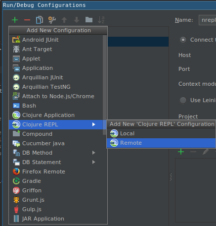
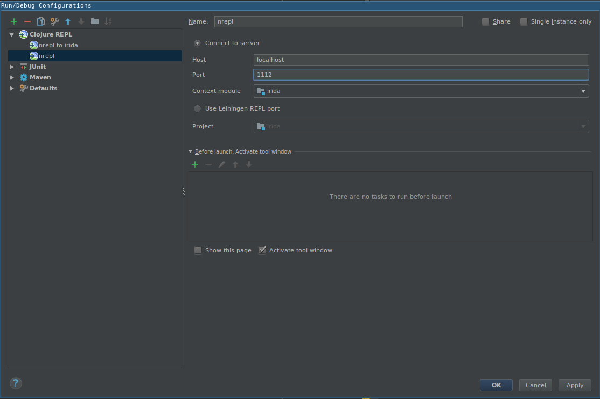
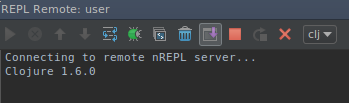
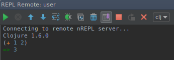

Using a Clojure nREPL to interact with a live instance of IRIDA
===============================================================
{:.no_toc}

<i class="fa fa-warning" style="color:Tomato"/> **The nREPL is to be used in development only! Use in production at your peril!** <i class="fa fa-"/>

Have you ever wanted to interact with live running instance of IRIDA to see what data an object contains or what a function does or to run some one-off arbitrary code? Well, you can use a Clojure nREPL to do these things and more! 

With the `jvm-breakglass` library (https://github.com/matlux/jvm-breakglass/), it is possible to use a Clojure REPL to interact with a live running Java Spring application like IRIDA.

 
With a `jvm-breakglass` Clojure nREPL, you can 

- access all your application Spring Beans in an interactive environment to do with as you please
    - e.g. `(get-bean "userRepository")` to get the `userRepository` Bean 
- you can explore the API of a library to see what kind of data you are able to retrieve from it 
    - e.g. using a blend4j `GalaxyInstance` object to see what kind of data you can retrieve from Galaxy 


Contents
--------
{:.no_toc}

* TOC
{:toc}

What is a REPL?
---------------

Read-Eval-Print-Loop (REPL) is an interactive environment that accepts user input, evaluates it and returns the result. If you've ever used the Javascript console in your web browser, the R language console, or IPython in a Jupyter Notebook, you've basically used a REPL.   


Requirements
------------

- Install `leiningen` (https://github.com/technomancy/leiningen)
- In your `/etc/irida/irida.conf` file, ensure that the `irida.debug.nrepl.server.port` property is set to a valid port number such as `1112`:

```
# Clojure nREPL server port
irida.debug.nrepl.server.port=1112
```


## Clojure nREPL in IntelliJ IDEA with the Cursive plugin 

Although it is possible to use `leiningen` from the command-line to connect to the nREPL server (`lein repl :connect localhost:1112`), it is recommended to use IntelliJ with the [Cursive Clojure plugin](https://cursive-ide.com/userguide/) for IntelliJ's general IDE awesomeness, auto-completion, showing method/class docs inline, paredit, etc. 

### Setup

- Install Cursive plugin for IntelliJ (https://cursive-ide.com/userguide/)
- Add `Run` config for Clojure nREPL (`Run`->`Edit Configurations...`) (save as "nrepl")
    - Add new config for Clojure remote repl for host `localhost` and port `1112` (or whatever port you set in `/etc/irida/irida.conf`)




- Start IRIDA with `-Dspring.profiles.active=dev`. You should see something like the following in the IRIDA log if the nREPL server is successfully started:


```
Dec 12, 2017 4:35:54 PM net.matlux.NreplServer <init>
INFO: Creating ReplStartup for Port=1112
Dec 12, 2017 4:35:54 PM net.matlux.NreplServer start
INFO: Repl started successfully on Port = 1112
Dec 12, 2017 4:35:54 PM net.matlux.MBeanRegistration registerNreplServerAsMBean
INFO: MBean Registration of JVM-breakglass successful
```

- Connect to the nREPL server with Clojure nREPL run config (Run "nrepl"). You should see the following:



### Using the Clojure REPL

One way of using the Clojure REPL is to input expressions like `(+ 1 2)`, pressing Enter and viewing the output:



In order to inspect and interact your running instance of IRIDA, you need to execute the following code in the REPL to load up Java and Spring introspector functions:

```clojure 
(do
  (use 'cl-java-introspector.spring)
  (use 'cl-java-introspector.core)
  (use 'me.raynes.fs))
```

Now you can get the names of all the IRIDA Spring Beans: 

```clojure
(->> (get-beans) sort)
```

Output:

```clojure
=>
("QCEntryRepository"
 "analysisCollectionServiceGalaxy"
 "analysisExecutionService"
... truncated
 "workflowsClient")
 ```

Let's say you're interested in the `galaxyInstance` Spring Bean and wish to use it. You can save it to a variable `gi`

```clojure
(def gi (get-bean "galaxyInstance"))
```

Let's see what `gi` is:

```clojure
(identity gi)
=> #<GalaxyInstanceImpl com.github.jmchilton.blend4j.galaxy.GalaxyInstanceImpl@4f2cd1c0>
```


- Print method info for all methods of `galaxyInstance`

```clojure
(methods-info gi)
```

Output:

```clojure
|                                                  :name |                                       :declaring-class |                                         :parameter-types | :exception-types |     :flags |
|--------------------------------------------------------+--------------------------------------------------------+----------------------------------------------------------+------------------+------------|
| com.github.jmchilton.blend4j.galaxy.GalaxyInstanceImpl | com.github.jmchilton.blend4j.galaxy.GalaxyInstanceImpl | [com.github.jmchilton.blend4j.galaxy.WebResourceFactory] |               [] |        #{} |
|                                              getApiKey | com.github.jmchilton.blend4j.galaxy.GalaxyInstanceImpl |                                                       [] |               [] | #{:public} |
|                                 getConfigurationClient | com.github.jmchilton.blend4j.galaxy.GalaxyInstanceImpl |                                                       [] |               [] | #{:public} |
|                                           getGalaxyUrl | com.github.jmchilton.blend4j.galaxy.GalaxyInstanceImpl |                                                       [] |               [] | #{:public} |
|                                     getHistoriesClient | com.github.jmchilton.blend4j.galaxy.GalaxyInstanceImpl |                                                       [] |               [] | #{:public} |
|                                          getJobsClient | com.github.jmchilton.blend4j.galaxy.GalaxyInstanceImpl |                                                       [] |               [] | #{:public} |
|                                     getLibrariesClient | com.github.jmchilton.blend4j.galaxy.GalaxyInstanceImpl |                                                       [] |               [] | #{:public} |
|                                  getRepositoriesClient | com.github.jmchilton.blend4j.galaxy.GalaxyInstanceImpl |                                                       [] |               [] | #{:public} |
|                                         getRolesClient | com.github.jmchilton.blend4j.galaxy.GalaxyInstanceImpl |                                                       [] |               [] | #{:public} |
|                                        getSearchClient | com.github.jmchilton.blend4j.galaxy.GalaxyInstanceImpl |                                                       [] |               [] | #{:public} |
|                                      getToolDataClient | com.github.jmchilton.blend4j.galaxy.GalaxyInstanceImpl |                                                       [] |               [] | #{:public} |
|                                         getToolsClient | com.github.jmchilton.blend4j.galaxy.GalaxyInstanceImpl |                                                       [] |               [] | #{:public} |
|                                         getUsersClient | com.github.jmchilton.blend4j.galaxy.GalaxyInstanceImpl |                                                       [] |               [] | #{:public} |
|                                         getWebResource | com.github.jmchilton.blend4j.galaxy.GalaxyInstanceImpl |                                                       [] |               [] | #{:public} |
|                                     getWorkflowsClient | com.github.jmchilton.blend4j.galaxy.GalaxyInstanceImpl |                                                       [] |               [] | #{:public} |
=> nil
```

Let's see what we can do with `galaxyInstance`:

```clojure
(.getGalaxyUrl gi)
;=> "http://localhost:48888"

(.getJobsClient gi)
;=> #<JobsClientImpl com.github.jmchilton.blend4j.galaxy.JobsClientImpl@35396aae>

(def jobs-client (.getJobsClient gi))
;=> #'user/jobs-client

(.getJobs jobs-client)
;=>
;[#<Job com.github.jmchilton.blend4j.galaxy.beans.Job@e538da41>
; ...
; #<Job com.github.jmchilton.blend4j.galaxy.beans.Job@820aacb0>]

; Get the fields for the first job returned by the JobClient object
(get-fields (first (.getJobs jobs-client)))
;=>
; ([:state "error"]
;  [:toolId "toolshed.g2.bx.psu.edu/repos/nml/sistr_cmd/sistr_cmd/1.0.2"]
;  [:created #inst"2017-11-08T15:33:23.212-00:00"]
;  [:updated #inst"2017-11-08T15:37:14.171-00:00"])
```


You can get IntelliJ auto-completion for `GalaxyInstance` objects by importing it into the environment:

```clojure
(import '(com.github.jmchilton.blend4j.galaxy GalaxyInstance))
``` 

If you type in the name of the Java class and press Enter, Cursive should automatically import the class into your namespace/environment.


#### Enabling Admin User Security Context So You Can Do Anything (in IRIDA)!

Copy-paste the following Clojure code into your REPL so that you can have admin privileges to access, create and persist any objects you want: 


```clojure
(do
  (use 'cl-java-introspector.spring
       'cl-java-introspector.core
       'clojure.reflect 'clojure.pprint 'clojure.java.javadoc
       'me.raynes.fs)
  (import '(org.springframework.security.core.authority AuthorityUtils)
          '(org.springframework.security.core.context SecurityContextHolder)
          '(org.springframework.security.authentication UsernamePasswordAuthenticationToken))
  (defn cfg-auth
      "Configure security context and set up authentication to allow access to objects from Spring Service and Repository Beans"
      [& {:keys [role principal]
          :or   {role      "ROLE_ADMIN"
                 principal "user"}}]
      (let [roles-array (into-array String [role])
            authorities (AuthorityUtils/createAuthorityList roles-array)
            auth (new UsernamePasswordAuthenticationToken principal role authorities)
            ctx (SecurityContextHolder/getContext)]
        (.setAuthentication ctx auth)))
  (def user-svc (get-bean "userServiceImpl"))
  (cfg-auth)
  (def admin-user (.loadUserByUsername user-svc "admin"))
  (defn as-admin
    "Setup principal user as the `admin-user` so that new objects can be persisted to the database"
    [] (cfg-auth :principal admin-user)))
```

Execute `(as-admin)` before any code where you try to save to the database such as:

```clojure
(let [user (new User "peter" "peter@k.com" "Password1!" "Peter" "Kruczkiewicz" "12345")]
  (pprint user)
  (pprint (get-fields user))
  ; calling as-admin to ensure we have admin user security context enabled!
  (as-admin) 
  ; saving user object to database using "userServiceImpl" Spring Bean
  (.create user-svc user)
  ; retrieving User object with username "peter" from database and printing
  (as-admin)
  (prn (.loadUserByUsername user-svc "peter")))
```


### REPL tutorial 

This tutorial should show you how to get use the Spring Beans to fetch or save objects to the database and how to interact with Galaxy through the blend4j library and GalaxyInstance Bean in IRIDA. 

It's recommended that you copy-paste the following Clojure code into a file and submit the expressions (or forms) one at a time in succession to the Clojure REPL.

This is how it should look in IntelliJ if you were to submit the first few forms to the REPL:


#### REPL tutorial Clojure code

```clojure
;==========
; Setup
;==========
; In IntelliJ with the Cursive plugin, you can send the top-most form/expression to the REPL with Ctrl+Shift+p on Linux.
; The keymaps bindings may be different on different OSes.
; You need to execute (ctrl+shift+p) the following (ns nrepl-example ...) form to load this namespace into the REPL
; environment.
(ns nrepl-example
  (:import (ca.corefacility.bioinformatics.irida.service.analysis.workspace AnalysisWorkspaceService)
           (ca.corefacility.bioinformatics.irida.service.workflow IridaWorkflowsService)
           (ca.corefacility.bioinformatics.irida.service.impl AnalysisExecutionScheduledTaskImpl ProjectServiceImpl)
           (ca.corefacility.bioinformatics.irida.service.analysis.execution AnalysisExecutionService)
           (ca.corefacility.bioinformatics.irida.model.workflow IridaWorkflow)
           (ca.corefacility.bioinformatics.irida.model.enums AnalysisState AnalysisType)
           (ca.corefacility.bioinformatics.irida.model.sequenceFile SequenceFilePair SequenceFile)
           (ca.corefacility.bioinformatics.irida.model.workflow.analysis ToolExecution Analysis)
           (ca.corefacility.bioinformatics.irida.repositories.analysis.submission AnalysisSubmissionRepository JobErrorRepository)
           (ca.corefacility.bioinformatics.irida.service SequencingObjectService CleanupAnalysisSubmissionCondition AnalysisExecutionScheduledTask)
           (ca.corefacility.bioinformatics.irida.model.workflow.submission AnalysisSubmission)
           (ca.corefacility.bioinformatics.irida.service.impl.user UserServiceImpl)
           (ca.corefacility.bioinformatics.irida.service.user UserService)
           (ca.corefacility.bioinformatics.irida.service.impl.analysis.submission AnalysisSubmissionServiceImpl)
           (ca.corefacility.bioinformatics.irida.repositories.user UserRepository)
           (ca.corefacility.bioinformatics.irida.model.user User)
           (com.github.jmchilton.blend4j.galaxy GalaxyInstance HistoriesClient WorkflowsClient WorkflowsClientImpl JobsClient JobsClientImpl ToolsClient)
           (com.github.jmchilton.blend4j.galaxy.beans HistoryContentsProvenance)
           (org.springframework.security.core.authority AuthorityUtils)
           (org.springframework.security.core.context SecurityContextHolder)
           (org.springframework.security.authentication UsernamePasswordAuthenticationToken)))

; execute the following form to initialize the Java and Spring inspectors and convenience functions for jvm-breakglass
(do
  (use 'cl-java-introspector.spring)
  (use 'cl-java-introspector.core)
  (use 'clojure.reflect 'clojure.pprint 'clojure.java.javadoc)
  (use 'me.raynes.fs))


(defn filter-by
  "Filter by some string/regex pattern"
  [pattern coll]
  (let [re-p (re-pattern (str ".*" pattern ".*"))]
    (filter #(re-matches re-p %) coll)))


(defn sorted-beans
  "Convenience function for returning sorted bean names matching a regex
   pattern if provided."
  ([]
   (->> (get-beans) sort))
  ([pattern]
   (->> (get-beans)
        sort
        (filter-by pattern))))

(sorted-beans "user")
;=>
;("userAuthenticationManager"
;  "userGroupJoinRepository"
;  "userGroupProjectJoinRepository"
;  "userGroupRepository"
;  "userGroupServiceImpl"
;  "userRepository"
;  "userRepositoryImpl"
;  "userServiceImpl")

(def user-svc (get-bean "userServiceImpl"))

; You can print the names of the methods for a Java object with the `get-method-names` function
; Here we will filter for method names with "load" in their name
(filter-by "load" (sort (get-method-names user-svc)))
;=> (... "loadUserByEmail" "loadUserByUsername" ...)

; If you try to execute the loadUserByUsername method then you'll get an AuthenticationCredentialsNotFoundException
(.loadUserByUsername user-svc "admin")
;CompilerException org.springframework.security.authentication.AuthenticationCredentialsNotFoundException: An Authentication object was not found in the SecurityContext, ...

; To get around this exception, you will need to set your authentication at the appropriate role
; You can use the following functions to configure and set authentication
(defn cfg-auth
    "Configure security context and set up authentication to allow access to objects from Spring Service and Repository Beans"
    [& {:keys [role principal]
        :or   {role      "ROLE_ADMIN"
               principal "user"}}]
    (let [roles-array (into-array String [role])
          authorities (AuthorityUtils/createAuthorityList roles-array)
          auth (new UsernamePasswordAuthenticationToken principal role authorities)
          ctx (SecurityContextHolder/getContext)]
      (.setAuthentication ctx auth)))
; If you execute `as-admin` before the `loadUserByUsername` method then you will be able to access the requested user
(cfg-auth)
(.loadUserByUsername user-svc "admin")
;=>
;#<User org.springframework.security.core.userdetails.User@586034f: Username: admin; Password: [PROTECTED]; Enabled: true; AccountNonExpired: true; credentialsNonExpired: true; AccountNonLocked: true; Granted Authorities: ROLE_ADMIN>

; Let's save the admin user to a variable `admin-user`
(cfg-auth)
(def admin-user (.loadUserByUsername user-svc "admin"))
(defn as-admin
  "Setup principal user as the `admin-user` so that new objects can be persisted to the database"
  [] (cfg-auth :principal admin-user))

(get-method-names admin-user)
;=>
;("sortAuthorities"
;  "isEnabled"
;  "getUsername"
;  "getPassword"
;  "eraseCredentials"
;  "getAuthorities"
;  "isAccountNonExpired"
;  "isAccountNonLocked"
;  "isCredentialsNonExpired"
;  "equals"
;  "toString"
;  "hashCode")
(.isAccountNonExpired admin-user)
;=> true
(.getAuthorities admin-user)
;=> #{#<Role ROLE_ADMIN>}

; get private fields into a Clojure map
(get-fields admin-user)
;=>
;([:password "$2a$10$Kg.HY/cxbViehsPvksaD8OPt27eatbCR4K.WPWEMnMZhssbHmdEMO"]
;  [:username "admin"]
;  [:authorities #{#<Role ROLE_ADMIN>}]
;  [:accountNonExpired true]
;  [:accountNonLocked true]
;  [:credentialsNonExpired true]
;  [:enabled true])


; Let's create and save a new User to the database
(let [user (new User "peter" "peter@k.com" "Password1!" "Peter" "Kruczkiewicz" "12345")]
  (pprint user)
  (pprint (get-fields user))
  (as-admin)
  (.create user-svc user))


(def user-repo (get-bean "userRepository"))
; Let's fetch the user we just created and saved to the database using the `userRepository` bean
(do
  (as-admin)
  (let [user-peter (.loadUserByUsername user-repo "peter")]
    (prn "Type: " (type user-peter))
    (prn "User ID " (.getId user-peter))
    ; The following command will throw a LazyInitializationException but still print some useful info
    (pprint (get-fields user-peter))))
; OUTPUT:
;"Type: " ca.corefacility.bioinformatics.irida.model.user.User
;"User ID " 19
;CompilerException org.hibernate.LazyInitializationException: failed to lazily initialize a collection of role: ca.corefacility.bioinformatics.irida.model.user.User.projects, could not initialize proxy - no Session, compiling:(/home/CSCScience.ca/pkruczkiewicz/repos/irida/src/main/clj/nrepl_example.clj:1:23)
;([:id 19]
;  [:username "peter"]
;  [:email "peter@k.com"]
;  [:password
;   "$2a$10$Qm0X77srn2wGZRgSJDoblO4JSFk55Fnujuekcq.d9xmaQ49Wuo7hi"]
;  [:firstName "Peter"]
;  [:lastName "Kruczkiewicz"]
;  [:phoneNumber "12345"]
;  [:enabled true]
;  [:systemRole #<Role ROLE_USER>]
;  [:createdDate #inst "2018-01-17T20:06:06.000000000-00:00"]
;  [:modifiedDate #inst "2018-01-17T20:06:06.000000000-00:00"]
;  [:lastLogin nil]


; Let's fetch the same user with the `userServiceImpl` bean
(do
  (as-admin)
  (let [user-peter (.loadUserByUsername user-svc "peter")]
    (prn "Type: " (type user-peter) user-peter)
    (get-fields user-peter)))
; OUTPUT:
;"Type: " org.springframework.security.core.userdetails.User #<User org.springframework.security.core.userdetails.User@659f20c: Username: peter; Password: [PROTECTED]; Enabled: true; AccountNonExpired: true; credentialsNonExpired: true; AccountNonLocked: true; Granted Authorities: ROLE_USER>
;=>
;([:password "$2a$10$Qm0X77srn2wGZRgSJDoblO4JSFk55Fnujuekcq.d9xmaQ49Wuo7hi"]
;  [:username "peter"]
;  [:authorities #{#<Role ROLE_USER>}]
;  [:accountNonExpired true]
;  [:accountNonLocked true]
;  [:credentialsNonExpired true]
;  [:enabled true])


; Let's try to get retrieve an AnalysisSubmission
(def asub-svc (get-bean "analysisSubmissionServiceImpl"))
(def admin-user (.loadUserByUsername user-repo "admin"))
(as-admin)
(def asubs (.getAnalysisSubmissionsForUser asub-svc admin-user))

(count asubs)
;=> 1
; Let's save the first AnalysisSubmission to the asub variable
(def asub (first asubs))

; This is what asub looks like
(identity asub)
;=>
;#<AnalysisSubmission AnalysisSubmission [id=6, name=AssemblyAnnotation_20171221_fail, submitter=admin, workflowId=87186c71-5c8a-4027-a9d9-b29850cebdb3, analysisState=ERROR, analysisCleanedState=NOT_CLEANED]>
; Getters work as expected
(.getId asub)
;=> 6
(.getLabel asub)
;=> "AssemblyAnnotation_20171221_fail"
(.getAnalysisState asub)
;=> #<AnalysisState ERROR>
(pprint (get-fields asub))
;([:id 6]
;  [:name "AssemblyAnnotation_20171221_fail"]
;  [:submitter
;   #<User User{username=admin, email=admin@example.org, firstName=Administrator, lastName=Administrator, phoneNumber=867-5309}>]
;  [:workflowId #uuid "87186c71-5c8a-4027-a9d9-b29850cebdb3"]
;  [:remoteAnalysisId "df7a1f0c02a5b08e"]
;  [:remoteInputDataId "a799d38679e985db"]

; Since this analysis is in an error state, let's try to retrieve the job error info for it
; Let's get jobErrorRepository bean
(def job-error-repo (get-bean "jobErrorRepository"))
; Find all the JobErrors for the AnalysisSubmission
(def job-errors (.findAllByAnalysisSubmission job-error-repo asub))
; Let's check how many JobErrors there are
(count job-errors)
;=> 2

; Let's get the fields for the first JobError
(get-fields (first job-errors))
;=>
;([:id 1]
;  [:toolId "toolshed.g2.bx.psu.edu/repos/nml/spades/spades/1.4"]
;  [:toolName "spades"]
;  [:toolVersion "1.4"]
;  [:toolDescription "SPAdes genome assembler for regular and single-cell projects"]
;  [:commandLine
;   "perl /shed_tools/toolshed.g2.bx.psu.edu/repos/nml/spades/35cb17bd8bf9/spades/spades.pl ..."]
;  [:parameters
;   "{iontorrent=\"false\", __workflow_invocation_uuid__=\"9ebb9a22e69b11e794c10242ac110002\", ...]
;  [:standardError "Failed with code 256..."]
;  [:standardOutput
;   "Command line: /export/tool_deps/spades/3.9.0/nml/package_spades_3_9_0/d8c8c3dc8f9a/bin/spades.py...
;    Please provide us with params.txt and spades.log files from the output directory.
;    "]
;  [:provenanceUUID #uuid"d9b0c822-5b27-499a-b693-75577a96a2fd"]
;  [:provenanceId "1343954bc98f8001"]
;  [:jobId "72ad249754f05d26"]
;  [:historyId "df7a1f0c02a5b08e"]
;  [:createdDate #inst"2017-12-21T22:13:17.000000000-00:00"]
;  [:updatedDate #inst"2017-12-21T22:22:24.000000000-00:00"]
;  [:exitCode 25]
;  [:analysisSubmission
;   #<AnalysisSubmission AnalysisSubmission [id=6, name=AssemblyAnnotation_20171221_fail, submitter=admin, workflowId=87186c71-5c8a-4027-a9d9-b29850cebdb3, analysisState=ERROR, analysisCleanedState=NOT_CLEANED]>])

; If we wanted to get the ToolName, ToolVersion and ExitCode for each JobError
(map (fn [x]
       [(.getToolName x)
        (.getToolVersion x)
        (.getExitCode x)])
     job-errors)
;=> (["spades" "1.4" 25] ["spades" "1.4" 9000])

; above equivalent to the following idiomatic Clojure:
(map
  #(->> %
        get-fields
        (into {})
        ((juxt :toolName :toolVersion :exitCode)))
  job-errors)
;=> (["spades" "1.4" 25] ["spades" "1.4" 9000])


; Let's interact with Galaxy using the blend4j library through the GalaxyInstance Bean
(def galaxy-instance (get-bean "galaxyInstance"))
; We'll get a HistoriesClient and a JobsClient so we can get Histories and Jobs from Galaxy
(def histories-client (.getHistoriesClient galaxy-instance))
(def jobs-client (.getJobsClient galaxy-instance))
; Using the HistoriesClient get all Histories
(def histories (.getHistories histories-client))
(count histories)
;=> 1
; Only one history
(def history (first histories))
; What does that history look like
(identity history)
;=> #<History com.github.jmchilton.blend4j.galaxy.beans.History@c34821c2>
(get-fields history)
;=> ([:name "Unnamed history"] [:deleted false])
; What's the history ID?
(.getId history)
;=> "f597429621d6eb2b"
; Let's get all the jobs for that history
(def jobs (.getJobsForHistory jobs-client (.getId history)))
; What do the jobs look like?
(map get-fields jobs)
;=>
;(([:state "error"]
;  [:toolId "toolshed.g2.bx.psu.edu/repos/nml/sistr_cmd/sistr_cmd/1.0.2"]
;  [:created #inst"2017-11-08T15:33:23.212-00:00"]
;  [:updated #inst"2017-11-08T15:37:14.171-00:00"])
;([:state "ok"]
;  [:toolId "upload1"]
;  [:created #inst"2017-11-08T15:31:49.523-00:00"]
;  [:updated #inst"2017-11-08T15:36:41.493-00:00"])
;([:state "ok"]
;  [:toolId "toolshed.g2.bx.psu.edu/repos/nml/sistr_cmd/sistr_cmd/1.0.2"]
;  [:created #inst"2017-11-08T15:21:51.718-00:00"]
;  [:updated #inst"2017-11-08T15:21:47.767-00:00"])
;([:state "ok"]
;  [:toolId "upload1"]
;  [:created #inst"2017-11-07T16:32:03.376-00:00"]
;  [:updated #inst"2017-11-07T16:31:29.300-00:00"]))

; Map of Galaxy Job ID to Job fields
(zipmap (map #(.getId %) jobs)
        (map #(into {} (get-fields %)) jobs))
;{"f597429621d6eb2b" {:state "ok",
;                     :toolId "toolshed.g2.bx.psu.edu/repos/nml/sistr_cmd/sistr_cmd/1.0.2",
;                     :created #inst"2017-11-08T15:21:51.718-00:00",
;                     :updated #inst"2017-11-08T15:21:47.767-00:00"},
; "ebfb8f50c6abde6d" {:state "error",
;                     :toolId "toolshed.g2.bx.psu.edu/repos/nml/sistr_cmd/sistr_cmd/1.0.2",
;                     :created #inst"2017-11-08T15:33:23.212-00:00",
;                     :updated #inst"2017-11-08T15:37:14.171-00:00"},
; "5969b1f7201f12ae" {:state "ok",
;                     :toolId "upload1",
;                     :created #inst"2018-01-12T22:20:39.345-00:00",
;                     :updated #inst"2018-01-12T22:30:27.272-00:00"}}
(def job (->> jobs
              (map #(into {} (get-fields %)))
              (filter #(= (:state %) "error"))
              first))
(get-fields job)
;=>
;(([:state "error"]
;  [:toolId "toolshed.g2.bx.psu.edu/repos/nml/sistr_cmd/sistr_cmd/1.0.2"]
;  [:created #inst"2017-11-08T15:33:23.212-00:00"]
;  [:updated #inst"2017-11-08T15:37:14.171-00:00"])

(get-method-names galaxy-instance)
(get-method-names job)
(->> (.getOutputs job)
     vals
     first
     get-fields
     (into {}))

(identity history)
(def history-details (.showHistory histories-client (.getId history)))
(identity history-details)
(get-fields history-details)
;=>
;([:state "error"]
;  [:stateIds
;   {"paused" [],
;    "ok" ["f2db41e1fa331b3e"
;          "f597429621d6eb2b"
;          "1cd8e2f6b131e891"
;          "ebfb8f50c6abde6d"
;          "33b43b4e7093c91f"
;          "a799d38679e985db"
;          "3f5830403180d620"
;          "e85a3be143d5905b"
;          "c9468fdb6dc5c5f1"
;          "4b187121143038ff"
;          "2d9035b3fc152403"],
;    "failed_metadata" [],
;    "upload" [],
;    "discarded" [],
;    "running" [],
;    "setting_metadata" [],
;    "error" ["5969b1f7201f12ae"
;             "df7a1f0c02a5b08e"
;             "0a248a1f62a0cc04"
;             "03501d7626bd192f"
;             "2a56795cad3c7db3"
;             "1e8ab44153008be8"
;             "417e33144b294c21"],
;    "new" [],
;    "queued" [],
;    "empty" []}])

(def errored-outputs (get (.getStateIds history-details) "error"))
(count errored-outputs)
;=> 7

; Let's get the HistoryContentsProvenance information for the first output in an error state
(def prov (.showProvenance histories-client (.getId history) (first errored-outputs)))
(identity prov)
;=> #<HistoryContentsProvenance com.github.jmchilton.blend4j.galaxy.beans.HistoryContentsProvenance@41e9657a>


; Let's get the standard error from the HistoryContentsProvenance object
(.getStandardError prov)
;=>
;"Fatal error: Exit code 1 ()
; ...
;Exception: makeblastdb was not able to create a BLAST DB for dataset_6_dat. STDERR: b'BLAST options error: /tmp/20171108153234-SISTR-messed_up/dataset_6_dat does not match input format type, default input type is FASTA\
;'
;"

; Let's see what type of info the HistoryContentsProvenance object contains
(get-fields prov)
;=>
;([:id "5969b1f7201f12ae"]
;  [:uuid "3448adf3-6e0e-4fa7-a093-83f2fa62fa71"]
;  [:toolId "toolshed.g2.bx.psu.edu/repos/nml/sistr_cmd/sistr_cmd/1.0.2"]
;  [:jobId "ebfb8f50c6abde6d"]
;  [:standardOutput ""]
;  [:standardError
;   "Fatal error: Exit code 1 ()
;    ...
;   Exception: makeblastdb was not able to create a BLAST DB for dataset_6_dat. STDERR: b'BLAST options error: /tmp/20171108153234-SISTR-messed_up/dataset_6_dat does not match input format type, default input type is FASTA\
;   '
;       "]
;     [:parameters
;      {"use_full_cgmlst_db" "\"false\"",
;   "no_cgmlst" "\"false\"",
;   "input_fastas" {"id" "a799d38679e985db", "uuid" "8cc0abd6-1ce4-4034-bd4d-89201f55d63d"},
;   "verbosity" "\"-v\"",
;   "more_output" "\"\"",
;   "dbkey" "\"?\"",
;   "keep_tmp" "\"false\"",
;   "run_mash" "\"true\"",
;   "qc" "\"true\"",
;   "input_fastas1" {"id" "a799d38679e985db", "uuid" "8cc0abd6-1ce4-4034-bd4d-89201f55d63d"},
;   "chromInfo" "\"/galaxy-central/tool-data/shared/ucsc/chrom/?.len\"",
;   "output_format" "\"tab\""}])

; Other methods for the HistoryContentsProvenance object
(get-method-names prov)
;=>
;("setParameters"
;  "setId"
;  "getToolId"
;  "getJobId"
;  "getStandardError"
;  "getStandardOutput"
;  "getUuid"
;  "setToolId"
;  "setUuid"
;  "setStandardOutput"
;  "setStandardError"
;  "setJobId"
;  "getId"
;  "getParameters")
```

