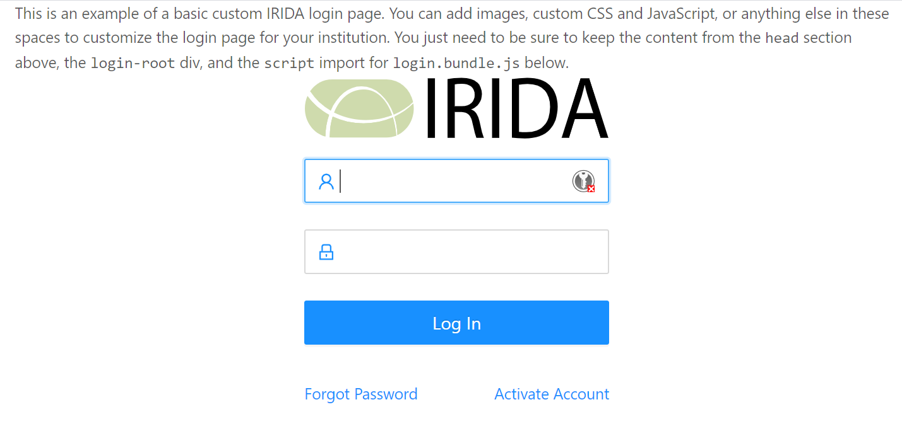
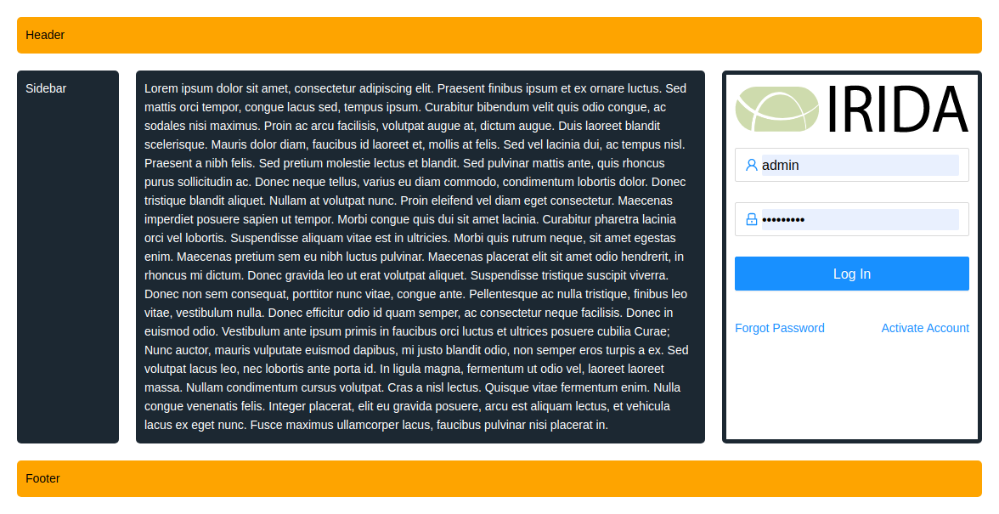

Custom Login Page
==========================================================

The default landing / login page for IRIDA can be replaced by an institution without modifying the existing one.

Create a html file called `login.html` on your files system, and save it to the path `/etc/irida/templates/`;

```properties
# Overwritten UI templates
ui.templates=/etc/irida/templates/
```

### Use IRIDA base login form.

IRIDA uses a React component as its login form and can be added to any template by adding:

 * CSS (`login.css`) and JS (`login.js`) files.
 * A `head` > `script` tag with a global `PAGE` variable containing: `BASE_URL: /*[[@{"/"}]]*/ "/"` as an attribute.
 * The div with id `login-root` should be placed on the dom element that you want React to render the login form.

#### Adding custom resources

Images, CSS and JS files can be added into `/etc/irida/static` and then loaded onto the custom login page.  Ensure that the Thymeleaf attributes are added, for example:

Examples:

    * Image: ``
    * JS: `<script th:src="@{/static/myFile.js}"></script>`
    * CSS: `<link th:href="@{/static/myFile.css}" />`

#### Example

```html
<!DOCTYPE html>
<html lang="en">
  <head>
    <webpacker:css entry="login" />
    <script th:inline="javascript">
      window.TL = {
        _BASE_URL: /*[[@{/}]]*/ "/",
        emailConfigured: /*[[${emailConfigured}]]*/ false
      };
    </script>
  </head>
  <body>
    <div id="login-root"></div>
    <webpacker:js entry="login" />
  </body>
</html>
```

#### Example of Custom login page

[Code for a basic custom login page.](./basic-login.html.md)



[Code for a more involved login page with added CSS.](./custom-login.html.md)



### Create a custom login form

To create a fully custom login page, you need to include a form that `POST`s to the url `/login`, with two elements:
1. `username` input
1. `password` input

If the authorization attempt fails, the server will redirect the `/login?error=true` which can be captured with JavaScript and display an error message to the user.

Please note in the example below the `th:` attributes on the form and other elements, this is from the server templating laguage Thymeleaf and will do the follow:
* `th:action="@{/login}"` will update the url to use what ever base url the servlet context is using.
    * For example if the context is `/foobar` the form's action will be updated to be `/foobar/login`
* `th:text="#{LoginPage.username}"` this is a call the internationalization function of Thymeleaf. The value between the braces is the key to a value in the file `messages_[language].resources`.

For more information of the [Thymeleaf please see their online documentation](https://www.thymeleaf.org/doc/tutorials/3.0/usingthymeleaf.html).

```html
<form method="post" th:action="@{/login}">
    <div>
      <label for="name" th:text="#{LoginPage.username}">Username</label>
      <input id="name" name="username" type="text">
    </div>
    <div>
      <label for="password" th:text="#{LoginPage.password}">Password</label>
      <input id="password" name="password" type="password" >
    </div>
    <button type="submit" th:text="#{LoginPage.submit}">Login</button>
    <div>
      <a th:href="@{/password_reset}" th:text="#{LoginPage.forgot}">Forgot Password</a>
      <a th:href="@{/password_reset/activate}" th:text="#{LoginPage.activate}">Activate Account</a>
    </div>
  </form>
```
