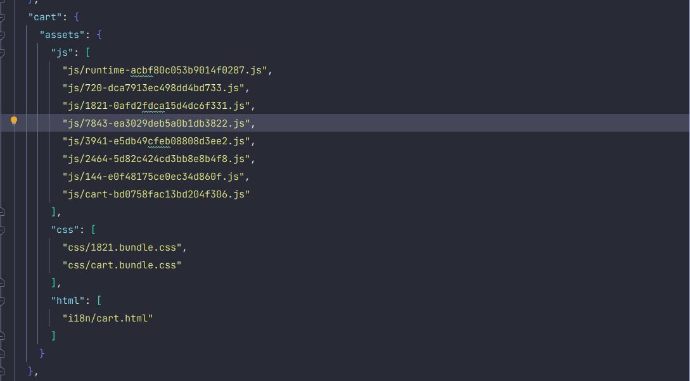

# User Interface Development Documentation

## HTML

**User interface components in IRIDA should be developed using ReactJS and the Ant Design component library** (for more information see below).

IRIDA depends upon the [Thymeleaf Template Engine](https://www.thymeleaf.org/) for internationalization and server root URLs.

## React JS

The IRIDA user interface is developed using the [React JS Framework](https://reactjs.org/), although there are legacy pages that still contain jQuery and AngularJS. **All new development for IRIDA is expected to be done in React**.

## Ant Design

IRIDA uses the design system [Ant Design](https://ant.design/), a [React JS](https://reactjs.org/) based component library.

## Webpack

- Compilation of JavaScript using `babel-loader`.
- Compilation of SCSS/CSS using `PostCSS` and `autoprefixr`.
- CSS extracted from JS/JSX files and put in seperate css files to be loaded onto page.
- Extraction of internationalization strings (more on this later).
- Asset manifest created stating which files have been generated for which entry point.

### Build Process:

#### Production Mode: `./gradlew builWebapp`
- Minimal source map
- File minification
- Bundle Chunking: Splits code into various bundles which can then me loaded on demand or in parallel. This makes for smaller bundle sizes and controls resource load prioritization. Bundle chunking also for code that is loaded on different pages be bundled together and cached by the browser.
- Hash code added to file name to allow for browser cache breaking.

#### Development Mode: `./gradlew startWebapp`
- **watch** mode set; any changes to JavaScript of CSS files will be automatically compiled
- Extensive source map
- No file minification

### JavaScript

IRIDA uses the [babel-loader](https://webpack.js.org/loaders/babel-loader/#root) to transpile the latest versions of JavaScript to a version supported by browsers.
 
Current babel plugins for UI development:
- [Class Properties](https://babeljs.io/docs/en/babel-plugin-proposal-class-properties)
- [Export default from](https://babeljs.io/docs/en/babel-plugin-proposal-export-default-from) 
- [Optional Chaining](https://babeljs.io/docs/en/babel-plugin-proposal-optional-chaining)

### CSS

IRIDA uses [PostCSS](https://postcss.org/) to transform CSS:
- Add vendor prefixes with [Autoprefixer](https://github.com/postcss/autoprefixer)
- Transform [LESS CSS](https://lesscss.org/) to CSS

IRIDA uses webpacks' [MiniCSSExtractPlugin](https://webpack.js.org/plugins/mini-css-extract-plugin/) to extract found in JS Files ito its own css file.

## Full Front End Build with Webpack and Thymeleaf

An "entry" is used by webpack to indicate the root JavaScript file for a page in IRIDA.  All entires for IRIDA are listed in `src/main/webapp/entries.js`.  This is a simple JavaScript exported object that contains key va pairs (key is the entry name, value is the path to the root file).

Example:
```javascript
module.exports = {
  dashboard: "./resources/js/pages/dashboard/Dashboard.jsx",
}
```

When webpack compiles all the assets found for that entry (CSS and JavaScript) it will output them in optimized chunks for faster loading and shared code between different entry points (e.g. code for displaying a modal window). This allows for faster loading between entries since this file would not need to be re-downloaded.

These compiled files change during development so it would become a futile effort to keep maintaining all the new links statically on their respective HTML pages. To get around this, we have created a system connecting Webpack and Thymeleaf to allow the dynamic addition of these links to their HTML page at runtime.

### Custom HTML Tags

**Do not add CSS `link` and JavaScript `script` tags for any Webpack entry or dependencies**

Due to webpack optimizing and chunking CSS and JavaScript files for faster loading, the IRIDA team created a Thymeleaf extension that parses a [webpack manifest file](https://webpack.js.org/concepts/manifest/) to handle adding the chunks onto the HTML entry page at runtime.

For entries:
* CSS: use `<webpacker:css entry="[ENTRY_NAME]" />` in the page header
* JS: use `<webpacker:js entry="[ENTRY_NAME]" />` before the closing html tag

#### How it works

##### Webpack

- `./gradlew buildWebapp`: runs webpack in production mode
    * Compilation, minification, and chunking of CSS and JavaScript assets.
    * Extraction for internationalization strings.
    * Creation of webpack manifest file

This is an excerpt from the assets-manifest.json file:



  - Each entry is broken down into 3 parts: js, css, and html:
    * **js**: JavaScript chunks
    * **css**: CSS chunks
    * **html**: Internationalization fragments
  
##### Thymeleaf

At compile time:
1. Parses the `assets-manifest.json` file to create an in memory object of the assets required for each entry point.

At runtime, Thymeleaf will intercept the HTML page request:
1. See if there is a cached version of this page (for the requested internationalization)
    * If cached, it will return cached page, else continue
2. Scan the page for the `webpacker` tags
    * For CSS (`<webpacker:css entry="cart" />`), it will create and add the required link tags for all CSS chunks to the HTML template
    * For JavaScript (`<webpacker:js entry="cart" />`), it will:
      * create and add the required script tags for all JavaScript chunks to the HTML template
      * see if there are HTML (internationalization) assets, and if there are it will inject the HTML fragment found on the asset path (in this case the markup found in  `i18n/cart.html`) will be added directly before the script tag for that entry
    
Example:

##### Template

```html
<!DOCTYPE html>
<html
  lang="en"
  xmlns:th="http://www.thymeleaf.org"
>
  <head>
    <meta charset="UTF-8" />
    <title th:text="#{ProjectRemoteSettings.title}">Title</title>
    <webpacker:css entry="cart"/>
  </head>
  <body>
    <div id="cart">LOADING ...</div>
    <webpacker:js entry="cart"/>
  </body>
</html>
```

##### After Thymeleaf Webpacker

```html
<!DOCTYPE html>
<html
  lang="en"
  xmlns:th="http://www.thymeleaf.org"
>
  <head>
    <meta charset="UTF-8" />
    <title th:text="#{ProjectRemoteSettings.title}">Title</title>
      <link rel="stylesheet" href="/dist/css/cart.bundle.css" />
      <link rel="stylesheet" href="/dist/css/268.bundle.css" />
  </head>
  <body>
    <div id="cart">LOADING ...</div>
    <script id="cart-translations" th:inline="javascript" th:fragment="i18n">
        window.translations = window.translations || [];
        window.translations.unshift({
            "SampleDetailsSidebar.removeFromCart": /*[[#{SampleDetailsSidebar.removeFromCart}]]*/ "",
            "SampleDetails.metadata": /*[[#{SampleDetails.metadata}]]*/ "",
            "SampleDetails.files": /*[[#{SampleDetails.files}]]*/ "",
            "SampleFiles.singles": /*[[#{SampleFiles.singles}]]*/ "",
            "SampleFiles.paired": /*[[#{SampleFiles.paired}]]*/ ""
        });
    </script>
    <script src="/dist/js/cart.bundle.js"></script>
    <script src="/dist/js/144-e0f48175ce0ec34d860f.js"></script>
    <script src="/dist/js/245-f59a9ead959e5e722bf0.js"></script>
  </body>
</html>
```

##### After Thymeleaf Internationalization (cached template)

```html
<!DOCTYPE html>
<html
  lang="en"
  xmlns:th="http://www.thymeleaf.org"
>
  <head>
    <meta charset="UTF-8" />
    <title th:text="#{ProjectRemoteSettings.title}">Title</title>
      <link rel="stylesheet" href="/dist/css/cart.bundle.css" />
      <link rel="stylesheet" href="/dist/css/268.bundle.css" />
  </head>
  <body>
    <div id="cart">LOADING ...</div>
    <script id="cart-translations">
        window.translations = window.translations || [];
        window.translations.unshift({
            "SampleDetailsSidebar.removeFromCart": "Remove From Cart",
            "SampleDetails.metadata": "Metadata",
            "SampleDetails.files": "Files",
            "SampleFiles.singles": "Single End Data",
            "SampleFiles.paired": "Paired End Date"
        });
    </script>
    <script src="/dist/js/cart.bundle.js"></script>
    <script src="/dist/js/144-e0f48175ce0ec34d860f.js"></script>
    <script src="/dist/js/245-f59a9ead959e5e722bf0.js"></script>
  </body>
</html>
```