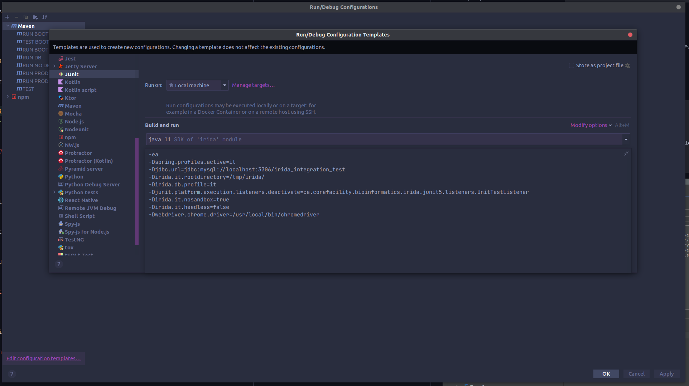
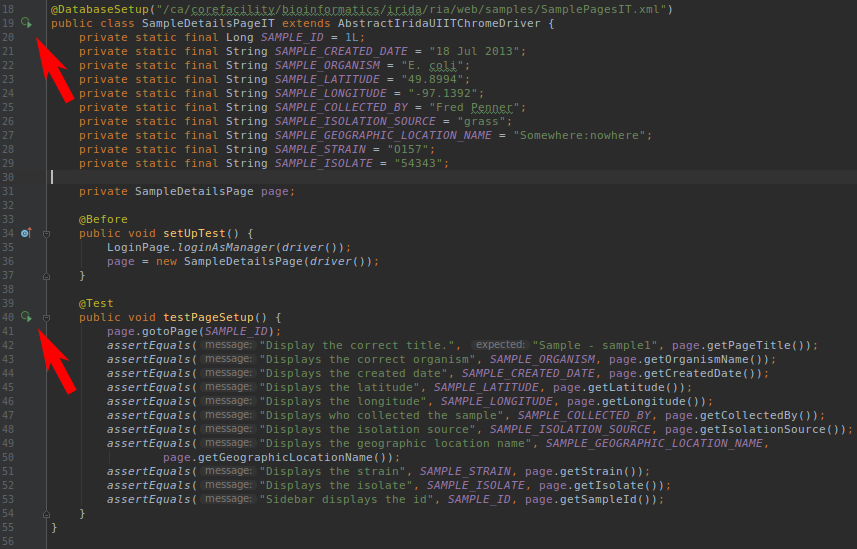

User interface testing using [Selenium] and [chromedriver]
==========================================================

In order to run the UI tests with [Selenium], you will need the appropriate version of [chromedriver] for your version of [Chrome] or [Chromium], or you can use a [selenium/standalone-chrome] docker image.


Initialize DB with Liquibase and run UI test server
---------------------------------------------------


### Create integration test DB

MariaDB/MySQL SQL for dropping and creating `irida_integration_test` database and granting user `test` all privileges on that DB: 
```sql
sudo mysql << EOF
DROP DATABASE irida_integration_test;
CREATE DATABASE irida_integration_test;
GRANT ALL PRIVILEGES ON irida_integration_test.* TO 'test'@'localhost';
EOF
```


### DB initialization with Liquibase 

You'll need the DB in the proper state to run the UI tests. To do this, you will need to run Liquibase in order to apply all of the necessary DB migration scripts. This can be done with the following command:

```
mvn clean jetty:run -B -Pui_testing \
  -Dspring.profiles.active=it \ # run IRIDA with the `it` Spring profile active
  -Djdbc.url=jdbc:mysql://localhost:3306/irida_integration_test \
  -Dirida.it.rootdirectory=/tmp/irida/ \
  -Dhibernate.hbm2ddl.import_files="" \
  -Dhibernate.hbm2ddl.auto="" \
  -Dliquibase.update.database.schema=true
```

**NOTE:**
- Running Liquibase is required to get the DB into the right state! `-Dhibernate.hbm2ddl.import_files=""`, `-Dhibernate.hbm2ddl.auto=""` and `-Dliquibase.update.database.schema=true` are required to run Liquibase. You might need to wipe the integration test DB and create it again.
- **BEWARE:** `-Djdbc.url=jdbc:mysql://localhost:3306/irida_integration_test` is VERY IMPORTANT. Specify explicitly so you don't point at your development DB and have it accidentally wiped...
- You don't need to specify `-Dsequence.file.base.directory` and `*reference*` and `*output*` if they all have the same root and dirnames of `sequence`, `reference` and `output`. It's automatically implied. 
- Set `-Dirida.it.headless=false` so you can see the UI tests in action!


### [chromedriver] and [Chrome]/[Chromium]

You need to match up the version of [Chrome] with [chromedriver]. For example, [Chrome] v66 needs [chromedriver] v2.39 or v2.40 (see https://sites.google.com/a/chromium.org/chromedriver/downloads)

You can specify which [chromedriver] to use with `-Dwebdriver.chrome.driver=/PATH/TO/chromedriver` otherwise, the `node_modules` version of [chromedriver] is used for running UI tests.


### Using [selenium/standalone-chrome]

To use [selenium/standalone-chrome] you will need to have docker installed on your machine.

Then when running the ui tests make sure to specify the `--selenium-docker` option otherwise, the `node_modules` version of [chromedriver] is used for running UI tests.


Running specific UI tests through [IntelliJ] IDEA
-----------------------------------------------


*Recommended [IntelliJ] Default/Template JUnit VM Options Configuration:* 

```
-ea 
-Dspring.profiles.active=it 
-Djdbc.url=jdbc:mysql://localhost:3306/irida_integration_test 
-Dirida.it.rootdirectory=/tmp/irida/ 
-Dirida.it.nosandbox=true 
-Dirida.it.headless=false
-Dwebdriver.chrome.driver=/PATH/TO/chromedriver
```




After starting the IRIDA UI test server (i.e. `mvn clean jetty:run -B -Pui_testing ...`), you can run the specific integration tests you're interested in through your IDE by going to the `*IT.java` file of interest and clicking the **Run Test** icon in the left gutter beside the first line of the class or function of interest.




**TIP:** Re-build (Ctrl+Shift+F9) to register changes to tests rather than re-building whole project!


[chromedriver]: http://chromedriver.chromium.org/
[Chrome]: https://www.google.com/chrome/
[Chromium]: https://www.chromium.org/
[Selenium]: http://www.seleniumhq.org/
[selenium/standalone-chrome]: https://hub.docker.com/r/selenium/standalone-chrome 
[IntelliJ]: https://www.jetbrains.com/idea/