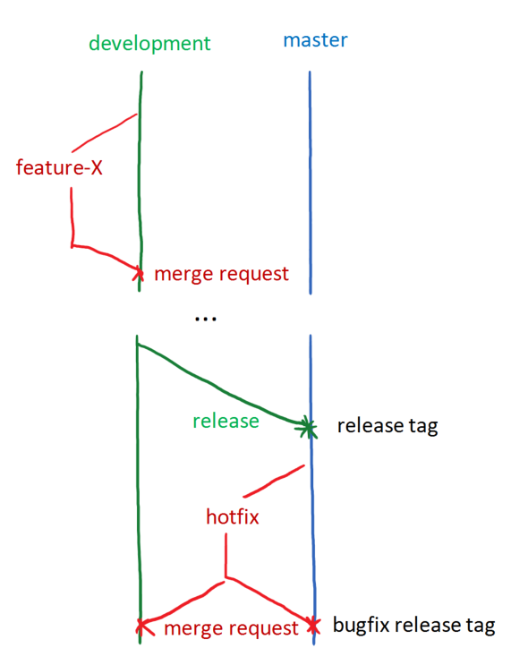

IRIDA Development Primer
========================

Important links
---------------
* IRIDA GitHub - https://github.com/phac-nml/irida
* IRIDA GitLab - http://gitlab-irida.corefacility.ca/ (only accessable from NML network)
* Documentation site - https://irida.corefacility.ca/documentation/
* Public website - https://irida.ca

Languages and Libraries
-----------------------

IRIDA is a Java application developed using Java 8.

#### Spring framework

Documentation: http://docs.spring.io/spring-framework/docs/4.2.3.RELEASE/spring-framework-reference/html/

IRIDA uses the Spring Framework as the main backbone of the application.  Spring is used to assist with many of the main functions of the application including configuration, dependency injection, MVC, REST API, Java persistance API management, and more.

For a better understanding of how Spring works, it's recommended that IRIDA developers attend a *Core Spring Training* course https://pivotal.io/training/courses/core-spring-training.

#### Apache Maven

Documentation: http://maven.apache.org/guides/

IRIDA uses Apache Maven for dependency management and build automation.  Maven allows developers to specify dependencies for a Java application and Maven will handle downloading all necessary required packages and ensuring they're available for developers on the Java classpath.  It also allows you to specify build lifecycles to automate packaging an application for distribution or execute code for development.

Maven settings and dependencies can generally be found in the `pom.xml` file in the IRIDA root directory.

#### Hibernate

Documentation: http://hibernate.org/orm/documentation/4.3/

Hibernate is used to map Java objects to database tables without the need for writing extra database code.  IRIDA uses hibernate through the Java Persistence API abstraction.

#### Other important libraries

* Thymeleaf - Web interface templating - http://www.thymeleaf.org/documentation.html
* JQuery - Javascript libraries - https://api.jquery.com/
* AngularJS - Javascript libraries and templating - https://docs.angularjs.org/api
* Jekyll - Documentation build - http://jekyllrb.com/docs/home/

Quick start development requirements
------------------------------------

* Clone IRIDA from the IRIDA [GitLab][].
* Install the following dependencies from your chosen package manager:
  * MariaDB
  * Java 8 JDK
  * Apache Maven
* Run the library installation script in the `lib/` directory:
```
cd irida/lib/
bash install-libs.sh
```
* Create a test database in MariaDB with the name `irida_test` and user `test` with password `test`.

Running and building IRIDA
--------------------------

#### Running a development server

An IRIDA development server can be run with the `run.sh` script available in the project root directory.  The script has one option `--create-db`.  Using this option will automatically drop and recreate the databse using test data.

Running the `run.sh` without arguments script is equivalent to running:

```bash
mvn clean jetty:run -Dspring.profiles.active=dev
```

Any arguments added after `run.sh` will be proxied to the `mvn ...` command.

#### Building IRIDA for release

Run the following:

```bash
mvn clean package -DskipTests
```

This will create the `.war` and `.zip` files for IRIDA release under the `target/` directory.

#### Building IRIDA docuementation

Building new features
---------------------
CHANGELOG, UPGRADING

Database Updates
----------------

Liquibase

Version control
---------------

The IRIDA project uses Git, [GitLab][], and [GitHub][] for verison control purposes.  The main development server used is the NML's [GitLab][] site.  We use an internal repository so that we have greater control over how the code is managed, greater control over the testing servers, and allows us to have private conversations about issues.  Once a feature is pushed to the *development* or *master* branches of the project, it is automatically mirrored to our [GitHub][] site to give access ot public users.

External collaborators are welcomed to develop new features and should submit pull requests on IRIDA's [GitHub][] page.

### Branch structure

IRIDA's branch structure is loosely based on the [GitFlow](http://nvie.com/posts/a-successful-git-branching-model) branch model.  This model allows the team to develop multiple features in parallel without contaminating the main development branch, keeping merge requests sane, and allows for stable releases.

#### Branches:

* *development* - This is the main running development branch.  It represents the latest features that have been developed by the team.  Features here should be kept in a state that they can be released at any time.
* *master* - This is the release branch.  It should be kept at the latest stable release.
* feature branches - These should be created by the developers as they work on new additions to the application.  They should be branched off *development* and merged back once the feature is entirely complete and ready to release.
* hotfix branches - These branches will be created when there is an bug in the master branch which must be fixed immediately.  When these branches are complete they should be merged into both *development* and *master*.

#### Release tags & versioning scheme

Whenever code is merged into *master*, a release should be created.  To mart the release the person merging the code should create a git tag at the point of the merge.

```bash
git tag 0.version.subversion
```

Don't forget to push the tag when you're finished.

```bash
git push --tags
```

Once the tag has been pushed, the tag should have been automatically created on IRIDA's [GitHub][] site at https://github.com/phac-nml/irida/releases.  This release will be created as a tag, but will not be a full release until release notes and release files are uploaded to [GitHub][].  To do this, click *Edit* next to the new tag, enter the details from the `CHANGELOG.md` file for this release, and upload the `.war` and `.zip` files for this release.


Example workflow:



IRIDA Codebase
--------------

IRIDA is organized as a fairly classic Java web application.  All files are found under the `ca.corefacility.bioinformatics.irida` package root.

* `config` - Configuration classes.  All Spring application config, web config, Maven config, and scheduled task configuration can be found here.
* `database.changesets` - Java liquibase changesets.  See more about our liquibase usage in the [liquibase section](#liquibase).
* `events` - Classes here handle the `ProjectEvent` structure in IRIDA.  These are the messages you can find on the IRIDA dashboard and project recent activity pages.
* `exceptions` - Java `Exception` classes written for IRIDA.
* `model` - IRIDA uses MVC.  These are the model classes.
* `pipeline.upload` - Classes used to communicate workflows, libraries, and histories to Galaxy.
* `processing` - IRIDA's file processing chain.  This contains classes used when processing files uploaded to IRIDA such as unzipping, FastQC, and quality control.
* `repositories` - Repositories used for communicating with IRIDA's database.  These classes generally use [Spring Data JPA][] for communicating with the database.
* `ria` - "Rich Internet Application", this is where the controller code and all Java code for the web interface is found.
* `security` - IRIDA's security layer.  You'll mostly find [Spring Security][]  classes within.  See more in the [security](#security) section.
* `service` - IRIDA's service layer.  Here you'll find the business logic for reading, saving, and manipulating data.
* `util` - General utility classes.  These are generally developer tools that don't fit anywhere else in the class structure.
* `validators` - Validation classes used to verify data being saved in the database is correct.
* `web` - IRIDA's REST API.


[GitHub]: (https://github.com/phac-nml/irida)
[GitLab]: (http://gitlab-irida.corefacility.ca/)
[Spring Data JPA]: (http://projects.spring.io/spring-data-jpa/)
[Spring Security]: (https://projects.spring.io/spring-security/)