Administrator User Guide
========================
{:.no_toc}

This guide shows how to use the administrative features of the IRIDA web interface.

* This comment becomes the table of contents
{:toc}

Accessing the Administrative Panel
==================================

The administrative features of IRIDA are accessed within the administrative panel.

To navigate to the administrative panel, click the button on the top right of the navbar.
The button is only present if you have the **Administrator** system role.

Administrative Panel Overview
=============================

The administrative panel contains a side menu with a menu option for each administrative feature.

The panel has a top navbar with a "Return" button to return to the main application plus a "Profile" dropdown menu for viewing the current user's account and logging out.

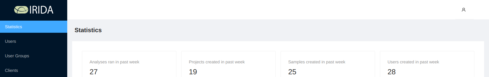

Viewing Statistics
==================

When the Administrative Panel is accessed you will be taken to the landing page which is the Statistics Page.

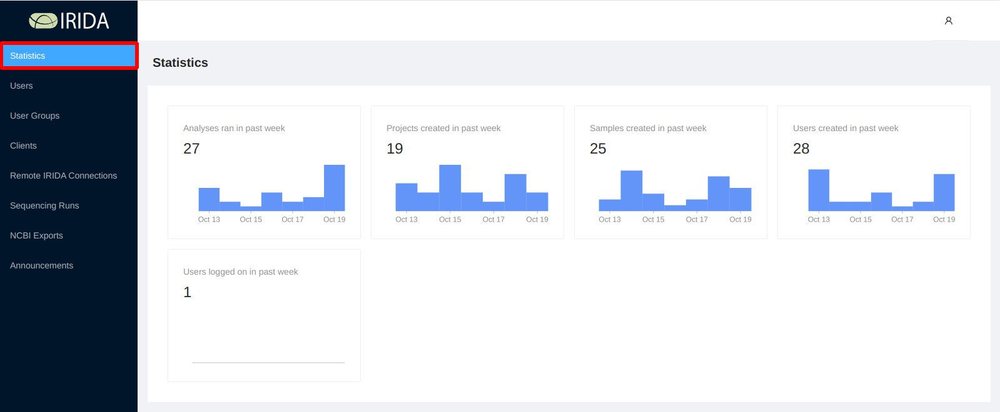

This page displays usage statistics for the number of analyses ran, projects created, samples created, users created, and users logged in within the default time period which is set to 7 days.

Clicking on a graph will take you to the full details of the graph. There you can set different time periods to explore the data and select different chart types.

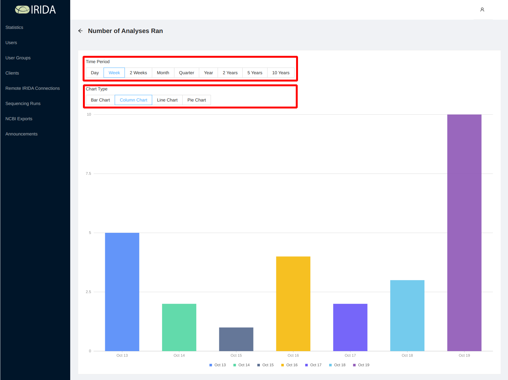

Managing User Accounts
======================

Only one account is created for a new instance of IRIDA by default: the administrator account.

This section of the guide describes how to create, modify, and remove local user accounts from IRIDA.

Creating a New User Account
---------------------------

First navigate to the users page via the admin panel side menu:

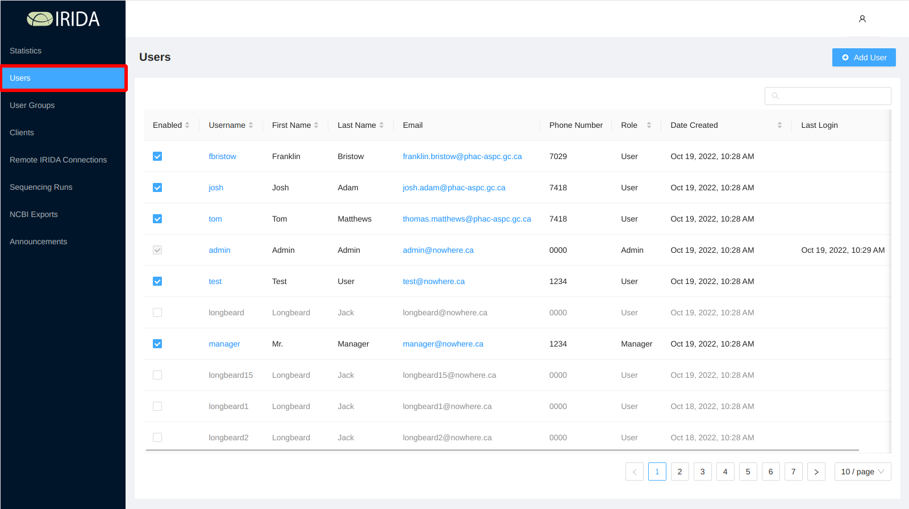

Then click the "Add User" button:

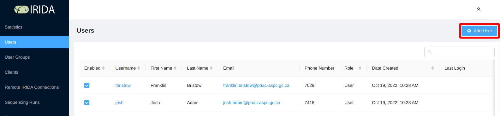



Updating an Existing User Account
---------------------------------



When editing a user account, remember to click the "Update User" button of the bottom of the form to save the changes.

Resetting a Password
--------------------



To reset the password for a user account, hit the "Security" tab and click on the "Send Email" button:

When you click the button, you will be asked to confirm if you would like to reset the password for the user account:

You should see a success notification at the top-right of your browser window when you confirm:

**Note**: Clicking the password reset button does *not* create a new password for the user, rather issues a reset request. The reset request will send an e-mail to the user with an account activation link (like when a user account is initially created), where the user will be allowed to create a new password.

Disabling a User Account
------------------------

Start from the users list, by clicking on the "Users List" side menu link:

The users list shows all users currently registered in the system:

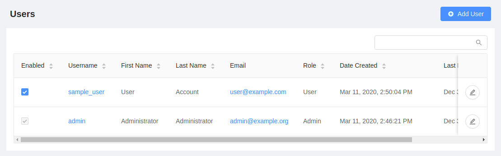

A user's account can be quickly disabled by unchecking the checkbox beside the username of the user to disable.

You can view the details of an existing user account by clicking on the username of the account your're interested in:

To disable a user account, uncheck the "Enabled" field and click the "Update User" button of the bottom of the form to save the change.

**Note**: A user account that is not "Enabled" is **not** deleted from the system, but that user can no longer log in to IRIDA.

Managing User Groups
====================

User accounts can be organized into a collection called a user group. User groups can be used to assign [project permissions](../project/#project-members) to collections of user accounts. This section of the user guide descibes how you can view projects, edit project metadata (including uploading reference files), search for projects by name, and create new projects.

Viewing existing user groups
----------------------------

First click on "User Groups List" via the admin panel side menu:

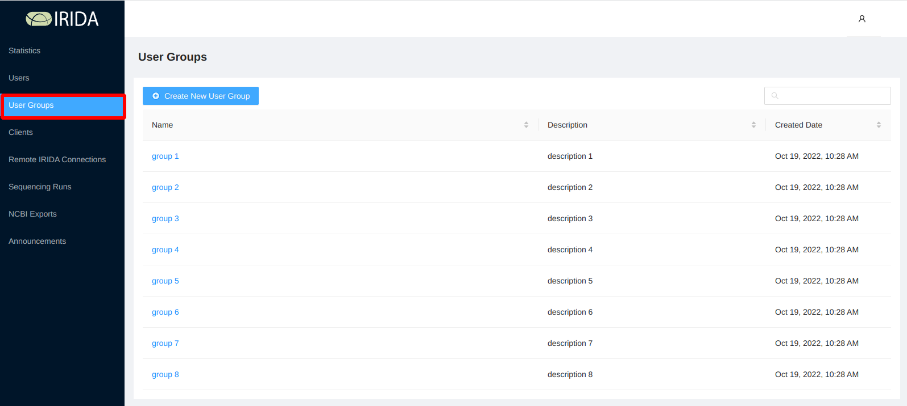

The user groups list shows all user groups in IRIDA:

The projects list provides a high-level overview of project details, including:

* The name of the group,
* The group description,
* The date that the group was created,
* The date that the group was last modified, and
* (if you are permitted) group deletion buttons.



Managing System Clients
=======================

External tools can interact with IRIDA using the IRIDA REST API. External tools are required to use the OAuth2 framework for authorization. You must create an entry in the IRIDA database for each external tool that wants to interact with the IRIDA REST API. The tool author requires a client ID and a client secret. In addition to the client ID and secret, you are responsible for deciding what type of access a client should have (read, write, or both) and *how* the client should be allowed to interact with the REST API using user credentials.

Creating a New System Client
----------------------------



### Client ID
{:.no_toc}
The client ID must be unique in IRIDA, no two clients can share the same client ID. A client ID is required, and must be shorter than 255 characters, but no other validation is applied to client IDs.

### Token Validity
{:.no_toc}
When a client first interacts with the IRIDA REST API, it must provide its client ID, client secret, and user credentials. On successful authentication, the authorization server provides the client with an access token. The access token has a limited lifetime and expires after a certain period of time.

You should choose an access token lifetime similar to the amount of time that the client needs to interact with the REST API. For example, when a sequencer requires less than one hour of time to upload a sequencing run, so the lifetime of the access token should be around 1 hour.

### Grant Types
{:.no_toc}
You may also choose *how* a client is allowed to provide authentication details from a user. IRIDA currently supports two grant types:

1. Password, and
2. Authorization code.

You should choose the password grant type for applications that **are not** web-based applications, usually desktop or command-line clients. The password grant type requires the application to collect the user name and password directly from the user and submits the user name and password over HTTPS.

You should choose the authorization code grant type for applications that **are** web-based applications. In the authorization code grant type the user's web browser is redirected to IRIDA to allow the user to authorize the client's interaction with IRIDA. In the authorization code grant type, the user's username and password are *never* provided to the client.

If you choose an authorization code grant, you must register a redirect URI for the service you expect to use this client.  This is the location which the token should be sent in the web application's API to set up an OAuth2 connection.  In the case of IRIDA, this is generally the IRIDA installation's base URL + `/api/oauth/authorization/token` (ex: `https://irida.ca/irida/api/oauth/authorization/token`).  In the case of the [IRIDA Galaxy Importer](https://github.com/phac-nml/irida-galaxy-importer), this will be your local server's base URL + `/galaxy/auth_code`.  Ex: `http://irida.ca/irida/galaxy/auth_code`.

### Refresh Tokens
{:.no_toc}
Refresh tokens allow client applications to generate a new authorization token without input from the user.  Because refresh tokens are valid for much longer than authorization tokens, refresh tokens can be used to ensure a connection can be made to an IRIDA API for longer running jobs.  Refresh tokens should be used for instances that a client application will require a long term connection to the IRIDA API where users may not be able to validate their connection.

You should choose a refresh token validity suitable for the client application.  Once a refresh token expires it will require a user to log in and reconnect to the IRIDA API.  It is suggested to use refresh tokens for clients which will be used for project synchronization. 

### Scopes
{:.no_toc}

Finally, you must decide what the client is allowed to do once it's been authorized to use the REST API. You must choose *at least one* scope, otherwise the client will not be allowed to do anything once it's been authorized to use the REST API.

If you choose *only* read scope, the client will have read-only access to the REST API (it will not be allowed to create new resources). The read scope is typically the only scope that should be enabled for a client.

If a client is going to be adding or modifying data in IRIDA, you should also enable the write scope. One specific example of a client that *must* be able to write to the REST API is the sequencer uploader tool.

Updating an Existing System Client
----------------------------------

To modify the client details, you can click on the "Edit" button at the end of the row.

From the client details page you can modify the client ID, the length of time that an authorization token is valid for, the grant type that the client uses, and the scopes (read or write) that the client is allowed to use:

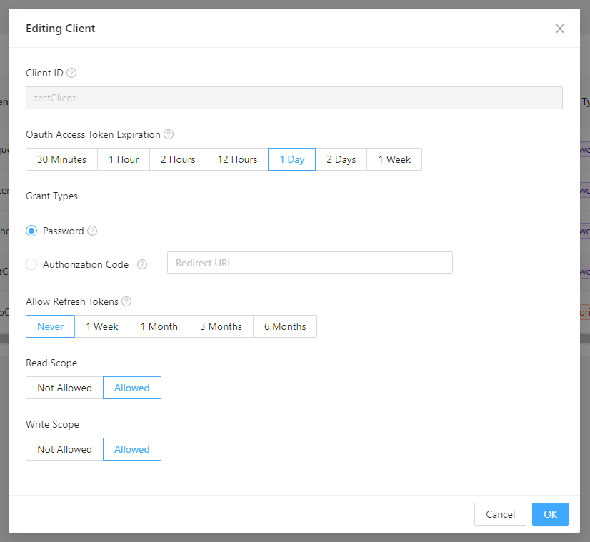

After you have made the modifications that you want to the existing client, click on the "Update Client" button.

### Generating a New Client Secret

You may want to generate a new client secret for a client if, for example, the client secret has been accidentally
leaked by the client and someone is abusing your API.

Client secrets are generated randomly by IRIDA. To generate a new secret, click on the refresh button next to the
client's secret in the table:

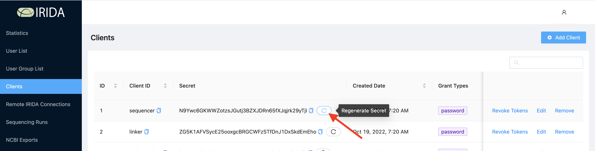

To generate the new secret, click on the "Update Client" button. The new client secret will be listed in the "Client Details" panel.

Removing a System Client
------------------------

To remove a client, click on the "Remove" button at the end of the row, you will need to select "Ok" on a confirmation
pop up to ensure this is what you intented to do:

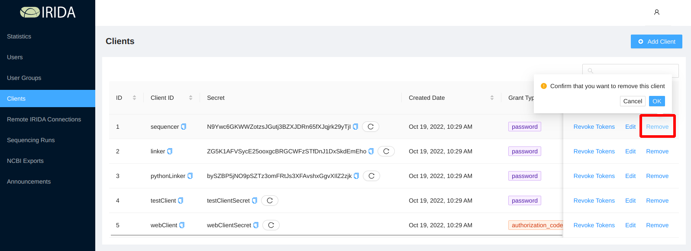

Managing Remote IRIDA Connections
=================================
Remote instances of IRIDA can be used as data sources for associated projects and workflows.  Users will be able to view an aggregated view of samples from the local project along with all local and associated projects.  Administrators can create connections to remote instances of IRIDA using OAuth2 similar to how external tool developers can connect to the IRIDA REST API.

See the [user guide](../../user/user/dashboard#managing-remote-irida-connections) for information on connecting to remote instances of IRIDA.

Allowing access to your IRIDA installation
------------------------------------------

A Remote Connection is granted with the same process as remote clients.  To allow a remote IRIDA instance to access your IRIDA instance, an OAuth2 client must be created with the following specifications:

* Token Validity: 12 hours recommended.  A short token validity will require users to reauthorize the API more often.
* Grant Type: `authorization_code`
* Remote URI: The URI of the OAuth2 token endpoint (typically the server URL + "/api/oauth/authorization/token". Ex: "http://irida.ca/api/oauth/authorization/token") for the IRIDA installation connecting to yours.
* Scopes: `read`

**Note:** In order for a remote client to communicate with the REST API, the client must be able to access the REST API via HTTP.  This may involve opening access in a firewall or setting up a VPN connection between sites.

For more information about creating OAuth2 clients see the [managing system clients](#managing-system-clients) section.

Adding a Remote IRIDA installation
----------------------------------

Before a user can use a remote instance of IRIDA as a data source for associated projects and workflows, an administrator must create a connection to that remote instance (similar to how external tool developers can connect to the REST API).  To add a Remote Connection, an administrator will need the following information from the remote installation:

* An OAuth2 client ID which has been set up on the remote installation.
* An OAuth2 client secret.
* The root address of the IRIDA REST API of the remote installation.

After being given the client credentials, access "Remote IRIDA Connections" via the admin panel side menu.

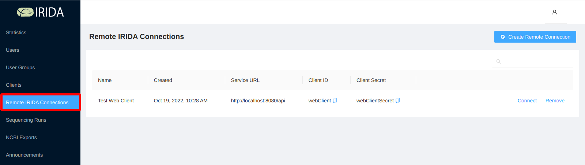

The Remote Connections page will display all currently available Remote Connections, and their connection status with an IRIDA instance.

To add a new connection, click the "Add Remote Connection" button:

Enter a suitable name for the remote installation.  This name will be visible to users connecting and accessing data from that instance.  Also enter the "Client ID", "Client Secret", and "Service URL" of the Remote Connection as given by the remote administrator.

After adding the Remote Connection the Remote Connections table will be updated.

To test the Remote Connection, click the "Connect" button. You should be directed to a login page for the remote
connection. To connect to the remote instance of IRIDA you must have been given a username and password for the remote
installation. See [Remote instances of IRIDA](../user/dashboard/#remote-instances-of-irida) for more details.

Removing a Remote Connection
----------------------------
From the Remote Connections list, click the "Remove" button at the end of the row for the remote connection you want to
remove. A confirmatory pop up message will appear. Click "Ok" and the connection will be removed.

Setting Analysis Submission Priority
====================================

Administrators have the ability to set the priority of analysis submissions in IRIDA.  This feature can be used to ensure important analyses are run in a timely fashion when the analysis queue is filled by routine or other low priority analyses.  By default all manually submitted submissions will have a priority of `MEDIUM`, whereas all automated submissions (such as automated assemblies and automated SISTR) will have `LOW` priority.

To update the priority of a submission, first view the analysis page.  The current priority will be displayed on the `Details` page. To edit the priority, click the select box under **Priority**:

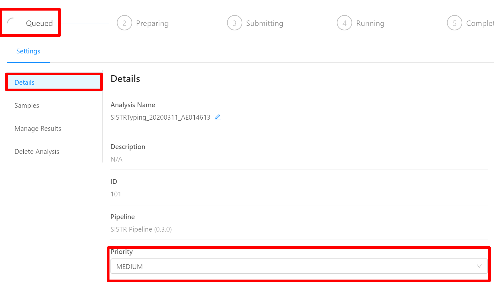

Note that a priority change will only effect analyses in the `Queued` state.  The analysis engine will pick higher priority analyses to begin running first, but currently running jobs will not be bumped by a higher priority analysis.  

Viewing Sequencing Runs
=======================
First navigate to the sequencing runs page via the admin panel side menu:

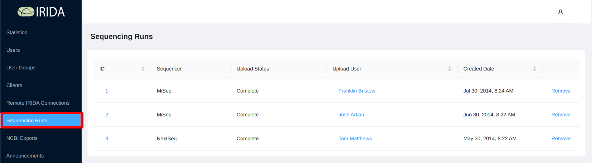

The "Sequencing Runs" page lists all of the sequencing runs uploaded to IRIDA:

You can view the specific details about a sequencing run by clicking on the ID of the sequencing run:

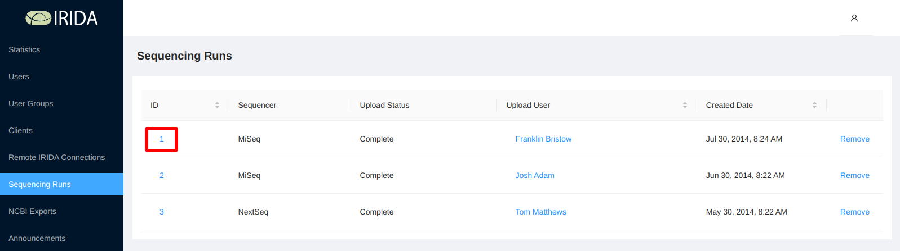

The sequencing run details page shows information that was captured from the sequencing run file, and provides you a method to view a complete collection of files that were uploaded as part of a run:

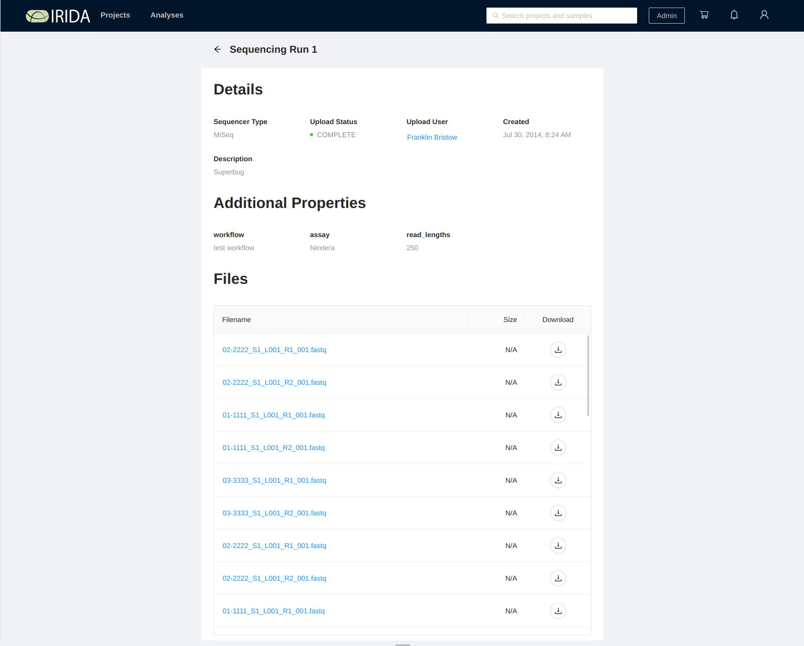

To delete a sequencing run, click the `Remove` button on the details page.  Note: This will remove the sequencing run and all assocaited sequence files.  If this operation results in a sample being empty, the sample will also be removed.

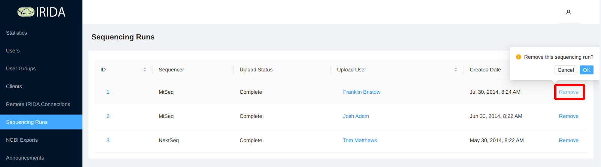

To view the collection of files that were uploaded as part of the run, click on the "Files" tab, above the quick-details pane:

On the sequencing run files list you can download individual files by clicking on the  button, or you can view the quality control results produced by FastQC by clicking on the filename in the table:

On the quality control report page you can view individual quality control metrics, like quality constrol charts and some statistics about the file:

You can also view the overrepresented sequences detected by FastQC by clicking on the "Overrepresented Sequences" tab on the top, left-hand corner of the page:

The overrepresented sequences page displays all of the overrepresented sequences detected by FastQC:

Uploading Data to IRIDA using the IRIDA Uploader
=======================

The IRIDA Uploader is an application used to submit sequencing data from a variety of sequencers to an instance of IRIDA. You can access the latest stable release of the IRIDA Uploader at:

<https://github.com/phac-nml/irida-uploader/releases/latest>

The Uploader is available as a stand alone application with user interface, and as a command line utility.

A tutorial for the stand alone application can be found here: <https://github.com/phac-nml/irida-uploader-tutorial>

The command line utility is available via source code on [Github](https://github.com/phac-nml/irida-uploader) as well as a package on [bioconda](https://anaconda.org/bioconda/irida-uploader)

The documentation for using the IRIDA Uploader is included in the package, but can also be found at:

<https://irida-uploader.readthedocs.io/en/stable/>

Displaying IRIDA Platform Updates/Announcements
===============================================
Announcements and updates can be displayed to users after they log in.

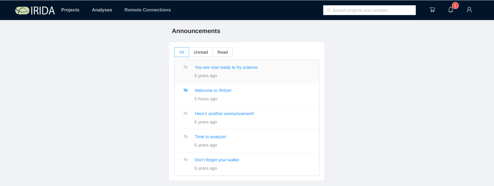

Administrators can create new announcements or view existing ones by clicking on the "Announcements" side menu link:

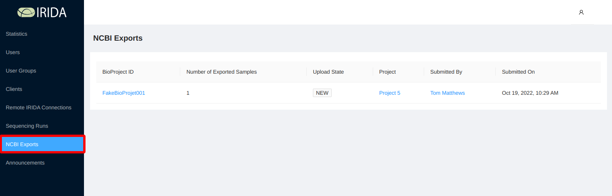

New Announcements can be created by clicking on the "Add Announcement" button:

Complete the form and hit the "Create Announcement" button. Note, the announcement content is rendered as markdown to the user.

To edit an announcement, click the edit button: 

After editing the announcement, you can save your changes by hitting the "Update Announcement" button:

To see the details of an announcement, click the details button: 

The announcement details displays a list of users who have marked this particular announcement as read, as well as see when they did so.

To delete an announcement, click the delete button: 

To confirm the deletion of the announcement, click the "Delete" button: 

Viewing All Project Exports
===========================
Administrators have the ability to view the status of all exports to NCBI in the system.  First navigate to the NCBI export uploads page via the admin panel side menu:

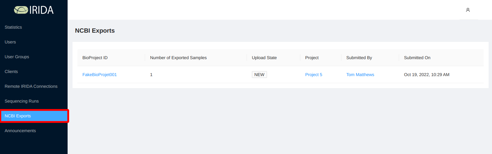

You will be displayed all the NCBI exports that have been created sorted by the date they were created.

The exports will have one of the following states:

 * `NEW`: Newly created submission that has not yet been uploaded
 * `UPLOADING`: Submission currently being uploaded
 * `UPLOADED`: Submission has been successfully uploaded
 * `UPLOAD_ERROR`: An error occurred while uploading
 * `created`: Submission created and being populated
 * `failed`: Failed immediately after submission
 * `queued`: Queued for processing by NCBI's processing pipeline
 * `processing`: Processing started by NCBI's processing pipeline
 * `processed-ok`: Processing completed successfully
 * `processed-error`: Processing completed with error(s)
 * `waiting`: Waiting for other files to continue
 * `submitted`: Submitted to NCBI
 * `Submission deleted`: Submission deleted
 * `retried`: Retried processing of failed action(s)
 
Troubleshooting
===============

To troubleshoot common problems in IRIDA, please see the **Troubleshooting** guides.

 1. [Troubleshooting Pipelines](troubleshooting/pipelines)
