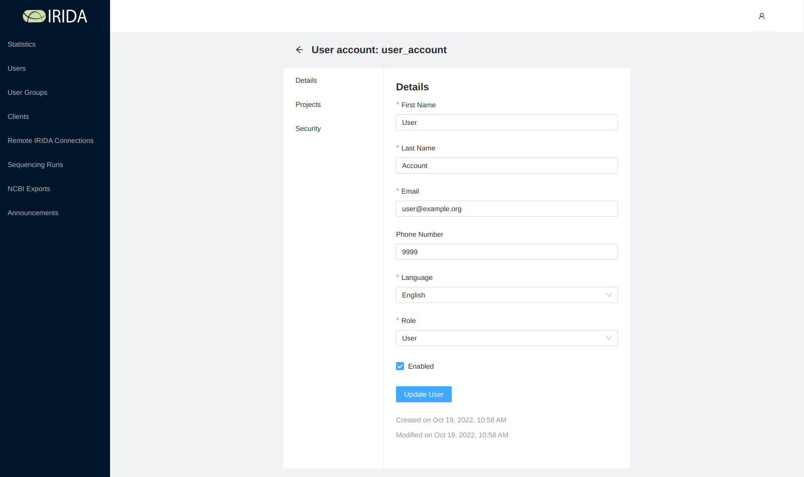
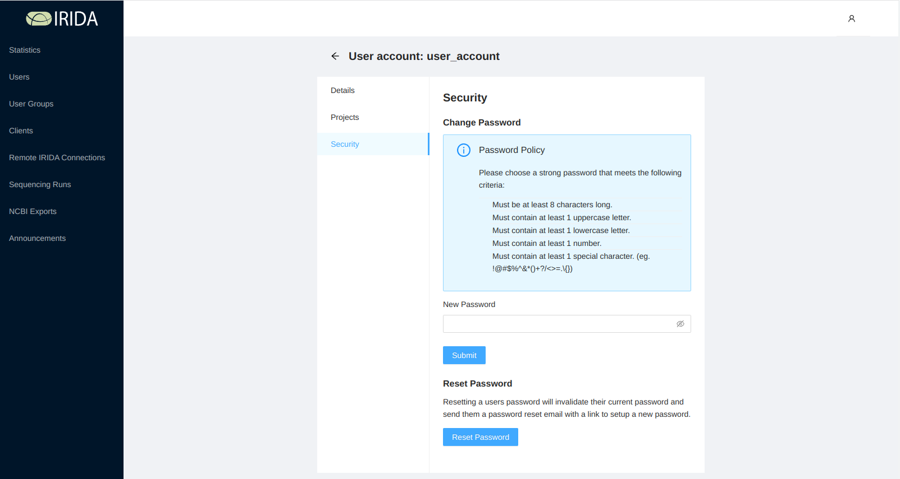
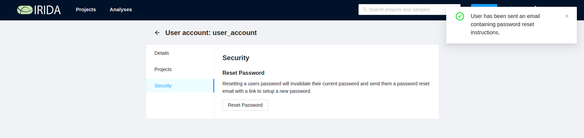
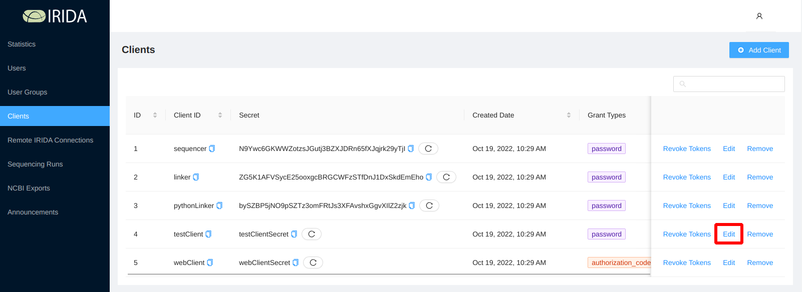
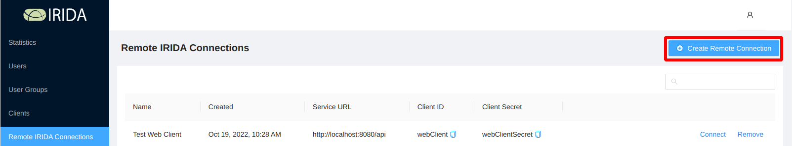
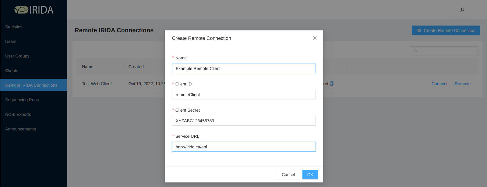
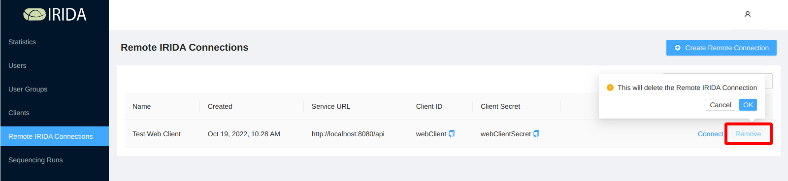
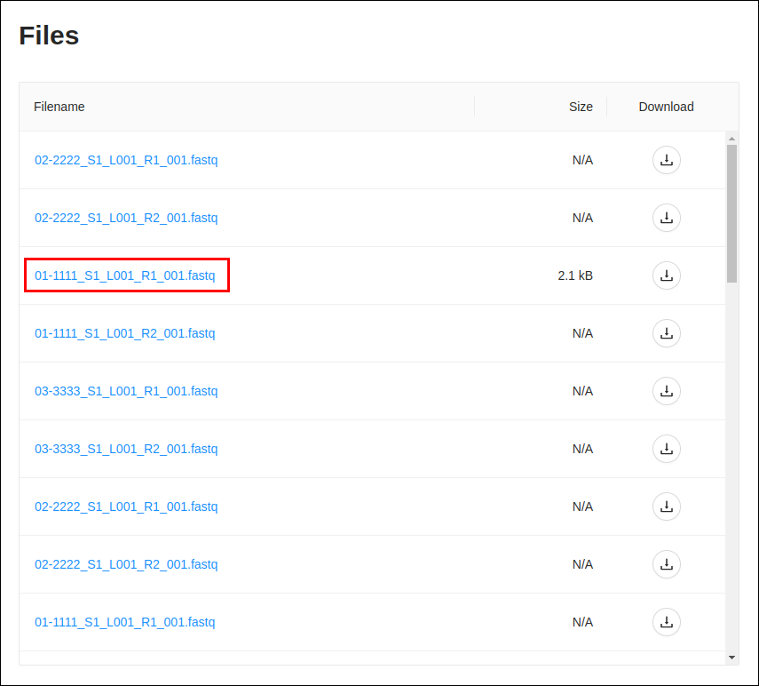

Administrator User Guide
========================
{:.no_toc}

This guide shows how to use the administrative features of the IRIDA web interface.

* This comment becomes the table of contents
{:toc}

Managing User Accounts
======================

Only one account is created for a new instance of IRIDA by default: the administrator account.

This section of the guide describes how to create, modify, and remove local user accounts from IRIDA.

Creating a New User Account
---------------------------
After logging in to IRIDA, click on the **Users** menu, and select "Create User":

Fill in the user details fields. All fields are required for a user account in IRIDA:

By default, a user will be issued a randomly-generated, one-time-use key to activate their account. The first time the user logs in, they will be required to change their password. You may manually enter a user password by unchecking "Require User Activation":

Passwords must have at least 1 upper-case character, 1 lower-case character, 1 number (0-9), and must be *at least* 8 characters long. If you manually set a password for a new user account, the user will not be required to change their password on first log in.

When you click "Create User", an e-mail will be sent to the user (to the e-mail address you entered) including the URL for IRIDA (as configured in the [Administrator Install Guide](../../administrator/web/#web-configuration)). If you did not manually set a password for the user, the e-mail will include a link to activate the user account:

On successfully creating a new user account, you will see the user details that you entered:

Updating an Existing User Account
---------------------------------



To edit a user account, click on the "Edit" button at the top of the "User Details" table:

All of the fields that were available to modify when creating a user account are available for editing:

When you're finished updating the user account, you can click the "Update User" button at the bottom of the form to save the changes.

Resetting a Password
--------------------



To reset the password for a user account, click on the "Reset Password" button at the top of the "User Details" table:

When you click the button, you will be asked to confirm if you would like to reset the password for the user account:

You should see a success notification in the top, right hand side of your browser window when you confirm:

**Note**: Clicking the password reset button does *not* create a new password for the user, rather issues a reset request. The reset request will send an e-mail to the user with an account activation link (like when a user account is initially created), where the user will be allowed to create a new password.

Disabling a User Account
------------------------



To edit a user account, click on the "Edit" button at the top of the "User Details" table:

To disable a user account, uncheck the "Enabled" field, and click "Update User":

**Note**: A user account that is not "Enabled" is **not** deleted from the system, but that user can no longer log in to IRIDA.

Managing System Clients
=======================

External tools can interact with IRIDA using the IRIDA REST API. External tools are required to use the OAuth2 framework for authorization. You must create an entry in the IRIDA database for each external tool that wants to interact with the IRIDA REST API. The tool author requires a client ID and a client secret. In addition to the client ID and secret, you are responsible for deciding what type of access a client should have (read, write, or both) and *how* the client should be allowed to interact with the REST API using user credentials.

Creating a New System Client
----------------------------



You can add a new client by clicking on the "Add Client" button:

When you add a client, you'll be required to provide the following information:

1. A unique client ID,
2. How long a token should be valid for once issued,
3. The type of OAuth2 flow that a client should use,
4. The scopes that the client is allowed to use (should the client be allowed to read, write, or both with the REST API).

### Client ID
{:.no_toc}
The client ID must be unique in IRIDA, no two clients can share the same client ID. A client ID is required, and must be shorter than 255 characters, but no other validation is applied to client IDs.

### Token Validity
{:.no_toc}
When a client first interacts with the IRIDA REST API, it must provide its client ID, client secret, and user credentials. On successful authentication, the authorization server provides the client with an access token. The access token has a limited lifetime and expires after a certain period of time.

You should choose an access token lifetime similar to the amount of time that the client needs to interact with the REST API. For example, when a sequencer requires less than one hour of time to upload a sequencing run, so the lifetime of the access token should be around 1 hour.

### Grant Types
{:.no_toc}
You may also choose *how* a client is allowed to provide authentication details from a user. IRIDA currently supports two grant types:

1. Password, and
2. Authorization code.

You should choose the password grant type for applications that **are not** web-based applications, usually desktop or command-line clients. The password grant type requires the application to collect the user name and password directly from the user and submits the user name and password over HTTPS.

You should choose the authorization code grant type for applications that **are** web-based applications. In the authorization code grant type the user's web browser is redirected to IRIDA to allow the user to authorize the client's interaction with IRIDA. In the authorization code grant type, the user's username and password are *never* provided to the client.

### Scopes
{:.no_toc}

Finally, you must decide what the client is allowed to do once it's been authorized to use the REST API. You must choose *at least one* scope, otherwise the client will not be allowed to do anything once it's been authorized to use the REST API.

If you choose *only* read scope, the client will have read-only access to the REST API (it will not be allowed to create new resources). The read scope is typically the only scope that should be enabled for a client.

If a client is going to be adding or modifying data in IRIDA, you should also enable the write scope. One specific example of a client that *must* be able to write to the REST API is the sequencer uploader tool.

Updating an Existing System Client
----------------------------------



To modify the client details, you can click on the "Edit" button, in the top, right-hand corner of the "Client Details" panel:

From the client details page you can modify the client ID, the length of time that an authorization token is valid for, the grant type that the client uses, and the scopes (read or write) that the client is allowed to use:

After you have made the modifications that you want to the existing client, click on the "Update Client" button:

### Generating a New Client Secret

You may want to generate a new client secret for a client if, for example, the client secret has been accidentally leaked by the client and someone is abusing your API.

Client secrets are generated randomly by IRIDA. You can have IRIDA issue a new client secret by navigating to the ["Edit Client Details"](#updating-an-existing-system-client) page (as above), and checking "Generate a new client secret":

To generate the new secret, click on the "Update Client" button. The new client secret will be listed in the "Client Details" panel.

Removing a System Client
------------------------



To remove a client, click on the "Remove" button at the top, right-hand corner of the "Client Details" panel:

You will be asked to confirm the deletion:

Click "OK" to confirm, or "Cancel" to decline the deletion.

After deleting a client, you will be returned to the list of clients.

Managing Remote APIs
====================
Remote IRIDA installations can be used as data sources for associated projects and workflows.  Users will be able to view an aggregated view of samples from the local project along with all local and associated projects.  Administrators can create connections to Remote APIs using OAuth2 similar to how external tool developers can connect to the REST API.

See the [user guide](../../user/user/dashboard#remote-apis) for information on connecting to remote APIs.

Allowing access to your API
---------------------------

Remote API access is granted with the same process as remote clients.  To allow a remote installation to access your API, an OAuth2 client must be created with the following specifications:

* Token Validity: 12 hours recommended.  A short token validity will require users to reauthorize the API more often.
* Grant Type: `authorization_code`
* Scopes: `read`

**Note:** In order for a remote client to communicate with the REST API, the client must be able to access the REST API via HTTP.  This may involve opening access in a firewall or setting up a VPN connection between sites.

For more information about creating OAuth2 clents see the [managing system clients](#managing-system-clients) section.

Adding a Remote API
-------------------

Before a user can use a remote instance of IRIDA as a data source for associated projects and workflows, an administrator must create a connection to that remote instance (similar to how external tool developers can connect to the REST API).  To add a Remote API, an administrator will need the following information from the remote installation:

* An OAuth2 client ID which has been set up on the remote installation.
* An OAuth2 client secret.
* The root address of the REST API of the remote installation.

After being given the client credentials, go to the "Remote API" page.

The Remote APIs page will display all currently available Remote APIs and your connection status with the API.

To add a new API, click the "Add Remote API" button:
 

 
Enter a suitable name for the remote installation.  This name will be visible to users connecting and accessing data from that api.  Also enter the "Client ID", "Client Secret", and "Service URL" of the remote API as given by the remote administrator.

After adding the remote API you should be directed to the details page for that API.

To test the remote API, click the "Connect" button.  You should be directed to a login page for the remote API's REST API.  To connect to the remote API you must have been given a username and password for the remote installation.  See [remote APIs](../user/dashboard/#remote-apis) for more details.

Removing a Remote API
---------------------
From the Remote API list page, click on the name of the API you wish to delete.  This will bring you to the API details page.  Click the "Remove" button on that page and confirm.

Viewing Sequencing Runs
=======================
Start by clicking on the "Admin" menu (in the top, right-hand corner of the screen) and selecting "Sequencing Runs":

The "Sequencing Runs" page lists all of the sequencing runs uploaded to IRIDA:

You can view the specific details about a sequencing run by clicking on the ID of the sequencing run:

The sequencing run details page shows information that was captured from the sequencing run file, and provides you a method to view a complete collection of files that were uploaded as part of a run:

To view the collection of files that were uploaded as part of the run, click on the "Files" tab, above the quick-details pane:

On the sequencing run files list you can download individual files by clicking on the  button, or you can view the quality control results produced by FastQC by clicking on the filename in the table:

On the quality control report page you can view individual quality control metrics, like quality constrol charts and some statistics about the file:

You can also view the overrepresented sequences detected by FastQC by clicking on the "Overrepresented Sequences" tab on the top, left-hand corner of the page:

The overrepresented sequences page displays all of the overrepresented sequences detected by FastQC:

Uploading Data to IRIDA
=======================
IRIDA comes with a tool for uploading data from an Illumina MiSeq instrument to IRIDA using the REST API. Please see the [uploading data guide](uploader/) for more information on how to upload data.
