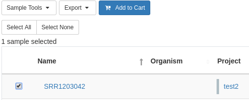
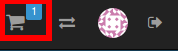
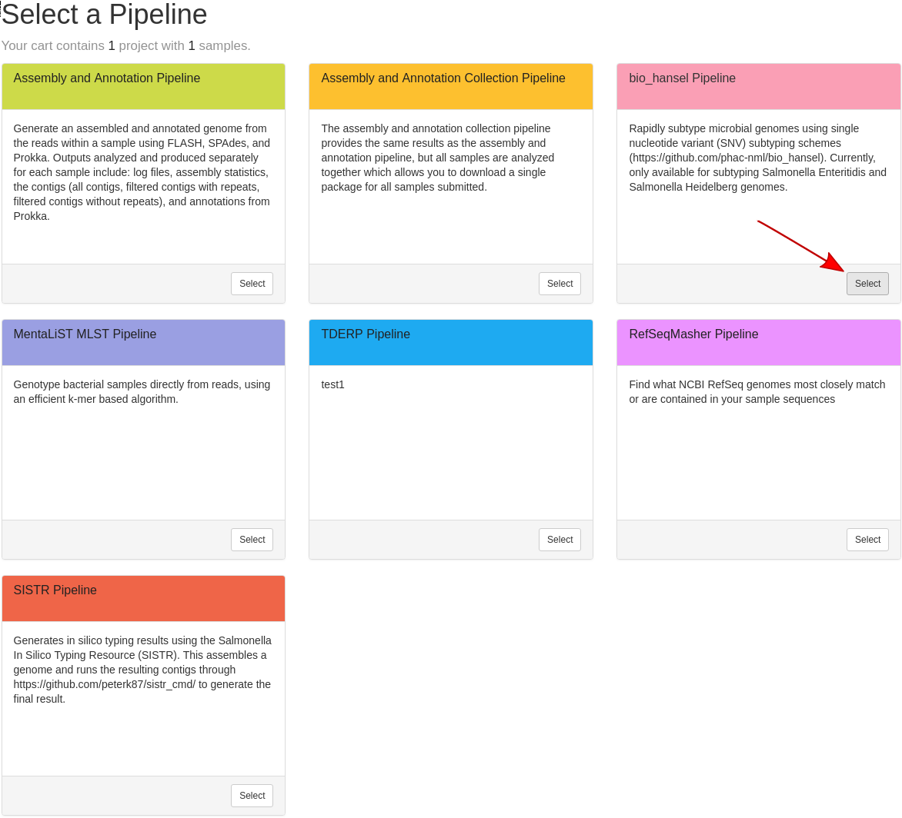
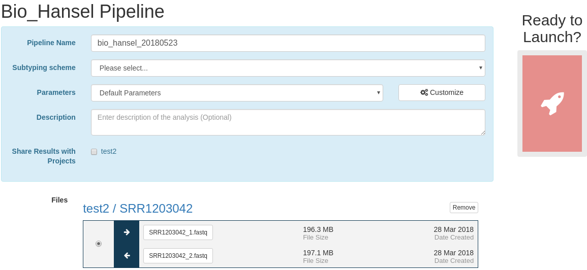
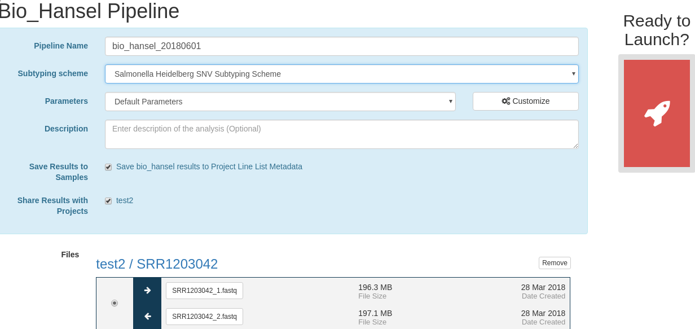
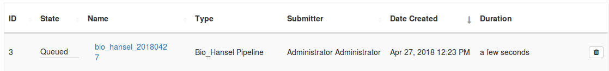
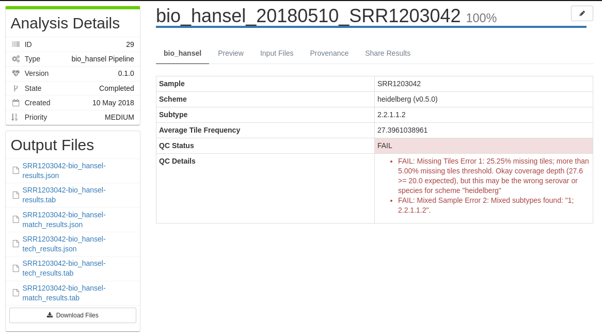
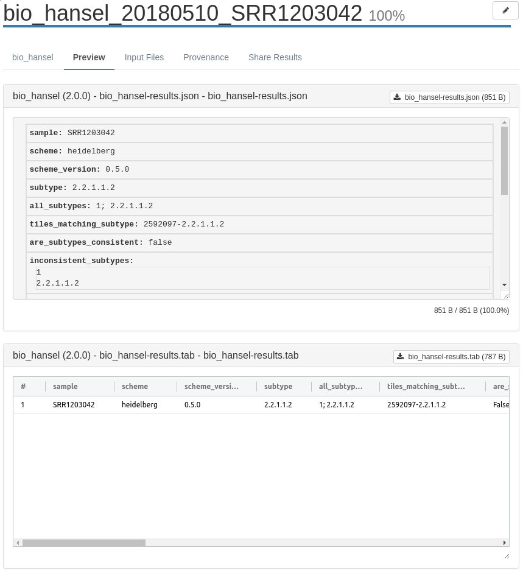
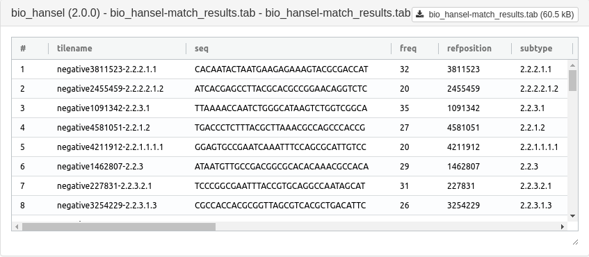
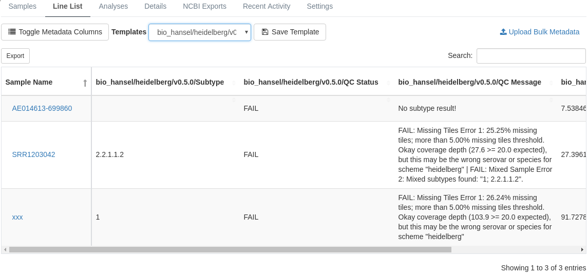

Subtyping *Salmonella* data with biohansel
============================================
This is a quick tutorial on how to use IRIDA to analyze data with the biohansel pipeline.

Tutorial Data
=============

The data for this tutorial comes from the EMBL-EBI ENA sequencing run sample [SRR1203042] (please download the [forward reads] and [reverse reads]). 

It is assumed the [forward reads] and [reverse reads] in `fastq.gz` format have been uploaded into an appropriate sample as described in the [Web Upload Tutorial]. 

Adding Samples to the Cart
==========================

Before a pipeline can be run a set of samples and sequence read data must be selected and added to the cart. For this tutorial please select the single sample and click the **Add to Cart** button.

Once the desired samples have been added to the cart, click the **Cart** button at the top navigation bar:

Selecting a Pipeline
====================

Once inside the cart, the **Select a Pipeline** button can be used to select a pipeline to run on the selected samples.

For this tutorial, we will select the **biohansel Pipeline**: 

Selecting Parameters
====================

Once the pipeline is selected, the next page provides an overview of all the input files, as well as the option to modify parameters. You will be required to **select a SNV subtyping scheme** to use for your analysis.

Please select the **Salmonella Heidelberg SNV Subtyping Scheme** and ensure that the **Save bio_hansel results to Project Line List Metadata** checkbox is checked:

You can leave the other parameters unmodified. Please use the **Ready to Launch?** button to start the pipeline.

Once the button is selected you should see a screen showing that your pipeline has been launched.

Monitoring Pipeline Status
==========================

To monitor the status of the launched pipeline, please select the **Analysis > Your Analyses** menu.

The will bring you to a page where you can monitor the status of each launched workflow.

Clicking the pipeline name will bring you to a page for that analysis pipeline. 

Viewing Individual Sample Results
=================================

Once the pipeline is complete, you will be able to view the `biohansel` pipeline results and download the output files of the analysis.

You can view the `biohansel` analysis output files:

You can view the detailed `biohansel` match results in a tabular view:

Viewing Results For Multiple Samples
====================================

If you had checked the **Save biohansel results to Project Line List Metadata** checkbox on the `biohansel` pipeline launch page, you will be able to view the results of your analyses in the **Line List** table on the **Project** page:

Interpreting the Results
========================

For more information on interpreting your `biohansel` results, please see:

- the [IRIDA biohansel Documentation][docs] or 
- the [biohansel GitHub] page.

[SRR1203042]: https://www.ebi.ac.uk/ena/data/view/SRR1203042&display=html
[forward reads]: ftp://ftp.sra.ebi.ac.uk/vol1/fastq/SRR120/002/SRR1203042/SRR1203042_1.fastq.gz
[reverse reads]: ftp://ftp.sra.ebi.ac.uk/vol1/fastq/SRR120/002/SRR1203042/SRR1203042_2.fastq.gz
[Web Upload Tutorial]: ../web-upload/
[docs]: ../../user/biohansel/
[biohansel GitHub]: https://github.com/phac-nml/biohansel
