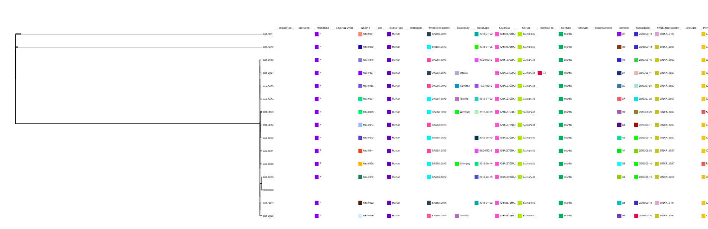
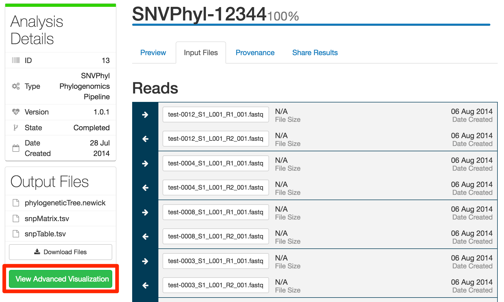
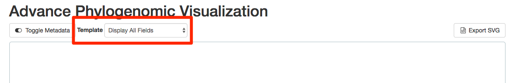
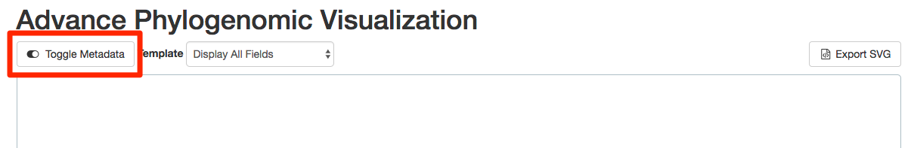
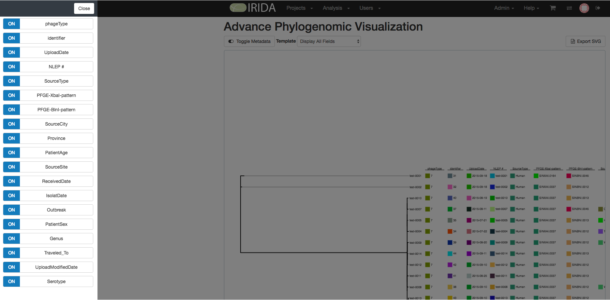
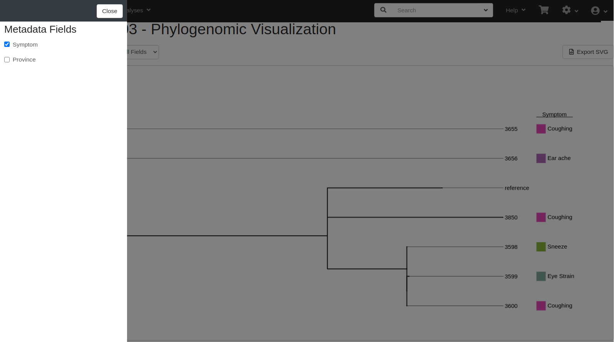
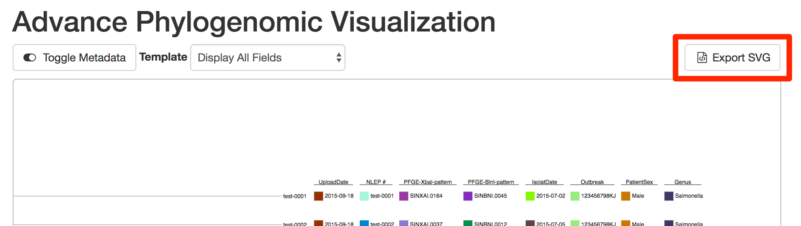

IRIDA Analysis Visualizations
=============================
{:.no_toc}

IRIDA has a set of integrated visualization tools that allow for a more thorough analyses of pipeline results.

### Phylogenetic Tree Visualization

Phylogenetic trees created by the SNVPhyl Analysis Pipeline are combined with metadata from the samples in the analysis to display the metadata beside the tree leaves.

Sample metadata can be added to the sample using the sample metadata uploader (see [Sample Metadata](../sample-metadata) for how to import).

To get to the advanced visualization page, on the analysis page, click the `View Advanced Visualization` button on the `Phylogenetic Tree` tab:

#### Using Sample Metadata Field Templates

[Sample Metadata Templates](../sample-metadata-templates/) can be used to update which metadata fields are displayed in the visualization.  When the page is loaded the default template is presented, all metadata fields are shown.  A different template can be selected from the template selection as demonstrated below.  This will update the view with the desired metadata fields in the proper order.

#### Toggling Sample Metadata Fields

Individual Metadata Fields can be displayed or hidden by clicking `Toggle Metadata` button, which will open a side panel displaying a list of metadata fields with checkboxes to make them visible or hidden.  

Individual metadata field by clicking on the field label in the side panel.

After unchecking the checkbox next to 'Province' the metadata column is removed from the image.

#### Export to SVG

To export a copy of the visualization into SVG format, simply click on the `Export SVG` button in the upper right.

This svg file can be opened in most external imaging software (except Adobe Illustrator for Mac).