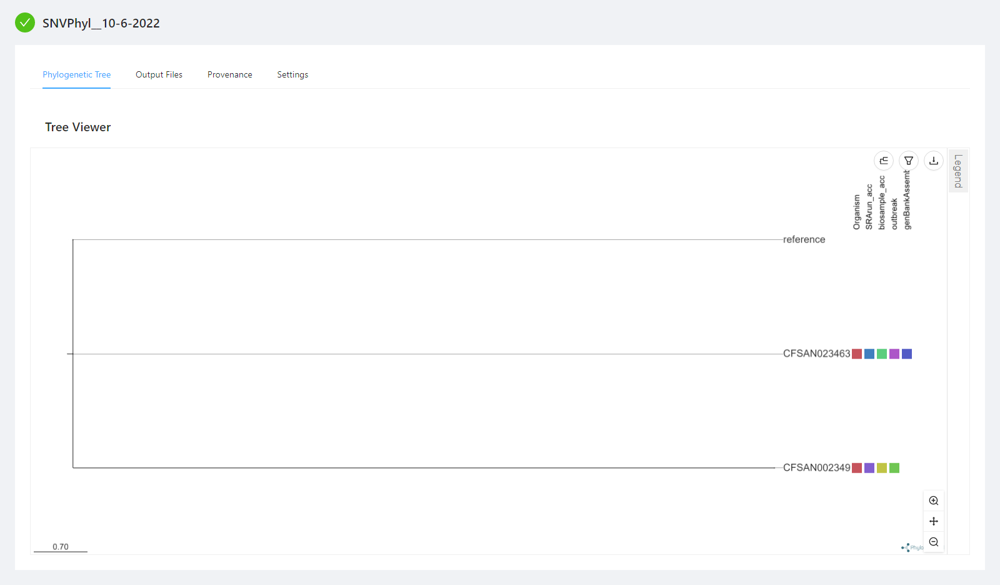
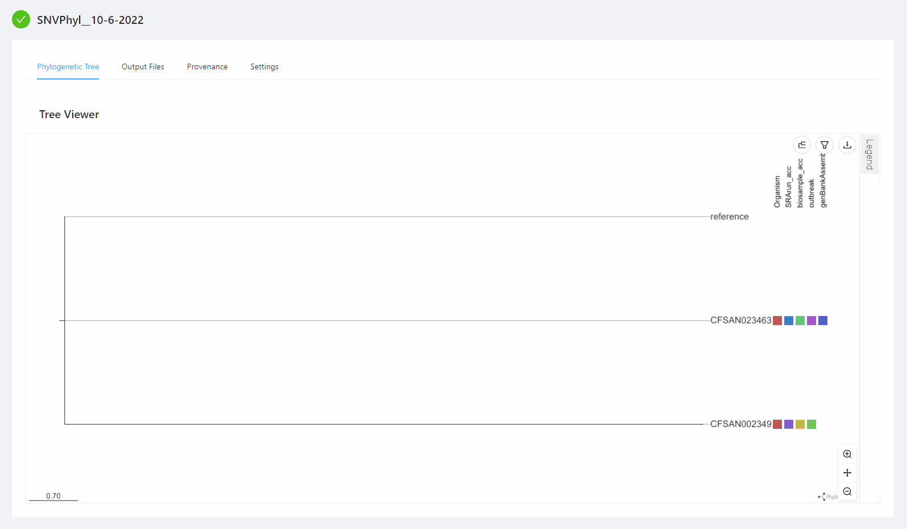
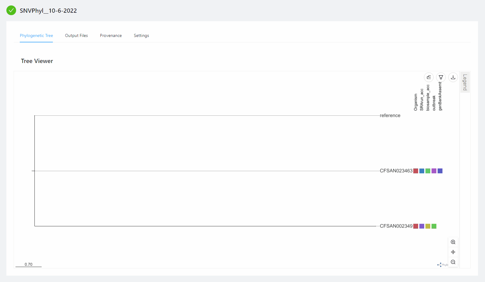
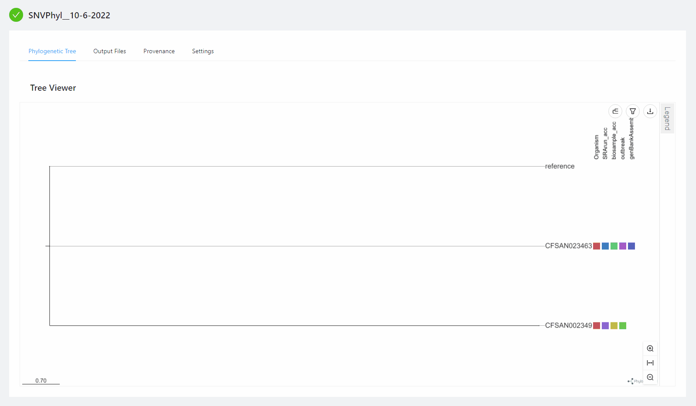
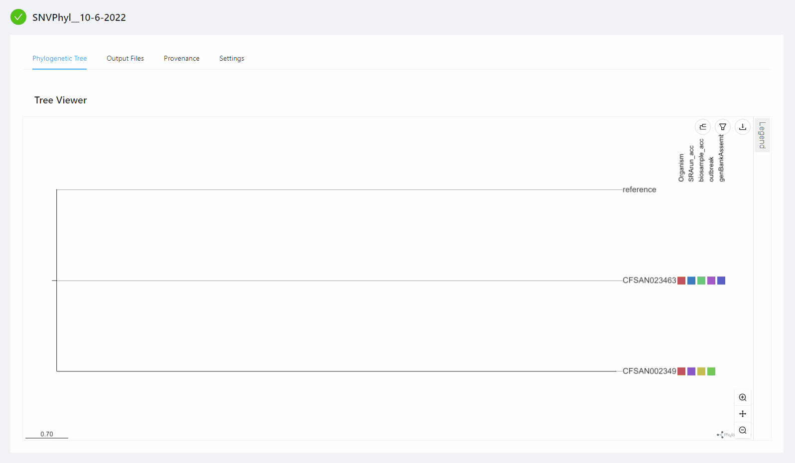
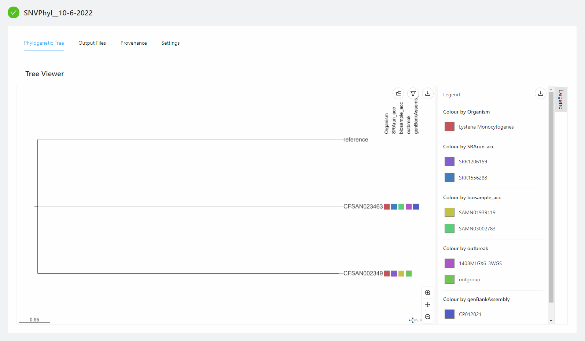
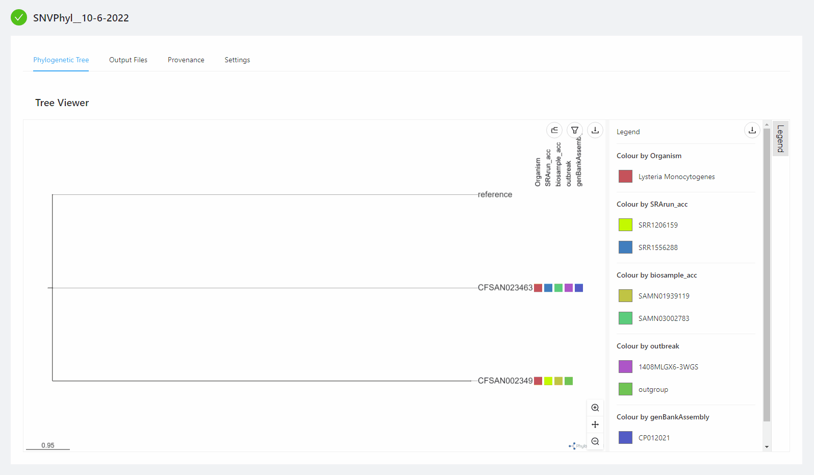

IRIDA Analysis Visualizations
=============================
{:.no_toc}

IRIDA has a set of integrated visualization tools that allow for a more thorough analyses of pipeline results.

## Phylogenetic Tree Visualization

Phylogenetic trees produced by analysis pipelines, for example SNVPhyl, are displayed on the analysis page in the "Phylogentic Tree" Tab. Sample metadata can be displayed concurrently with the tree and can be toggled on or off (either on a field or metadata template basis).

If you want to display additional metadata, first upload it using the sample metadata uploader (see [Sample Metadata](../sample-metadata) for how to import) or by clicking the sample name in the "Settings" -> "Samples" tab and going to the "Metadata" tab.

### Tree Menu Option (at top right of tree area)
#### Toggling Tree Types

The phylogenetic tree viewer can display five types of trees:

1. Circular
1. Diagonal
1. Hierarchical
1. Radial
1. Rectangular (default)

You can change the tree shape by clicking on the tree shape menu icon () at the top right corner of the tree area.  A drop down menu will appear allowing you to select the desired tree shape.

#### Toggling Metadata Fields

To toggle metadata fields click the filter menu icon () at the top right corner of the tree area. A drop down menu will be appear displaying:
1. Metadata Template selection
1. Select all switch
1. List of checkboxes for all metadata fields associated with samples in the analysis

##### Toggling Individual Fields

You can toggle the visibility of all metadata fields by clicking on the switch to the right of the "Select all". 

Individual fields can have their visibility toggled based on their checkbox. A single field can be made visible by clicking the "Only" button, which is only visible when hovering over a single metadata field in the dropdown.

##### Using Metadata Templates

In addition to being able to toggle individual metadata fields, a [Sample Metadata Templates](../sample-metadata-templates/) can be selected in the dropdown, which will make only the fields present in that template visible. By default, all fields are displayed.

#### Export to newick, PNG or SVG format

To export a copy of the tree in newick, PNG or SVG format, click on the download menu icon () at the top right corner of the tree area.  The resulting dropdown will allow you to select the type of export you want.

### Tree Zoom Menu (at bottom right of tree ares)

#### Default Zoom

Default zoom allows you to increase or decrease the magnification of the whole tree (similar to zooming on Google Maps).

#### Branch Zoom

Branch zoom compresses or expands the length of the branches.

#### Step Zoom

Step zoom increases or decreases the distance between branches.

### Legend

The legend can be displayed by clicking on the Legend button to the right of the tree.  This displays the **visible** metadata fields and the colour of each value for that field (more on this below), for example in the preceding gif the "Lysteria Monocytogenes" is the only value for the "Organism" field and has the same colour in both locations on the tree.  The legend can be expanded by dragging from the edge where the legend meets the tree, and click and draged.

Colours for each metadata field value can be modified by clicking on the colour box next to the field value.  This opens a colour selector where fine grain control of the colour can be selected.

An SVG version of each Legend Metadata section can be downloaded by clicking on the download menu icon within the Legend area. Within the dropdown you can select which Legend section to download.