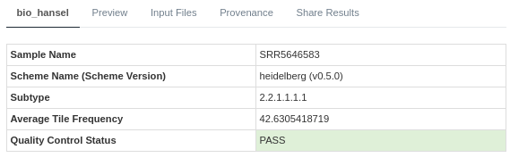
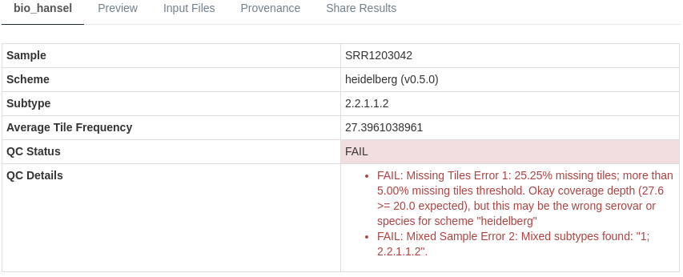

# About the [bio_hansel] Pipeline

## Overview

The [bio_hansel] IRIDA pipeline enables rapid SNV-based subtyping of microbial organisms.
It currently comes with two tested and validated schemes for: 

- *Salmonella enterica* subsp. enterica serovar Heidelberg 
- *Salmonella enterica* subsp. enterica serovar Enteritidis 

Based on the combination of SNV targeting k-mers present within an whole-genome sequencing (WGS) sample, `bio_hansel` is able to assign a hierarchical subtype, which can inform the user of the phylogentically derived subtype that a sample belongs to and what other subtypes it may be related to.

In addition to assignment of a subtype to a WGS sample, `bio_hansel` performs several quality control (QC) checks to help give you confidence in the results are obtaining. 

## Running the [bio_hansel] Pipeline

For details on running [bio_hansel] please see the [IRIDA bio_hansel tutorial][tutorial]. 

## bio_hansel Results

### Example QC Passing Results

Here is an example of the `bio_hansel` results page in IRIDA after analysis of an NCBI/ENA SRA sample [SRR5646583].

What the results mean:

* **Sample**: The name of the sample used within this analysis.
  - e.g. [SRR5646583] is the sample name.
* **Scheme**: The name and version of the SNV subtyping scheme used in the analysis.
  - e.g. `heidelberg` is the name of the scheme and `v0.5.0` is the version number.
* **Subtype**: The hierarchical subtype predicted by `bio_hansel` for the selected SNV subtyping scheme.
  - e.g. `2.2.1.1.1.1` is the subtype of [SRR5646583].
* **Average Tile Frequency**: How often are the nucleotide tiles (k-mers) observed on average?
  - e.g. the tiles are observed on average 42.6X in the sample. 
* **QC Status**: QC of the results will produce a `PASS`, `WARNING` or `FAIL`.
  - e.g. we have a QC `PASS` for sample [SRR5646583]

### Example QC Failing Results

Here is an example of the `bio_hansel` results page in IRIDA after analysis of an NCBI/ENA SRA sample [SRR1203042].

What the results mean:

* **Sample**: The name of the sample used within this analysis.
  - e.g. [SRR1203042] is the sample name.
* **Scheme**: The name and version of the SNV subtyping scheme used in the analysis.
  - e.g. `heidelberg` is the name of the scheme and `v0.5.0` is the version number.
* **Subtype**: The hierarchical subtype predicted by `bio_hansel` for the selected SNV subtyping scheme.
  - e.g. `2.2.1.1.2` is the subtype of [SRR1203042].
* **Average Tile Frequency**: How often are the nucleotide tiles (k-mers) observed on average?
  - e.g. the tiles are observed on average 27.4X in the sample. 
* **QC Status**: QC of the results will produce a `PASS`, `WARNING` or `FAIL`.
  - e.g. we have a QC `FAIL` for sample [SRR1203042]
* **QC Details**:  Why did we get a QC `WARNING` or `FAIL`?
  - e.g. we got a QC `FAIL` due to multiple reasons: too many missing tiles and a potentially mixed sample due to observing multiple incompatible subtypes.

[SRR5646583]: https://www.ebi.ac.uk/ena/data/view/SRR5646583&display=html
[SRR1203042]: https://www.ebi.ac.uk/ena/data/view/SRR1203042&display=html
[bio_hansel]: https://github.com/phac-nml/bio_hansel
[tutorial]: ../../tutorials/bio_hansel/
