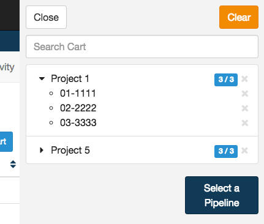
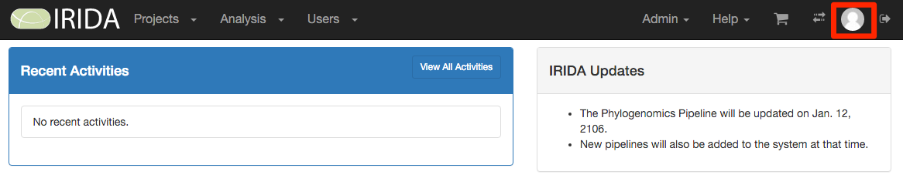
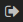

IRIDA Dashboard Overview
========================
{:.no_toc}

The IRIDA dashboard is the main location for accessing all of the data management and pipeline execution functionality built into IRIDA. This document describes the general features of the IRIDA dashboard.

* this comment becomes the TOC
{:toc}

Main Dashboard
--------------

The main IRIDA dashboard has several different areas:

* The [main menu](#main-menu), for accessing and managing data and pipelines,
* The [cart](#cart), for data selections,
* The [settings](#settings) menu,
* The [logout](#logout) button, and
* The [recent activities](#recent-activities) section.

Main Menu
---------

The main menu area is at the top, left-hand side of the IRIDA dashboard:

### Projects

From the main menu, you can click on the "Projects" button to access all projects that you are permitted to view or modify. You may also create a new project by clicking on "Projects", then "Create New Project".

For more information about managing your projects, please see the [managing projects](../project) section.

### Pipelines

You can view the pipelines that are installed in IRIDA by clicking on the "Pipelines" button.

For more information about running pipelines, please see the [launching pipelines](../pipeline) section.

### Analyses

After you've launched a pipeline, you can monitor its progress and view results by clicking on the "Analyses" button.

For more information about viewing pipeline results and working with analysis, please see the [viewing pipeline results](../analysis) section.

Cart
----

The cart is a temporary area to keep a collection of samples that you intend to submit for use in a pipeline execution. The dashboard provides a quick summary of the contents of your cart on the top, right-hand corner of the page:

You can click on the cart button to reveal more information about the contents of your cart:

For more information about using the cart, please see the [launching pipelines](../pipeline) section, and the [managing samples](../samples) section.

Settings
--------

The settings menu allows you to view and edit the details of your own user account. You can find the settings menu in the top, right-hand corner of the page:

User accounts with the administrator role can also use the settings menu to add and remove software client details from IRIDA. For more information about managing clients in IRIDA, please see the [managing system clients](../../administrator/#managing-system-clients) section in the [administrator guide](../../administrator).

Logout
------

Once you've finished working with IRIDA, we strongly recommend that you log out, especially if you are using a shared computer.

You can log out of IRIDA by clicking on the  in the top, right-hand corner of the page:

Recent Activities
-----------------

The recent activities panel appears in the middle of the dashboard:

The recent activities section will show you things like:

* Users being added or removed from project access,
* Samples being added to projects.

All activities in the recent activities section will link to the project or user account that has been modified by the activity.
