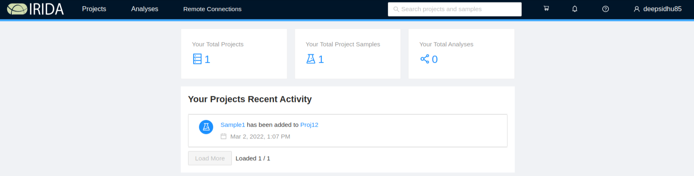
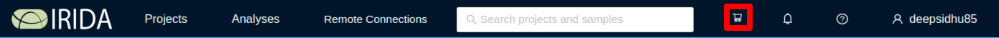
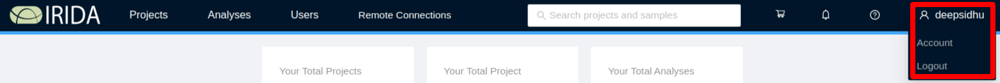

IRIDA Dashboard Overview
========================
{:.no_toc}

The IRIDA dashboard is the main location for accessing all of the data management and pipeline execution functionality built into IRIDA. This document describes the general features of the IRIDA dashboard.

* this comment becomes the TOC
{:toc}

Main Dashboard
--------------

The main IRIDA dashboard has several different areas:

* The [main menu](#main-menu), for accessing and managing data and pipelines,
* The [cart](#cart), for data selections,
* The [user settings](#user-settings) menu,
* The [logout](#logout) button,
* The [recent activities](#recent-activities) section, and
* The [updates](#updates-announcements) section.

Main Menu
---------

The main menu area is at the top, left-hand side of the IRIDA dashboard:

### Projects

From the main menu, you can click on the "Projects" button to access all projects that you are permitted to view or modify. You may also create a new project by clicking on "Projects", then "Create New Project".

For more information about managing your projects, please see the [managing projects](../project) section.

### Analyses

The analyses menu displays information about analysis pipelines available in IRIDA and links to how to monitory your running pipelines.

#### Pipelines
{:.no_toc}

You can view the pipelines that are installed in IRIDA by clicking on the "Pipelines" button.

For more information about running pipelines, please see the [launching pipelines](../pipelines) section.

#### Your Analyses
{:.no_toc}

After you've launched a pipeline, you can monitor its progress and view results by clicking on the "Analyses" button.

For more information about viewing pipeline results and working with analysis, please see the [viewing pipeline results](../pipelines/#viewing-pipeline-results) section.

Search
------

IRIDA's global search panel can be found in the middle of the navigation bar at the top of the application.  This search can be used from anywhere in the application to search for your projects and samples in the system.  To search, simply type a few character of the project or sample name you're looking for and press `Enter`.

After completing your search, you'll be taken to the *search results* page which will display all *projects* and *samples* which match your search query.  The initial results displayed will be *samples*.

To view *projects* matching your search result, click the `Projects` tab.

Cart
----

The cart is a temporary area to keep a collection of samples that you intend to submit for use in a pipeline execution. The dashboard provides access to your cart on the top, right-hand corner of the page:

For more information about using the cart, please see the [launching pipelines](../pipelines) section, and the [managing samples](../samples) section.

Settings
--------

The <i class="fa fa-cog"></i> menu allows you to manage a number of settings for IRIDA.

### Groups

From the main menu, you can click on the "Groups" link to view the groups available on the system.  You may create a new user group by clicking on "Create Group".

For more information about managing user groups, please see the [managing user groups](../user-groups) section.

### Remote instances of IRIDA

Remote instances of IRIDA can be used as data sources for associated projects and workflows.  The "Remote IRIDA Connections" section allows users to connect to remote instances of IRIDA.  

**Note**: You must have been provided with a username and password for a remote instance of IRIDA before you can use the data located on that instance.

Administrators can add or remove available remote instances of IRIDA from this menu.  Details can be found in the [administrator guide](../../administrator/#managing-remote-irida-connections).

#### Connecting to remote instances of IRIDA
{:.no_toc}

The Remote Connections list will show you all configured remote instances of IRIDA.  To connect, click the "Connect" button next to the right of the connection status.

If you have never connected to the remote IRIDA instance before, or your login has expired, you will be shown a login window for the remote site.  Enter your login credentials for that site.  The username and password that you use to connect to a remote instance of IRIDA are different than the username and password that you used to log in to the local site.

You will be shown an authorization page.  Read the details and click "Authorize" to connect to the API.

You will be shown a confirmation and your browser will reload the current page.  You should now be connected to the remote installation.

User Settings
-------------

The settings menu allows you to view and edit the details of your own user account. This menu also allows you to update your email subscription preferences.  You can find the settings menu in the top, right-hand corner of the page, if you have a [Gravatar](https://en.gravatar.com/) account associated with your email in IRIDA, your gravatar will be displayed:

For more information about the user settings page, see the [user settings page](user.html).

### Logout

Once you've finished working with IRIDA, we strongly recommend that you log out, especially if you are using a shared computer.

You can log out of IRIDA by clicking on the user settings menu in the top, right-hand corner of the page, and *Logout*.

Recent Activities
-----------------

The recent activities panel appears on the left panel of the dashboard:

The recent activities section will show you things like:

* Users being added or removed from project access,
* Samples being added to projects.

All activities in the recent activities section will link to the project or user account that has been modified by the activity.

Updates-Announcements
---------------------

Updates to the IRIDA Platform will be announced on the right side of the dashboard.

The platform announcements section will show you things like:

* When scheduled downtime will happen.
* Recently added features or bug fixes.
* Other platform announcements.

To dismiss an announcements/mark it as read, click the check mark button to the right of the announcement:

If you accidentally marked an announcement as read and want to see it again, or if you would like to view *all* announcements you have marked, click the `View Read Announcements` button:

This will bring you to the `Read Announcements` page, which will show you all announcements you have marked as read. 

<a href="../login/">Previous: Logging in</a><a href="../user-groups/" style="float: right;">Next: Managing user groups</a>
