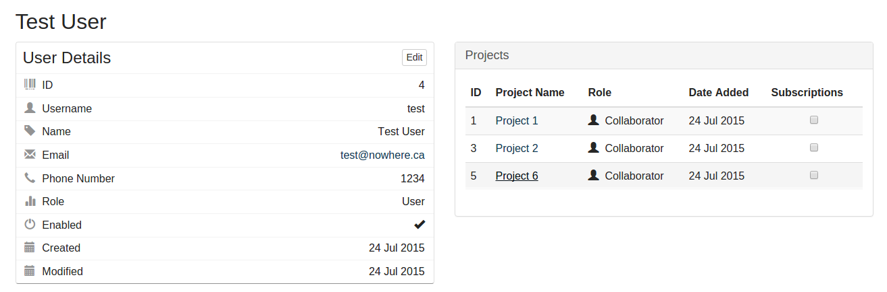
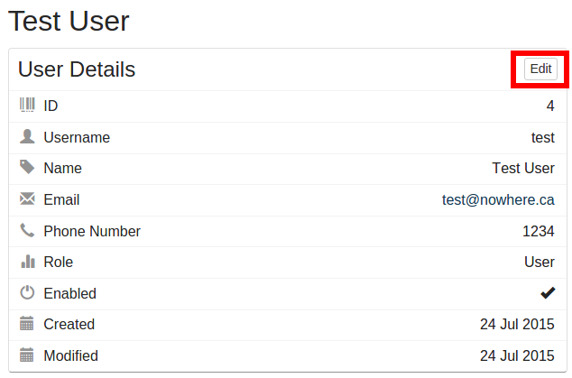
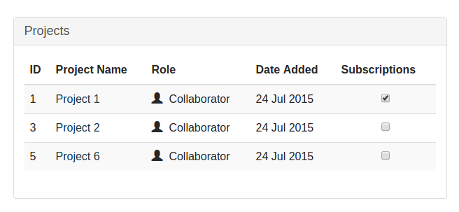

User Settings
========================
{:.no_toc}

The user settings page allows you to view and update your user details, view details about which projects you are on, and manage your email subscriptions.

* this comment becomes the TOC
{:toc}

User Details
------------

The user details section displays all of your current system settings.  Many of these settings can be updated by clicking the "Edit" button.

Projects
---------------------
The projects section displays which projects you are a part of and what your role is on those projects.  You can also manange which projects you receive activity updates for in this section.

To subscribe to a project, click the checkbox beside the project name.  By subscribing to a project, you will receive daily email updates about what activities have occurred on the project.  

__Note:__  If no activities occur on any of your projects in 24 hours, you will not receive an email update.