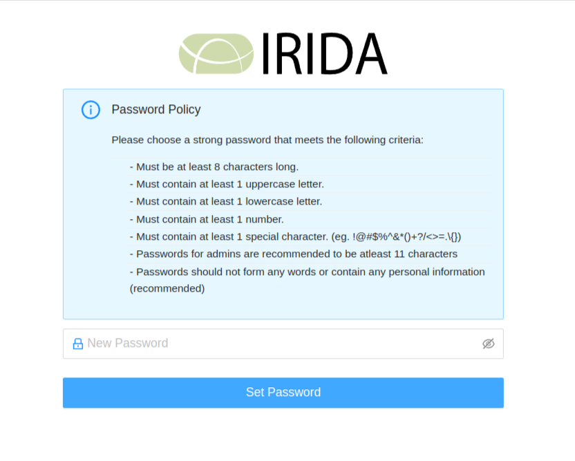
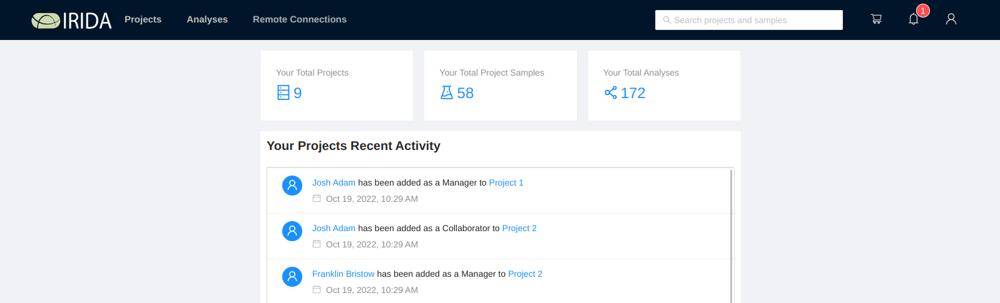
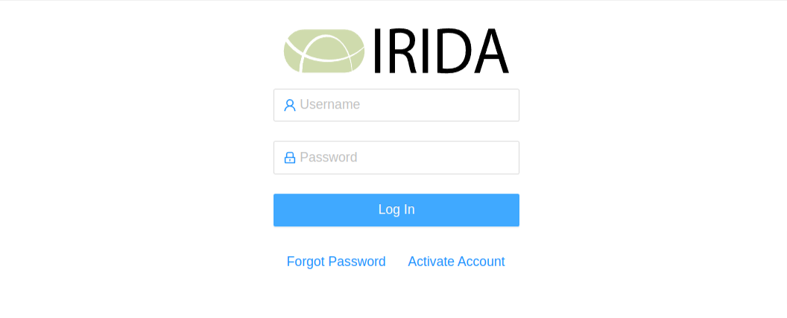
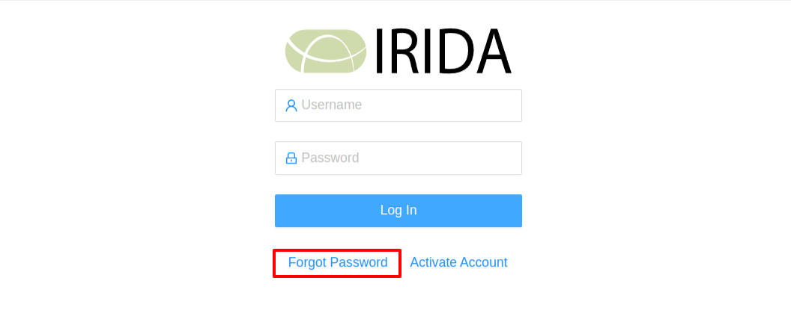
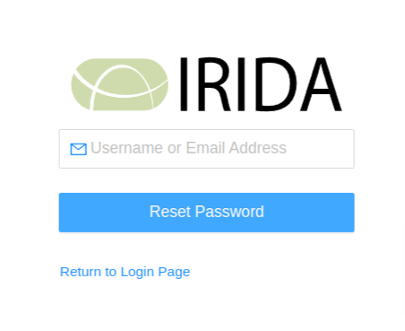

Logging in to IRIDA
===================
{:.no_toc}

After an administrator or manager has created a user account for you in IRIDA, you'll be able to log in.

* This comment becomes the TOC
{:toc}

Logging in for the first time
-----------------------------

After a manager or administrator has created a user account for you, you'll receive an e-mail with instructions about how to access IRIDA:

To log in to IRIDA for the first time, click on the "Activate Account" link.

The first thing that you're required to do when you access IRIDA is to create a password for your account:

As in the [system introduction](..), passwords must:



After you enter a new password you should see a success message with a link to return to IRIDA:

Clicking on the `Return to IRIDA` link should take you to the dashboard

Once you've logged in, you can proceed to the [dashboard overview](../dashboard) page.

Logging in after your first login
---------------------------------

Logging in after you have created a password is simple. Navigate to the IRIDA URL provided in your welcome e-mail (you should bookmark this URL!):

Enter the username provided in the e-mail and the password you selected the first time you logged in. After logging in you will be automatically directed to the main IRIDA dashboard:

Once you've logged in, you can proceed to the [dashboard overview](../dashboard) page.

Resetting your password
-----------------------

If you have forgotten your IRIDA password, you can have IRIDA reset your password. From the login page, click on the "Forgot Password" link:

You will be required to enter either the username or e-mail address associated with your IRIDA account:

Enter your e-mail address and click the "Reset Password" button. You will then see a confirmation that your password reset request has been e-mailed to you, so check your inbox. When the e-mail arrives, you can click on the "Create New Password" link:

You can then change your password:

As in the [system overview](../system-overview), passwords must:



After you enter a new password you should automatically be redirected to the main IRIDA dashboard:

Once you've logged in, you can proceed to the [dashboard overview](../dashboard) page.

<a href="../system-overview/">Previous: System Overview</a><a href="../dashboard/" style="float: right;">Next: Dashboard Overview</a>

Activating account
------------------

If for some reason the `Activate Account` link in the email does not work, then you can click on the `Activate Account` link on the IRIDA login page (IRIDA URL provided in your welcome e-mail).

Enter the Activation ID provided in the email

Once you have entered your Activation ID and click the `Reset Password` button, you will be redirected to set your password

