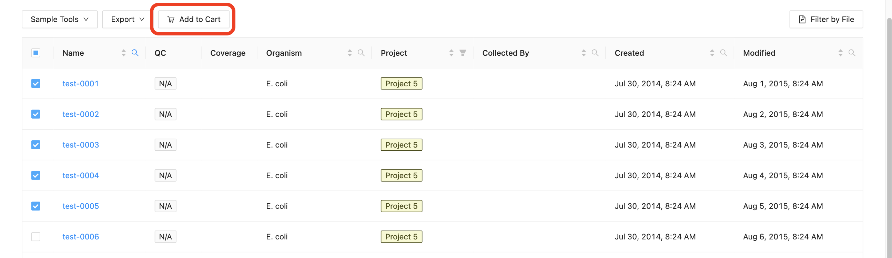
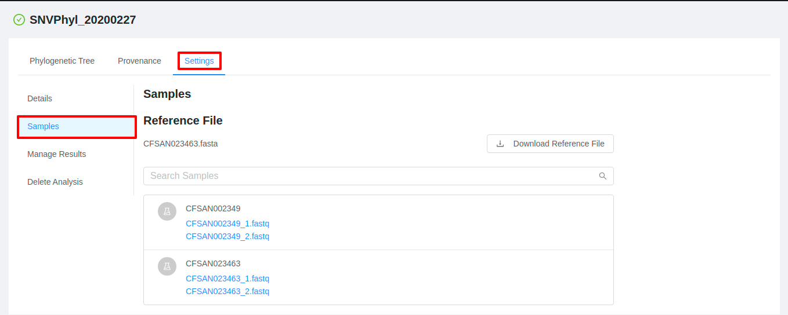
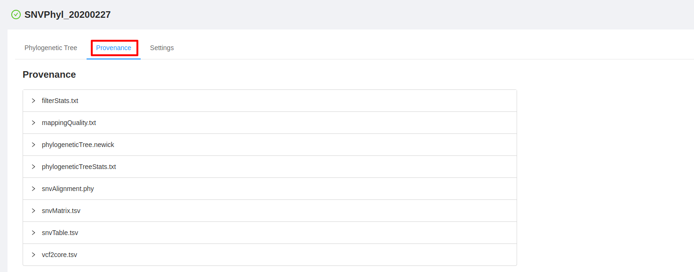

Launching Pipelines
===================
{:.no_toc}

IRIDA provides multiple analysis pipelines for analysing your sequencing data.  These pipelines take as input a set of sequencing read files from different samples. The samples must first be added to a cart before a pipeline can be run.

* this comment becomes the toc
{:toc}

Adding samples to the cart
--------------------------

The cart is a place where you can temporarily store a selection of samples from across multiple projects for submission to a pipeline for analysis.

The cart is initially empty. You can add samples to your cart by navigating to the [samples list for a project](../samples/#viewing-samples-in-a-project) and [selecting the samples that you want to add](../samples/#selecting-samples). Once you've selected the samples that you want to add, click on the "Add to Cart" button, just above the samples list:

Once you’ve added some samples to the cart, if you click the `Cart` button on the main navigation, you will be taken to the cart page.

You can remove individual samples or all selected samples from a project by clicking on the sample menu icon:

 
 
And either selecting “Remove Sample” which will remove just a single sample or “Remove Project” which will remove all samples that belong to the same project. You can also empty the cart entirely by clicking on the “Empty” button, in the top, right-hand corner of the cart.

Searching samples in the cart
-----------------------------

You can search for individual samples within the cart use the 'cart search' field.

Search terms can match partial samples names.

Selecting a pipeline
--------------------

The default cart page will allow you to choose from the pipelines that are currently configured in IRIDA.  If you are not on the pipelines page, select the "Pipelines" menu from the top of the section:

Click on the "Select" button at the bottom, right-hand side of the pipeline that you'd like to launch.

Running a pipeline
------------------

**Note**: Some pipelines will require a reference sequence:

If you have the  **Manager** role on a project, you can [add a reference file to the project](../project/#reference-files). Reference files added to a project can be shared with all other project members.

If you do not have the  **Manager** role on a project, or you would just like to upload a reference file for *this* pipeline, you can add a new reference file to the analysis by clicking on the " Upload New" button. If you upload a reference to the analysis instead of the project, no other users will be able to see or use the file you've uploaded.

When you select a pipeline that doesn't require a reference file (or you've already [uploaded one](../project/#reference-files)), you will be presented with a list of the samples that you've selected for analysis in the pipeline:

### Removing samples from a pipeline submission

You can remove a sample from a pipeline submission by clicking on the "Remove" button on the right-hand side of the sample:

### Multiple filesets per sample

If a sample has been sequenced multiple times (a top-up run, for example), the pipeline submission page will display multiple filesets for that sample:

You may only select one fileset for submission to the pipeline for analysis. You can select the fileset that you want to submit to the pipeline for analysis using the radio buttons on the left-hand side of the sample fileset display:

Modifying pipeline parameters
-----------------------------

IRIDA has pre-defined some default values for pipeline submissions, but you may change the default parameters for your analysis by clicking on the "Customize" button on the right-hand side of the parameters drop-down at the top of the pipeline submission page:

The dialog window that appears will allow you to change the parameters for the pipeline execution:

If you would like to reset a value that you modified back to the default value, click on the "Use Default" button on the right-hand side of the paramater:

<blockquote>

<b>Note</b>: customized pipeline parameters are not validated, please ensure that the values you are entering are valid for the parameter that you are modifying.

</blockquote>

When you've finished customizing the pipeline parameters, you can click on the "Use these Parameters" button to return to the pipeline submission page.

### Saving pipeline parameters

You may save the [parameters that you modified](#modifying-pipeline-parameters) by clicking on the "Save these parameters for later?" checkbox at the bottom of the parameters dialog:

You should provide a name for the pipeline parameters that reflects the modifications that you've made to the parameters. When you've entered the name for the parameter set, you can click on the "Use these Parameters" button at the bottom of the parameter modification dialog to return to the pipeline submission page.

### Using pre-saved pipeline parameters

Parameter sets that [have been saved](#saving-pipeline-parameters) can be used on subsequent executions of the pipeline by using the parameters drop-down, just below the pipeline name:

Running the pipeline
--------------------

Once you've [selected the files](#multiple-filesets-per-sample) and [selected](#using-pre-saved-pipeline-parameters) or [customized](#modifying-pipeline-parameters) the parameters, you can submit the pipeline for execution by clicking on the rocket ship button on the right-hand side of the page:

Your pipeline submission will be prepared and launched, and you will see a confirmation dialog:

You can [monitor pipeline progress](#monitoring-pipeline-progress) by clicking on the "Let's see how this pipeline is doing" button, or you can empty your cart and start again by clicking on the "Let the pipeline run!" button.

Monitoring pipeline progress
----------------------------

Once you've [launched a pipeline](#launching-pipelines), you can monitor the overall progress of the pipeline by clicking on the "Analyses" tab at the top of the [dashboard](../dashboard):

The analysis overview list will show the current progress of all running and completed pipelines that you've submitted for execution:

The "State" column will change over time if you leave your browser window open so you can monitor the progress of your pipeline executions.

Viewing pipeline results
------------------------

You can view or download the outputs of a pipeline execution once a pipeline has completed:

You can either click on the  icon to download *all* of the outputs produced by the pipeline execution, or you can click on the name of the analysis to view more detailed outputs and, if available, view a preview of the outputs:

The analysis details page shows you more detailed information about your pipeline submission, including the names of the files that were produced by the analysis (on the left-hand side of the page), a preview of the outputs (if available), and some tabs to view more details about how the pipeline was submitted:

<figcaption>Example SNVPhyl pipeline phylogenetic tree preview</figcaption>

![view-results-preview-refseq-masher]
<figcaption>Example `refseq_masher` tabular results preview</figcaption>

To download output files, you can use the "Output Files" section from this page.  To download an individual file, click on the file name.  To download *all* the outputs produced by the pipeline, you can click on the "Download Files" button.

### Previewing analysis output files

All analysis pipelines produce analysis output files. You can preview these output files under the **Preview** tab on the **Analysis Details** page:

![view-results-preview-refseq-masher]
<figcaption>Example `refseq_masher` tabular results preview</figcaption>

For each analysis output file, you will see a panel and in each panel you will see:

- a panel heading with the Galaxy tool name (e.g. "RefSeq Masher Matches") and version (e.g. "(0.1.1)"), internal IRIDA output name (e.g. "refseq-masher-matches") and output file name (e.g. "refseq-masher-matches.tsv")
- a file download link
- a preview of the file contents displayed as plain text or in a table

#### Previewing tabular analysis output

Some of the output files will be rendered in a table:

![view-results-tabular-snvphyl-snv-table]
<figcaption>SNVPhyl SNV  results shown in an interactive table.</figcaption>

![view-results-tabular-refseq_masher-contains-default]
<figcaption>`refseq_masher` results shown in an interactive table.</figcaption>

When you scroll to the bottom row in the table, more lines will be fetched as they are needed. You can also resize the table by clicking and dragging the "resize icon"  in the corner of the panel:

![view-results-resize]
<figcaption>
  Click and drag the "resize icon" to resize the table. 
</figcaption>

![view-results-refseq_masher-contains-resized]
<figcaption>Resized `refseq_masher` results table</figcaption>

#### Default plain text preview of analysis output

Analysis output files with file extensions like `.log`, `.txt` or `.fasta` can be previewed in the browser as plain text:

![view-results-plain-text-snvphyl-mapping]

If an analysis output file is small enough like this log file, it will be loaded in its entirety:

![view-results-plain-text-shovill-log]
<figcaption>Notice that the `4.0 kB / 4.0 kB (100%)` indicates that 100% of the file has been loaded.</figcaption>

If an analysis output file is fairly large like this FASTA file, it will be loaded in chunks as needed for viewing:

![view-results-plain-text-shovill-fasta]
<figcaption>Notice that the `24.0 kB / 693.9 kB (3.5%)` indicates that only 3.5% of the file has been loaded into this view. Scrolling to the end will trigger loading of the next chunk of this file into the view!</figcaption>

### Viewing the sequencing data submitted for analysis

To view the data that was submitted to the pipeline for analysis, start from the [analysis details page](#viewing-pipeline-results) and click on the "Input Files" tab:

The pipeline input files page shows all of the files that were submitted for analysis in the pipeline submission:

You can view more details about each of the files that were submitted in the pipeline submission by clicking on the names of the files. This provides you a quick way to view the file details, including quality control measurements provided by [FastQC](http://www.bioinformatics.babraham.ac.uk/projects/fastqc/).

### Viewing pipeline parameters used at runtime

To view the parameters that were used when submitting the pipeline, start from the [analysis details page](#viewing-pipeline-results) and click on the "Provenance" tab:

The provenance page shows a list of the files that were generated as outputs by the pipeline execution:

You can click on each of the file names to expand the complete listing of *how* the file was generated behind the scenes:

You can further inspect the parameters of each of the tools that were used to generate the analysis by clicking on one of the steps:

### Edit analysis name

If you are the user who submitted the pipeline, you are able to change the submission name from the results page.  Click the pencil icon next to the analysis name, enter the new analysis name, and click update.

## Sharing pipeline results

Pipeline results can be shared with projects so that other users on a shared project can view results of the analysis.

### Sharing when launching a pipeline

When launching a pipeline you can select which projects the results should be shared with by selecting them in the `Share Results` section of the pipeline setup.

Note that for a project to be displayed in this list it must have samples being used in the pipeline.

Once the pipeline has been submitted the submission will show up in the analysis listing for the selected projects.  From this page users on the project will be able to monitor the pipeline's progress and view results once they are complete.  For more information on viewing analysis results shared with a project, see the [Managing Projects](../project/#project-analysis-results) page. 

### Share results after pipeline has been launched

Pipeline results can also be shared anytime after a pipeline has been launched.  To view or modify which projects an analysis has been shared with, click the `Share Results` tab on the pipeline results page.

 From this page you will be shown all projects that the pipeline result has been shared with (indicated by a check mark) along with additional projects available for sharing results.  To share or unshare the results with a project, check or uncheck the box next to the project name.

 Note that for a project to be displayed in this list it must contain samples which were used in the analysis.

## Saving pipeline results to a sample

Some pipelines allow you to save data back to the samples in which the pipeline was ran.  The type of data which will be saved back to the samples will differ between pipelines.  For example an assembly and annotation pipeline will save the assembly to the list of files on a sample, whereas a typing pipeline such as SISTR may save a serotype to the metadata of the sample.

To save analysis results back to a sample, on submission of a pipeline please select the `Save Results to Samples` checkbox on the pipeline setup page.

Results can also be saved after a pipeline has completed.  To save analysis results after the pipeline has finished, click the `Share Results` tab on the pipeline results page.  If you are able to save the analysis results back to the sample, a `Save Results` section will be displayed.  Click the button to save the results to the related samples.

## Receive email upon pipeline completion or error

When launching a pipeline you can select the checkbox to receive an email upon pipeline completion or on error.

## Downloading single sample analysis output files in batch

You can download all of your single sample analysis output files in batch by clicking **Analyses>Output Files** in the top navigation bar:

 

You will see a table of your single sample analysis output files:

You can apply filters to any columns by clicking the column menu icon, for example, applying a filter to the `File` column:

Filtering for files with `contigs` in the filename:

You will then see a filter icon displayed beside the column name 

You can select the files you wish to download using the checkboxes or by holding the `Ctrl` or `Shift` keys as you click on the rows for the files you wish to download. 

Or you can click the checkbox in the leftmost column header to select all files displayed:

 

Click **Download** to download. Depending on the number of files you have selected, preparation of the download may take a moment. 

Single files will be downloaded as is, while multiple files will downloaded bundled together in ZIP file. 

 

## Errors when executing pipelines

You may experience an analysis pipeline execution failure caused by an error in one or more tools within a pipeline.

For example, you may encounter an error when running the "Assembly and Annotation" pipeline:

If you click on the  icon, you can preview the Galaxy job error information:

If you follow the link to the analysis page, you can view all the job error information for the pipeline in error:

This information may be helpful for troubleshooting and communicating what went wrong in a particular analysis pipeline.   

<a href="../samples/">Previous: Managing Samples</a>

[view-results-plain-text-shovill-fasta]: images/view-results-plain-text-shovill-fasta.png
[view-results-plain-text-shovill-log]: images/view-results-plain-text-shovill-log.png
[view-results-plain-text-snvphyl-mapping]: images/view-results-plain-text-snvphyl-mapping.png
[view-results-preview-refseq-masher]: images/view-results-preview-refseq-masher.png
[view-results-refseq_masher-contains-resized]: images/view-results-refseq_masher-contains-resized.png
[view-results-tabular-refseq_masher-contains-default]: images/view-results-tabular-refseq_masher-contains-default.png
[view-results-tabular-snvphyl-snv-table]: images/view-results-tabular-snvphyl-snv-table.png
[view-results-resize]: images/view-results-resize.png
