Launching Pipelines
===================
{:.no_toc}

IRIDA provides multiple analysis pipelines for analysing your sequencing data.  These pipelines take as input a set of sequencing read files from different samples. The samples must first be added to a cart before a pipeline can be run.

* this comment becomes the toc
{:toc}

Adding samples to the cart
--------------------------

The cart is a place where you can temporarily store a selection of samples from across multiple projects for submission to a pipeline for analysis.

The cart is initially empty. You can add samples to your cart by navigating to the [samples list for a project](../samples/#viewing-samples-in-a-project) and [selecting the samples that you want to add](../samples/#selecting-samples). Once you've selected the samples that you want to add, click on the "Add to Cart" button, just above the samples list:

Once you’ve added some samples to the cart, if you click the `Cart` button on the main navigation, you will be taken to the cart page.

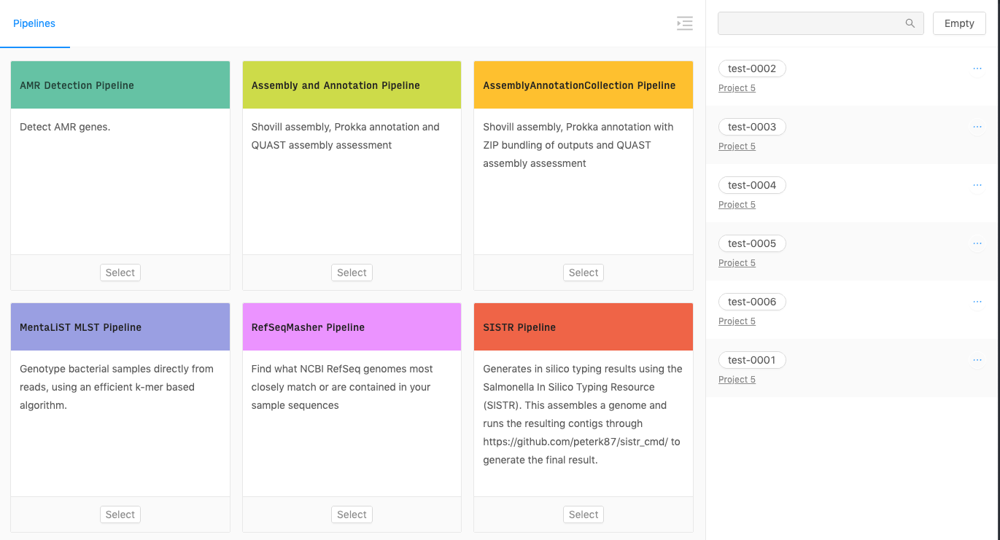

You can remove individual samples or all selected samples from a project by clicking on the sample menu icon:

 
 
And either selecting “Remove Sample” which will remove just a single sample or “Remove Project” which will remove all samples that belong to the same project. You can also empty the cart entirely by clicking on the “Empty” button, in the top, right-hand corner of the cart.

Searching samples in the cart
-----------------------------

You can search for individual samples within the cart use the 'cart search' field.

Search terms can match partial samples names.

Running and Queued Counts
------------

You can get a snapshot of the current state of the analysis server in the page menu bar.  Inside the blue box are the counts for the number of running and queued analyses.  The longer the queue, the longer time it will take to start your analysis.

Selecting a pipeline
--------------------

The default cart page will allow you to choose from the pipelines that are currently configured in IRIDA.  If you are not on the pipelines page, select the "Pipelines" menu from the top of the section:

Click on the "Select" button at the bottom of the pipeline that you'd like to launch.

Running a pipeline
------------------

After selecting a pipeline, you will be sent to the pipeline specific launch page where you can modify the pipeline's general information, parameters, reference file, and have a final look at the files that are going to be used.

1. General Details:

   

    * Pipeline Name: A custom pipeline name can be entered allowing you to easily identify the specific analysis at a later date.  By default, the name is given the pipeline name followed by the date ran (e.g. SNVPhyl__2-15-2021).
    * Pipeline Description: Any custom text can be entered here.
    * Email Pipeline Results: There are three options:
      * No email: don't send any emails about the pipeline outcome (default)
      * On Error: only send an email if the pipeline fails
      * On Completion: Send an email if the pipeline fails or when the pipeline successfully completes running.
  
2. Parameters: parameters used to run the pipeline.

    * There are default sets provided by the pipeline developer as well as any that have been saved.
      

    * Parameters can be modified by clicking on the "Modify" button which will expose all available parameters:
      

   <blockquote>
      
<b>Note</b>: customized pipeline parameters are not validated, please ensure that the values you are entering are valid for the parameter that you are modifying.

   </blockquote>

    * If you modify one of the parameters you will be given the option to save the changes for future use.  In the yellow box, just click the "Save template as" button and you will be asked to enter the name for the parameter set.  Once saved they can be selected in the dropdown above for the current pipeline or any future pipelines.

       

    * Below these parameters are other settings that can be set (but cannot be saved)

3. Share Results:

    * Some pipelines will allow you to share the results back to either the project or sample. Checkbox will be visible here if this option is available on this pipeline

       

4. Reference Files:

   * If the pipeline requires a reference file, you will be prompted to select a reference file from one of the projects that you have access to, or to upload a new one.

       

   * If you have a **Manager** role on a project, you can [add a reference file to the project](../project/#reference-files). Reference files added to a project can be shared with all other project members.
   * If you do not have a **Manager** role on a project, or you would just like to upload a reference file for *this* pipeline, you can add a new reference file to the analysis by clicking on the "Upload Upload" area or dragging a reference file to it. If you upload a reference to the analysis instead of the project, no other users will be able to see or use the file you've uploaded.

   * If there is an error uploading the reference file, you will receive a notification at the top right of the screen explaining the issue encountered (invalid bases, etc):

       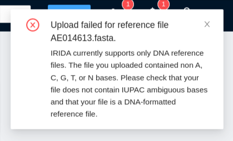

5. Samples are listed last. Here you can see all the files selected to run the pipeline with.

   

    * You can remove a sample by clicking on the remove button to the right of the sample.
    * If the sample contains multiple files that could be run on the pipeline, the most recently added are selected by default.  If you want to run a different set, select them by clicking on the name.

Running the pipeline
--------------------

Once you have made all the modifications to the pipeline and are ready to launch, select the "Launch Pipeline" button to start the pipeline.

Once the pipeline has been launched, you will be redirected to the analysis page where you can see the current state of the pipeline, as well as the settings for the pipeline:

Monitoring pipeline progress
----------------------------

Once you've [launched a pipeline](#launching-pipelines), you can monitor the overall progress of the pipeline by clicking on the "Analyses" tab at the top of the [dashboard](../dashboard):

The analysis overview list will show the current progress of all running and completed pipelines that you've submitted for execution:

If you leave your browser window open you can monitor the progress of your pipeline executions. The "State" and "Duration" columns will auto update every **60** seconds.

You can also monitor the progress of the analysis by clicking on the analysis name which will open up the analysis details page. If you leave the browser window open on this page the "state" and "duration" of the analysis will auto update every **60** seconds.

Viewing pipeline results
------------------------

You can either click on the  icon to download *all* of the outputs produced by the pipeline execution, or you can click on the name of the analysis to view more detailed outputs and, if available, view a preview of the outputs:

The analysis page shows you more detailed information about your pipeline submission, including the names of the files that were produced by the analysis (on the Output File Preview page), a preview of the outputs (if available), and some tabs to view more details about how the pipeline was submitted and for sharing results:

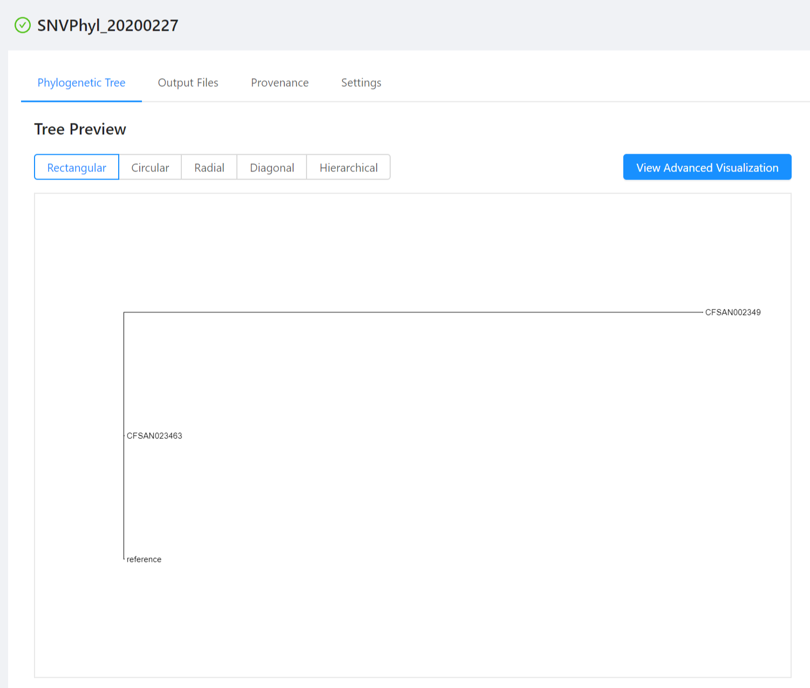
<figcaption>Example `SNVPhyl` pipeline phylogenetic tree preview</figcaption>
  

<figcaption>Example `refseq_masher` tabular results preview</figcaption>
  
To download output files, you can click on the `Output Files` tab. To download an individual file, click on the file name. If the file does not have an available output preview it can be downloaded by clicking the `...` next to the Download All Files button and selecting the file to download.  To download *all* the outputs produced by the pipeline, you can click on the "Download All Files" button.

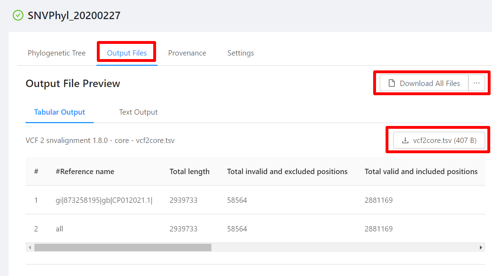

### Previewing analysis output files

All analysis pipelines produce analysis output files. To view these file, click the `Output Files` tab on the **Analysis** page:

<figcaption>Example `refseq_masher` tabular results preview</figcaption>

For each analysis output file, you will see a panel and in each panel you will see:

- a panel heading with the Galaxy tool name (e.g. "RefSeq Masher Matches") and version (e.g. "(0.1.1)"), internal IRIDA output name (e.g. "refseq-masher-matches") and output file name (e.g. "refseq-masher-matches.tsv")
- a file download link
- a preview of the file contents displayed as plain text or in a table

#### Previewing tabular analysis output

Some of the output files will be rendered in a table:

![view-results-tabular-snvphyl-snv-table]
<figcaption>SNVPhyl SNV  results shown in a table.</figcaption>

![view-results-tabular-refseq_masher-contains-default]
<figcaption>`refseq_masher` results shown in a table.</figcaption>

#### Default plain text preview of analysis output

Analysis output files with file extensions like `.log`, `.txt` or `.fasta` can be previewed in the browser as plain text:

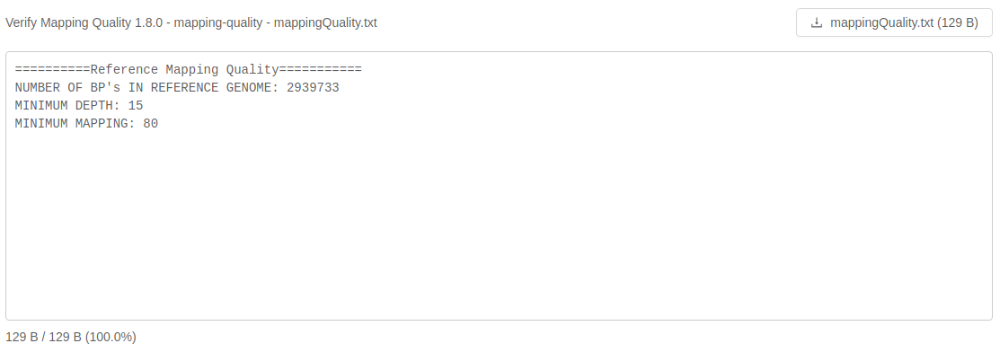

If an analysis output file is small enough like this log file, it will be loaded in its entirety:

<figcaption>Notice that the `3.0 kB / 3.0 kB (100%)` indicates that 100% of the file has been loaded.</figcaption>

If an analysis output file is fairly large like this log file, it will be loaded as you scroll to the bottom of the file preview:

![view-results-plain-text-shovill-log]
<figcaption>Notice that the `8.0 kB / 212.0 kB (3.8%)` indicates that only 3.8% of the file has been loaded into this view. Scrolling to the end will trigger loading of the next chunk of this file into the view!</figcaption>

#### Default html preview of analysis output

Analysis output files with file extensions like `.html`, or `.html.zip` can be previewed in the browser as html:

<figcaption>Notice that the file is named `quast.html.zip` which if you downloaded it you will see that it contains multiple html files. We are loading `quast.html.html`, which is the first html file found in the zip that has the same prefix as the original output file zip.</figcaption>

### Viewing the sequencing data submitted for analysis

To view the data that was submitted to the pipeline for analysis, start from the [Analysis results page](#viewing-pipeline-results), click on the `Settings` tab and then click on the `Samples` tab:

The pipeline samples page shows all of the files that were submitted for analysis in the pipeline submission:

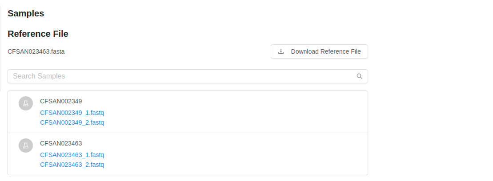

You can view more details about each of the files that were submitted in the pipeline submission by clicking on the names of the files. This provides you a quick way to view the file details, including quality control measurements provided by [FastQC](http://www.bioinformatics.babraham.ac.uk/projects/fastqc/).

### Viewing pipeline parameters used at runtime

To view the parameters that were used when submitting the pipeline, start from the [Analysis results page](#viewing-pipeline-results) and click on the "Provenance" tab.

The provenance page shows a list of the files that were generated as outputs by the pipeline execution:

You can click on each of the file names to expand the complete listing of *how* the file was generated behind the scenes:

You can further inspect the parameters of each of the tools that were used to generate the analysis by clicking on one of the steps:

### Edit analysis name

If you are the user who submitted the pipeline, you are able to change the submission name from the results page.  To edit an analysis name, click the `Settings` tab and then click the Pencil icon next to the analysis name. Once you have edited the analysis name, pressing the `ENTER` key on your keyboard or clicking anywhere outside of the text box will update the name. To cancel editing a name you can either hit the `ESC` key on your keyboard or if the name has not been changed you can also click anywhere outside of the text box.

## Sharing pipeline results

Pipeline results can be shared with projects so that other users on a shared project can view results of the analysis.

### Sharing when launching a pipeline

When launching a pipeline you can select which projects the results should be shared with by selecting them in the `Share Results` section of the pipeline setup.

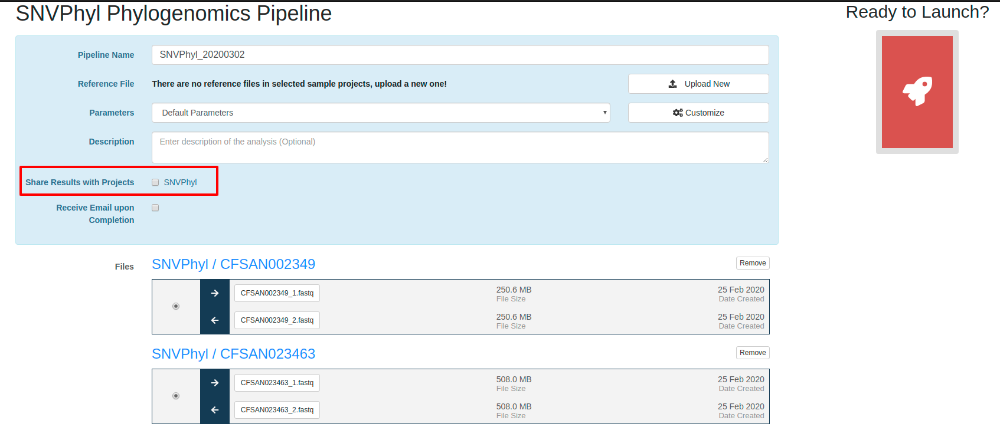

Note that for a project to be displayed in this list it must have samples being used in the pipeline.

Once the pipeline has been submitted the submission will show up in the analysis listing for the selected projects.  From this page users on the project will be able to monitor the pipeline's progress and view results once they are complete.  For more information on viewing analysis results shared with a project, see the [Managing Projects](../project/#project-analysis-results) page. 

### Share results after pipeline has been launched

Pipeline results can also be shared anytime after a pipeline has been launched.  To view or modify which projects an analysis has been shared with, click the `Settings` tab and then click the `Manage Results` tab on the pipeline results page.

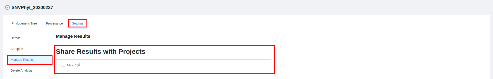

 From this page you will be shown all projects that the pipeline result has been shared with (indicated by a check mark) along with additional projects available for sharing results.  To share or unshare the results with a project, check or uncheck the box next to the project name.

 Note that for a project to be displayed in this list it must contain samples which were used in the analysis.

## Saving pipeline results to a sample

Some pipelines allow you to save data back to the samples in which the pipeline was ran.  The type of data which will be saved back to the samples will differ between pipelines.  For example an assembly and annotation pipeline will save the assembly to the list of files on a sample, whereas a typing pipeline such as SISTR may save a serotype to the metadata of the sample.

To save analysis results back to a sample, on submission of a pipeline please select the `Save Results to Samples` checkbox on the pipeline setup page.

Results can also be saved after a pipeline has completed.  To save analysis results after the pipeline has finished, click the `Settings` tab and then click the `Manage Results` tab on the pipeline results page.  If you are able to save the analysis results back to the sample, a `Save Results` section will be displayed.  Click the button to save the results to the related samples.

## Receive email upon pipeline completion or error

When launching a pipeline you can select the checkbox to receive an email upon pipeline completion or on error.

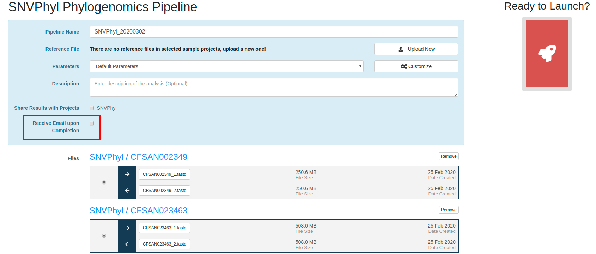

The option to receive an email upon analysis completion (success or error) or upon error can also be updated as long as the analysis is not in `COMPLETED` or `ERROR` state. To update the email option click the `Settings` tab and select the dropdown in the `Receive analysis status email` section to set your preference. 

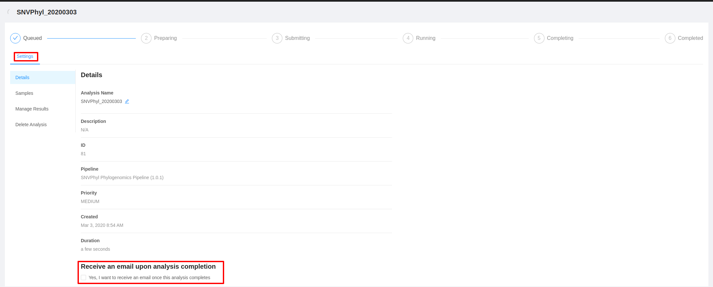

## Downloading single sample analysis output files in batch

You can download all of your single sample analysis output files in batch by clicking **Analyses>Output Files** in the top navigation bar:

 

You will see a table of your single sample analysis output files:

You can filter the outputs using the search box, and the outputs are filtered as you type. The following fields are searched:
- Sample Name
- File
- Analysis Type
- Pipeline
- Submitter

You can select the files you wish to download using the checkboxes.

Or you can click the checkbox in the leftmost column header to select all files displayed:

 

Click **Download** to download. Depending on the number of files you have selected, preparation of the download may take a moment. 

Single files will be downloaded as is, while multiple files will downloaded bundled together in ZIP file. 

## Errors when executing pipelines

You may experience an analysis pipeline execution failure caused by an error in one or more tools within a pipeline.

For example, you may encounter an error when running the "Assembly and Annotation" pipeline:

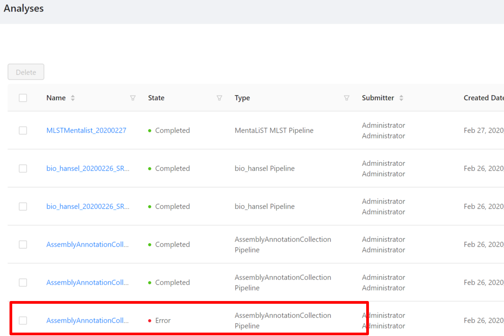

If you click on the analysis name it will take you to the analysis page. From here you can view all the job error information for the pipeline including the galaxy job information, the galaxy parameters, standard error, and standard output.

This information may be helpful for troubleshooting and communicating what went wrong in a particular analysis pipeline.   

<a href="../samples/">Previous: Managing Samples</a>

[view-results-plain-text-shovill-fasta]: images/view-results-plain-text-shovill-fasta.png
[view-results-plain-text-shovill-log]: images/view-results-plain-text-shovill-log.png
[view-results-plain-text-snvphyl-mapping]: images/view-results-plain-text-snvphyl-mapping.png
[view-results-preview-refseq-masher]: images/view-results-preview-refseq-masher.png
[view-results-tabular-refseq_masher-contains-default]: images/view-results-tabular-refseq_masher-contains-default.png
[view-results-tabular-snvphyl-snv-table]: images/view-results-tabular-snvphyl-snv-table.png
[view-results-resize]: images/view-results-resize.png
