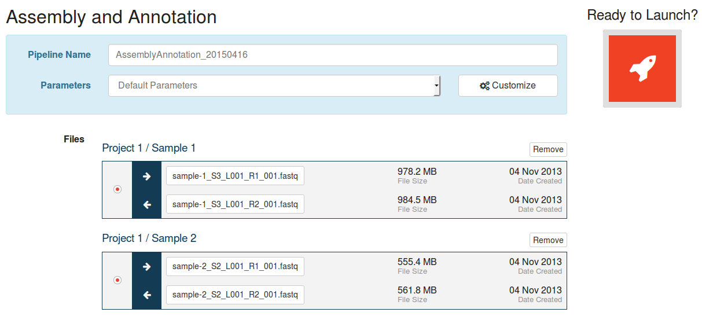
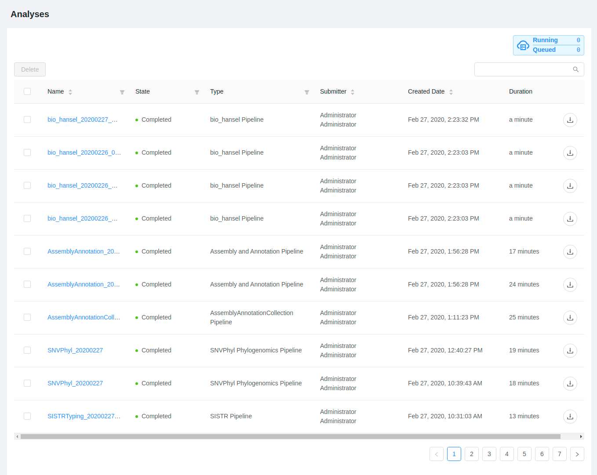
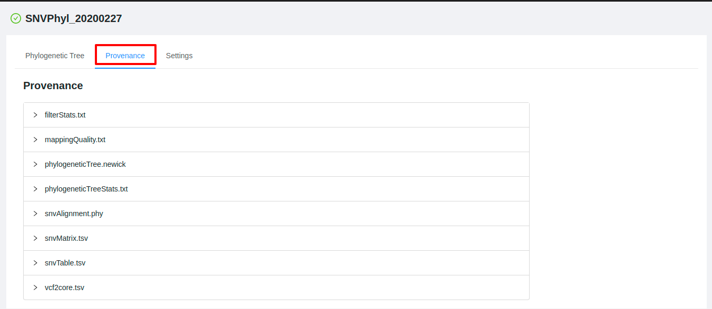
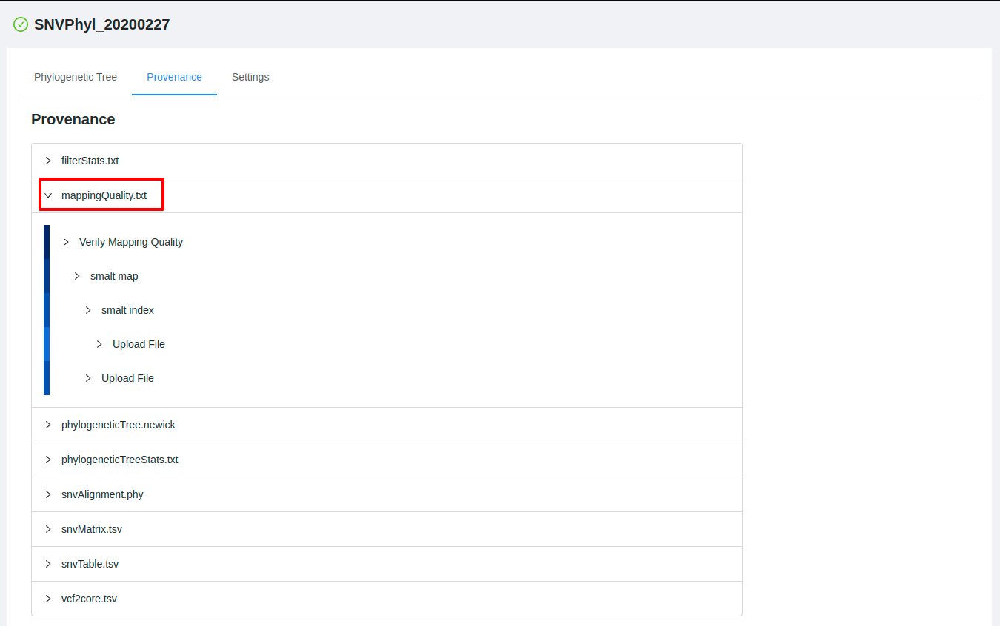
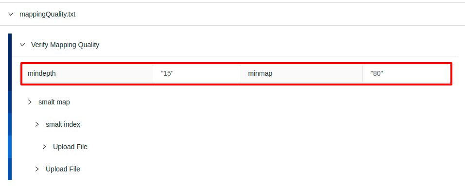

Launching Pipelines
===================
{:.no_toc}

IRIDA currently provides two different pipelines for analysing your sequencing data:

1. The SNVPhyl whole-genome phylogeny pipeline ([poster](https://share.corefacility.ca/public.php?service=files&t=b1fef5379e23b663d308db9ebb5b6bb5&download)), and 
2. An assembly ([SPAdes](http://bioinf.spbau.ru/spades)) and annotation ([Prokka](http://www.vicbioinformatics.com/software.prokka.shtml)) pipeline.

These pipelines take as input a set of sequencing read files from different samples. The samples must first be added to a cart before a pipeline can be run.

* this comment becomes the toc
{:toc}

Adding samples to the cart
--------------------------

The cart is a place where you can temporarily store a selection of samples from across multiple projects for submission to a pipeline for analysis.

You can see the current contents of the cart by clicking on the "Cart" button, on the top, right-hand side of the [dashboard](../dashboard):

The cart will appear on the right-hand side of the page:

The cart is initially empty. You can add samples to your cart by navigating to the [samples list for a project](../samples/#viewing-samples-in-a-project) and [selecting the samples that you want to add](../samples/#selecting-samples). Once you've selected the samples that you want to add, click on the "Add to Cart" button, just above the samples list:

Once you've added some samples to the cart, if you click the "Cart" button on the dashboard, you'll be able to review all of the samples that you've selected, organized by project:

You can remove individual samples or all selected samples from a project by clicking on the  icon, or you can empty the cart entirely by clicking on the "Clear" button, in the top, right-hand corner of the cart:

Selecting a pipeline
--------------------

Once you've selected the samples that you want to analyse and [added them to the cart](#adding-samples-to-the-cart), you can click on the "Select a Pipeline" button at the bottom of the cart:

The pipelines page will allow you to choose from the pipelines that are currently configured in IRIDA. IRIDA currently has two pipelines:

Click on the "Select" button at the bottom, right-hand side of the pipeline that you'd like to launch.

**Note**: Some pipelines will require a reference sequence:

If you have the  **Manager** role on a project, you can click on the name of the project to be directed to the project details page where you can [add a reference file to the project](../project/#adding-reference-files-to-a-project).

When you select a pipeline that doesn't require a reference file (or you've already [uploaded one](../project/#adding-reference-files-to-a-project)), you will be presented with a list of the samples that you've selected for analysis in the pipeline:

### Removing samples from a pipeline submission

You can remove a sample from a pipeline submission by clicking on the "Remove" button on the right-hand side of the sample:

### Multiple filesets per sample

If a sample has been sequenced multiple times (a top-up run, for example), the pipeline submission page will display multiple filesets for that sample:

You may only select one fileset for submission to the pipeline for analysis. You can select the fileset that you want to submit to the pipeline for analysis using the radio buttons on the left-hand side of the sample fileset display:

Modifying pipeline parameters
-----------------------------

IRIDA has pre-defined some default values for pipeline submissions, but you may change the default parameters for your analysis by clicking on the "Customize" button on the right-hand side of the parameters drop-down at the top of the pipeline submission page:

The dialog window that appears will allow you to change the parameters for the pipeline execution:

If you would like to reset a value that you modified back to the default value, click on the "Use Default" button on the right-hand side of the paramater:

<blockquote>

<b>Note</b>: customized pipeline parameters are not validated, please ensure that the values you are entering are valid for the parameter that you are modifying.

</blockquote>

When you've finished customizing the pipeline parameters, you can click on the "Use these Parameters" button to return to the pipeline submission page.

### Saving pipeline parameters

You may save the [parameters that you modified](#modifying-pipeline-parameters) by clicking on the "Save these parameters for later?" checkbox at the bottom of the parameters dialog:

You should provide a name for the pipeline parameters that reflects the modifications that you've made to the parameters. When you've entered the name for the parameter set, you can click on the "Use these Parameters" button at the bottom of the parameter modification dialog to return to the pipeline submission page.

### Using pre-saved pipeline parameters

Parameter sets that [have been saved](#saving-pipeline-parameters) can be used on subsequent executions of the pipeline by using the parameters drop-down, just below the pipeline name:

Running the pipeline
--------------------

Once you've [selected the files](#multiple-filesets-per-sample) and [selected](#using-pre-saved-pipeline-parameters) or [customized](#modifying-pipeline-parameters) the parameters, you can submit the pipeline for execution by clicking on the rocket ship button on the right-hand side of the page:

Your pipeline submission will be prepared and launched, and you will see a confirmation dialog:

You can [monitor pipeline progress](#monitoring-pipeline-progress) by clicking on the "Let's see how this pipeline is doing" button, or you can empty your cart and start again by clicking on the "Let the pipeline run!" button.

Monitoring pipeline progress
----------------------------

Once you've [launched a pipeline](#launching-pipelines), you can monitor the overall progress of the pipeline by clicking on the "Analyses" tab at the top of the [dashboard](../dashboard):

The analysis overview list will show the current progress of all running and completed pipelines that you've submitted for execution:

The "State" column will change over time if you leave your browser window open so you can monitor the progress of your pipeline executions.

Viewing pipeline results
------------------------

You can view or download the outputs of a pipeline execution once a pipeline has completed:

You can either click on the  icon to download *all* of the outputs produced by the pipeline execution, or you can click on the name of the analysis to view more detailed outputs and, if available, view a preview of the outputs:

The analysis details page shows you more detailed information about your pipeline submission, including the names of the files that were produced by the analysis (on the left-hand side of the page), a preview of the outputs (if available), and some tabs to view more details about how the pipeline was submitted:

### Viewing the sequencing data submitted for analysis

To view the data that was submitted to the pipeline for analysis, start from the [analysis details page](#viewing-pipeline-results) and click on the "Input Files" tab:

The pipeline input files page shows all of the files that were submitted for analysis in the pipeline submission:

You can view more details about each of the files that were submitted in the pipeline submission by clicking on the names of the files. This provides you a quick way to view the file details, including quality control measurements provided by [FastQC](http://www.bioinformatics.babraham.ac.uk/projects/fastqc/).

### Viewing pipeline parameters used at runtime

To view the parameters that were used when submitting the pipeline, start from the [analysis details page](#viewing-pipeline-results) and click on the "Provenance" tab:

The provenance page shows a list of the files that were generated as outputs by the pipeline execution:

You can click on each of the file names to expand the complete listing of *how* the file was generated behind the scenes:

You can further inspect the parameters of each of the tools that were used to generate the analysis by clicking on one of the steps:

