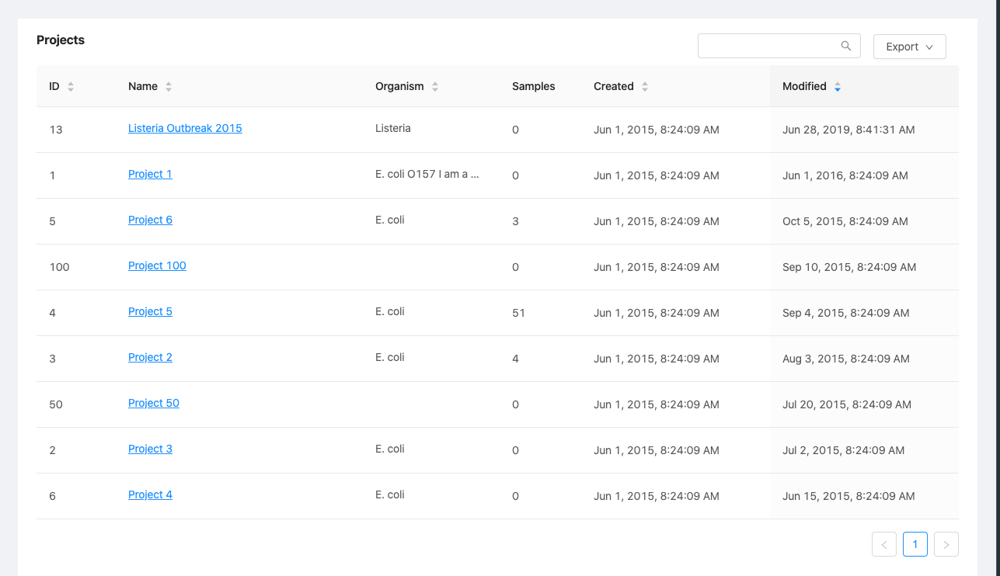
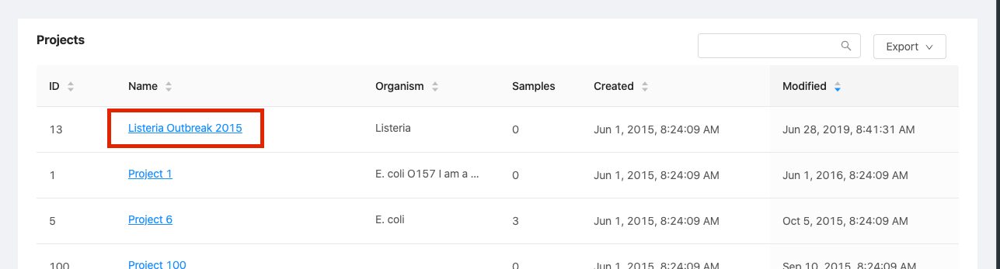

Managing Projects
=================
{:.no_toc}

The main organizational tool in IRIDA is the project. This section of the user guide descibes how you can view projects, edit project metadata (including uploading reference files), search for projects by name, and create new projects.

* This comment becomes the toc
{:toc}

Viewing existing projects
-------------------------

You can access the list of projects that you have permission to view and modify by clicking on the "Projects" menu at the top of the dashboard and selecting "Your Projects":

The projects list shows all projects that you are permitted to view or modify:

The projects list provides a high-level overview of project details, including:

* The IRIDA-generated identifier for the project,
* The name of the project,
* The project organism,
* Your role on the project,
* The number of samples created in the project,
* The number of other user accounts with permissions to view or edit the project,
* The date that the project was created in IRIDA,
* The time that the project was last modified.

You have **read-only** permissions on projects where you are listed as a **Collaborator** role. You have **modify** permissions on projects where you are listed as **Manager** role. You can view the role that you have on a project in the **Role** column.

Creating a new project
----------------------

You can create a new project by clicking on the "Projects" menu at the top of the dashboard and selecting "Create New Project":

When you create a new project, you'll need to provide a project name, and can optionally provide a project organism, a free-form project description, and a link to another web site that has more inforamtion about the project:

A project name must be **at least** 5 characters long, and **must not** contain any of the following characters: `? ( ) [ ] / \ = + < > : ; " , * ^ | &`

If you choose to set a project organism, click on the "Select an Organism" drop-down menu and begin typing the name of the organism. For example, if you wanted to specify a project organism of "Salmonella enterica", you would begin to type "Sal" and the menu would allow you to choose from a set of well-defined organism names:

The organism names are derived from the [NCBI taxonomy database](http://www.ncbi.nlm.nih.gov/taxonomy).

When you've finished entering the details for your new project, click on the "Create Project" button. You will be redirected to the projects list.

IRIDA will automatically generate a numeric project identifier for your project. The project identifier is used by external tools for uploading sequencing data to IRIDA. The project identifier can be found in the ["Project Details" panel](#viewing-project-details), or in the [projects list](#viewing-existing-projects).

Viewing project details
-----------------------

To view project details, start from the [projects list](#viewing-existing-projects) and click on the **Name** of the project:

The project details page shows a summary of the project details and provides a view of the samples that belong to the project. You can find out more about managing samples in a project by navigating to the [managing samples](../samples) section.

On the left side, the **Project Details** panel shows the IRIDA-generated project identifier, the project organism, the date the project was created, and the date that the project details were last modified:

More detailed project information can be found by clicking the tabs above the project details panel.

Editing project details
-----------------------

To edit project details, start by [viewing the project details](#viewing-project-details), then click on the "Metadata" tab:

On the project metadata page, click on the "Edit" button in the top, right-hand corner of the page:

The project details editing page provides the same form as when you [created the project](#creating-a-new-project), and all of the same descriptions apply. When you've finished editing the project details, you can click on the "Update" button at the bottom of the form.

Project members
---------------

Project members are users who have permissions to view or edit project metadata. Project members can also view, download, and submit pipelines using sequencing data that's contained in a project. Project members can have two different roles: a project collaborator (*read-only* permissions), and a project manager (*read* and *modify* permissions).

If you are a project **Manager**, you can add new members to the project. Start by clicking on the "Members" tab, above the [project details panel](#viewing-project-details):

A project  **Collaborator** will only be able to *view* the project members:

A project  **Manager** will be able to *modify* the project members:

### Adding a project member

To add a project member, click on the "Add Member" button, just below the project title:

You can use the dialog that appears to select a user account (you can choose from a list, or click the "Select a User" field and start typing), and choose the **Project Role** that the new member should have:

**Remember**: a project collaborator has *read-only* permissions, and a project *manager* is allowed to modify project details.

Once you've selected the user and role to add the new member, click on the "Submit" button.

### Changing a project member role

You may want to change a project member role if you wish to remove permissions for an individual user account to modify project details, but still want to allow that user account to view the project data. You can only change a project member role if you have the  **Manager** role on the project.

Start by [viewing the project members](#project-members).

To change the role of a project member, click on the "Edit" button on the right-hand side of the table:

When you click the edit button, you can choose a new project role in the "**Project Role**" column of the table:

The project role is saved as soon as you make a selection -- you **do not** need to click a "Save" button.

### Removing a user from a project

You may want to completely remove all permissions for a user to access data in a project. To remove those permissions, you must remove the user account from the project members list.

Start by [viewing the project members](#project-members).

To remove a project member, click on the "Remove" button on the right-hand side of the table:

When you click the "Remove" button, you will be asked to confirm the project member removal:

To confirm, click the "Ok" button.

Adding reference files to a project
-----------------------------------

Reference files are required by at least one of the workflows that are installed in IRIDA by default. Reference files are stored on a project-by-project basis.

Starting from [viewing project details](#viewing-project-details), you can add a reference file to a project by clicking on the "Reference Files" tab at the top of the projects page:

You can upload a new reference file to the project by clicking on the "Upload Reference File" button:

Reference files **must** be in `fasta` format. Files containing **ambiguous base calls** will be rejected.

Once you've uploaded a reference file, you can optionally download the reference file (useful if someone else uploaded the reference file for the project) by clicking on the  download icon in the list of reference files.

Viewing recent project activity
-------------------------------

Project data and metadata is changed over time. You can see a list of recent changes that have taken place by viewing the recent activity for a project.

Starting from [viewing project details](#viewing-project-details), you can view recent project activity by clicking on the "Recent Activity" tab at the top of the projects page:

Recent activities include adding or modifying project members and adding new samples to a project:

