Managing Projects
=================
{:.no_toc}

The main organizational tool in IRIDA is the project. This section of the user guide descibes how you can view projects, edit project metadata (including uploading reference files), search for projects by name, and create new projects.

* This comment becomes the toc
{:toc}

Viewing existing projects
-------------------------

You can access the list of projects that you have permission to view and modify by clicking on the "Projects" menu at the top of the dashboard and selecting "Your Projects":

The projects list shows all projects that you are permitted to view or modify:

The projects list provides a high-level overview of project details, including:

* The IRIDA-generated identifier for the project,
* The name of the project,
* The project organism,
* The number of samples created in the project,
* The number of other user accounts with permissions to view or edit the project,
* The date that the project was created in IRIDA,
* The time that the project was last modified.

To enter into a project click the **Name** of the project:

Searching the Projects Table
----------------------------

There are two ways to find a specific project in the projects table - filtering and searching.

### Searching

Search is always available in the text field directly above and to the right of the table.  This search across the project's id, name, and organism.

Example searching the projects table for `O157` results in 2 items.

Creating a new project
----------------------



Viewing project samples
-----------------------

The project samples page provides a view of the samples that belong to the project.  To view the samples for a project, click on the **Samples** tab on the project page:

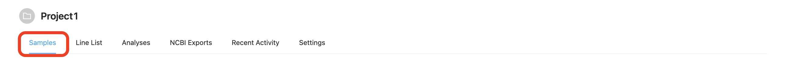

You can find out more about managing samples in a project by navigating to the [managing samples](../samples) section.

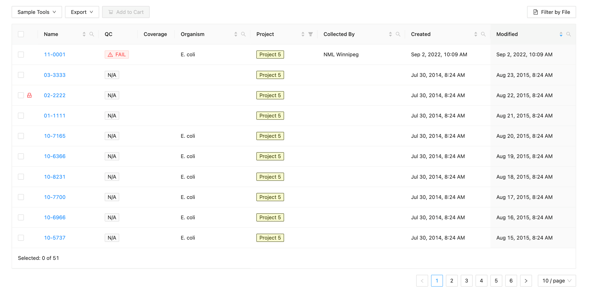

Project analysis results
------------------------

To view the results of an analysis that has been shared with a project, click the `Analysis` tab at the top of the project page. 

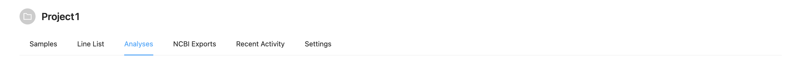

From this page you can view and monitor the progress of all analyses which have been shared with this project.  To view the results of an analysis click on the analysis name.  For more information on analysis results, see the [pipeline documentation page](../pipelines/#viewing-pipeline-results).

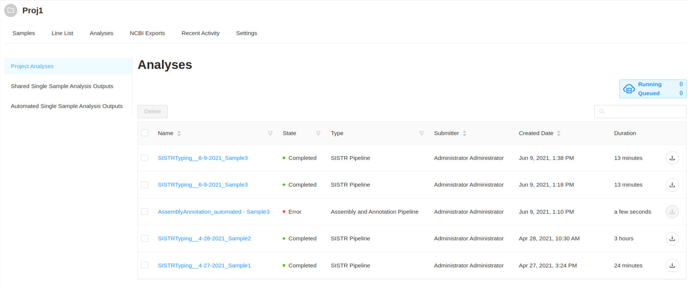

If there are shared single sample analysis output files, you will see them in the **Shared Single Sample Analysis Outputs** tab:

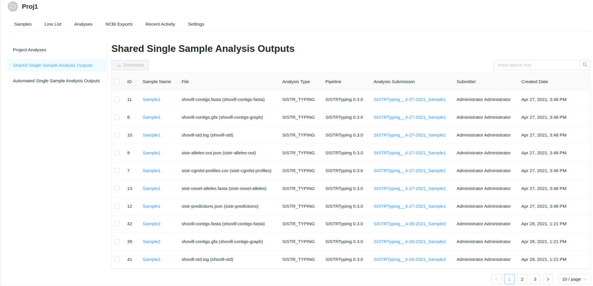

If there are automated single sample analysis output files, you will see them in the **Automated Single Sample Analysis Outputs** tab:

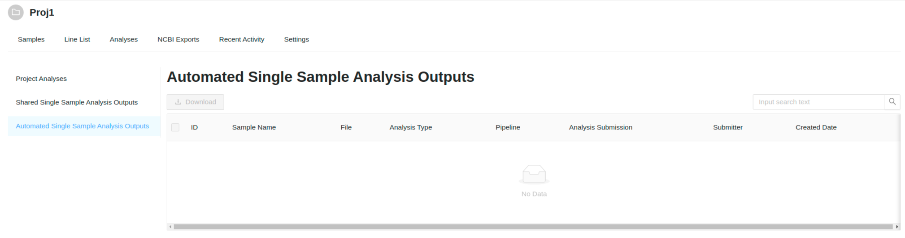

*There are no automated analysis output files for this project `Proj1`.*

From these tables you can select which files you wish to download by filtering based on values in certain columns (e.g. `contigs` in the `File` column) using the search box, selecting the checkboxes for the files you wish to download, and clicking the **Download** button to download your selected files.

For more information on using the single analysis output file tables, see the [pipeline documentation page](../pipelines/#downloading-single-sample-analysis-output-files-in-batch).

Project NCBI Exports
--------------------

To view exports from this project to NCBI, click on the **NCBI Exports** tab.

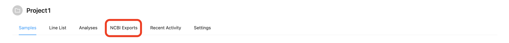 

For more information on exporting to NCBI, see the [documentation on the samples page](../samples/#ncbi-upload).

Viewing recent project activity
-------------------------------

Project data and metadata is changed over time. You can see a list of recent changes that have taken place by viewing the recent activity for a project.

Starting from [viewing project details](#viewing-project-details), you can view recent project activity by clicking on the "Recent Activity" tab at the top of the projects page:

Recent activities include adding or modifying project members and adding new samples to a project:

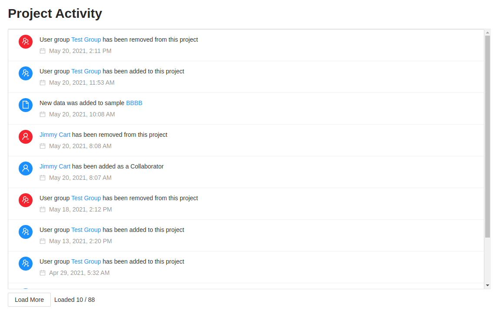

By default, the 10 most recent activities wil be displayed.  Clicking the "Load More" button will load 10 more activties until all the activities are loaded.

Managing project settings
-------------------------

Project managers can manage settings on individual projects. These settings are found in the **Settings** tab at the top of the project page.

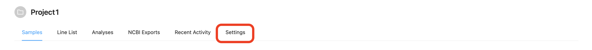

### Project Details

Project details include:
- Project name (required)
- Project description
- Project organism
- As well as the non-modifiable information including project identifier, created date, and the last modified date

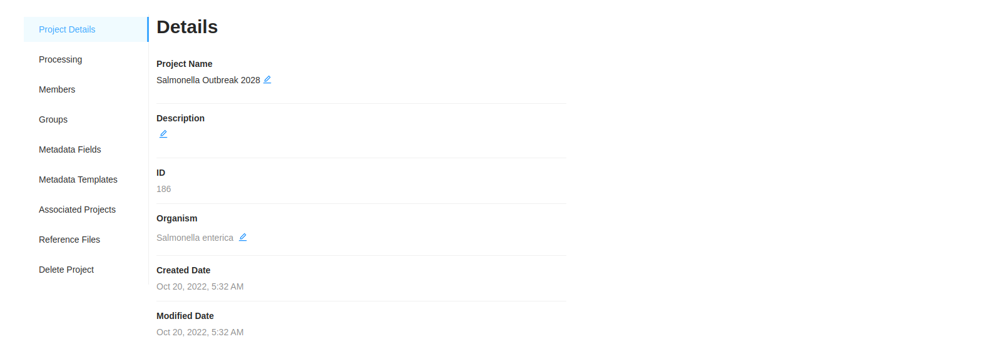

Managers can edit the modifiable fields by clicking on the edit (pencil) icon within the field.  Updates will be saved immediately after hitting the enter key or clicking anywhere outside the field.  If you want to cancel the update, just press the `esc` key and the original value will be displayed.

### Coverage, Processing and Automated Pipelines

Project processing settings can be found in the **Processing** tab in the project settings page.

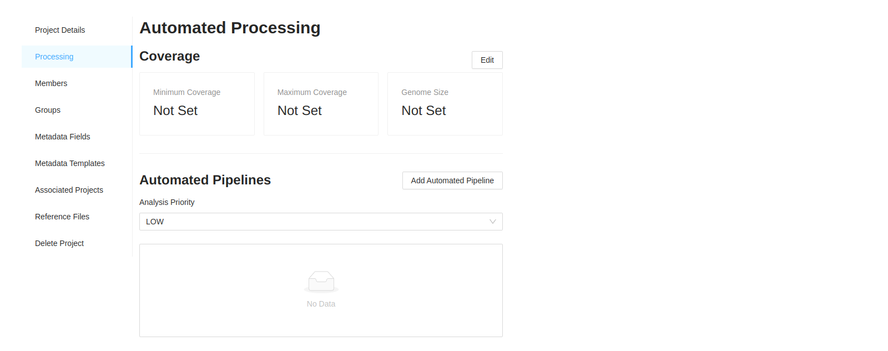

#### Project coverage

IRIDA can calculate the coverage of uploaded sequencing data for a sample.  To enable this a genome size and expected coverage must be set for a project in the project settings page.

* **Minimum Coverage** - The minimum coverage expected by any sequencing data being uploaded to the project.
* **Maximum Coverage** - The maximum coverage expected by any sequencing data being uploaded to the project.
* **Genome Size** - The size of the genome of the organism being targeted by the project.

To edit coverage settings, click the `Edit` button.

You can then enter your coverage settings and click `Ok`.

When these options are set IRIDA will flag any samples which do not meet the expected coverage requirement in the [project/samples list](../samples/#viewing-samples-in-a-project).  It will also display the coverage for a sample when you [view sequence files for a sample](../samples/#viewing-sequence-files).

#### Automated Pipelines

A project can be setup to automatically trigger the execution of a pipeline on upload of new data.  Any installed pipeline that analyzes individual sample files may be launched on upload (including plugin pipelines).  This setting is enabled on a project-by-project basis and must be enabled by a project **manager**.

To set up a new automated pipeline, click the *Add Automated Pipeline* button on the processing page.  

After clicking the *Add Automated Pipeline* button you'll be brought to the pipeline list page similar to launching a regular pipeline with data in your cart.  From here you can follow the same process for launching a pipeline including selecting the pipeline, customizing parameters, sharing results, etc.  See more about this process in the [pipelines documentation](../pipelines/#selecting-a-pipeline).

When you have successfully set up your automated analysis pipeline, you'll be returned to the project settings processing page.  Any new data uploaded to the project will now trigger the execution of the selected pipelines.

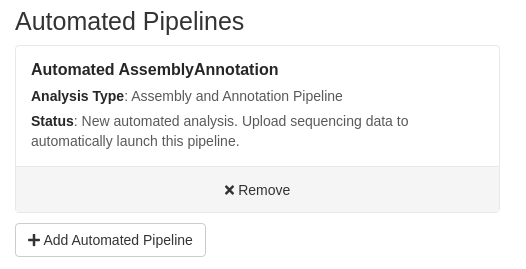

To remove an automated pipeline, click the *X* button to the right of the pipeline description and confirm.  Automated pipelines can only be removed by a project **manager**.

Note that automated pipeline parameters cannot currently be modified after the pipeline has been created.  To modify the parameters for an automated pipeline, you should remove the original automated pipeline and create a new one with the new desired parameters.

Administrators can change the priority of automated pipelines for a given project.  The default setting for a project is "LOW".

### Project members

Project member settings can be found in the **Members** tab in the project settings page.

Project members are users who have permissions to view or edit project metadata. Project members can also view, download, and submit pipelines using sequencing data that's contained in a project. Project members can have two different project roles: a project collaborator (*read-only* permissions), and a project manager (*read* and *modify* permissions). Project members also have a metadata role (Level 1, Level 2, Level 3, Level 4). Level 4 is the highest metadata role for a project. A **Manager** has a metadata role of Level 4 and this cannot be changed. Project collaborators can have one of the metadata roles assigned to them. A user must be a **Manager** on a project to add or remove members, modify project roles, and/or modify metadata roles.

A project **Collaborator** will only be able to *view* the project members and their project roles on the project. A collaborator can not view the metadata roles assigned to the project members:

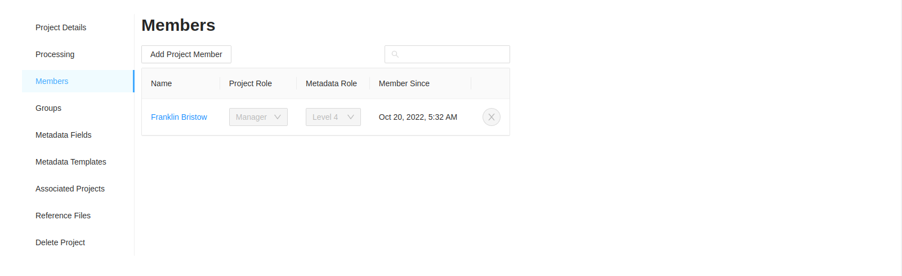

A project **Manager** will be able to *modify* the project members:

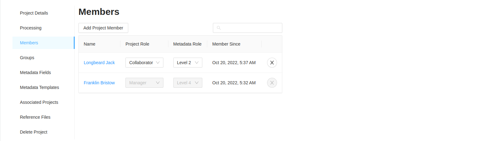

### Project user groups
Similar to project members, user groups can also be added to projects to manage collections of users.

#### Adding a project member

##### Adding an individual project member



##### Adding a group project member



#### Changing a project member's project role

You may want to change a project member's project role if you wish to remove permissions for an individual user account to modify project details, but still want to allow that user account to view the project data. You can only change a project member project role if you have the **Manager** role on the project.

Start by [viewing the project members](#project-members).

To change the role of a project member, click on the project role drop-down menu of the user that you would like to change:

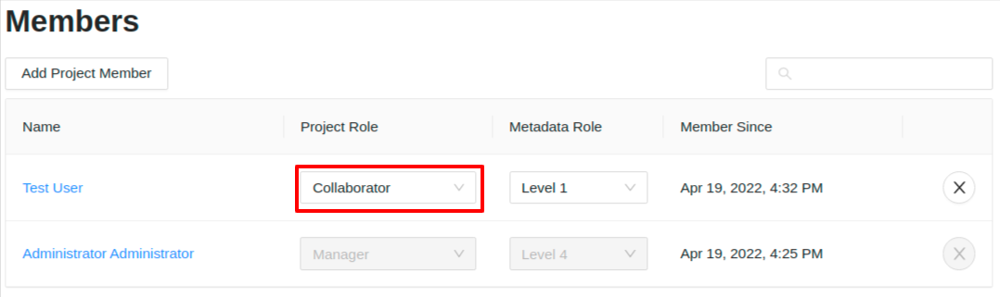

The project role is saved as soon as you make a selection -- you **do not** need to click a "Save" button.

#### Changing a project member's metadata role

You may want to change a project member's metadata role if you wish to restrict an individual user from viewing certain metadata on the project. You can only change a project member's metadata role if you have the **Manager** role on the project and the member is also not a **Manager** on the project.

Start by [viewing the project members](#project-members).

To change the metadata role of a project member, click on the metadata role drop-down menu of the user that you would like to change:

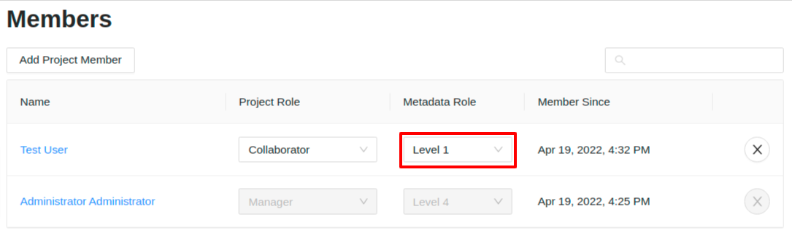

The metadata role is saved as soon as you make a selection -- you **do not** need to click a "Save" button.

#### Changing a project user group's project role

You may want to change a project user group's project role if you wish to remove permissions for members of a user group to modify project details, but still want to allow that user group to view the project data. You can only change a project user group's project role if you have the **Manager** role on the project.

Start by [viewing the project user groups](#project-user-groups).

To change the project role of a project user group, click on the project role drop-down menu of the user group that you would like to change:

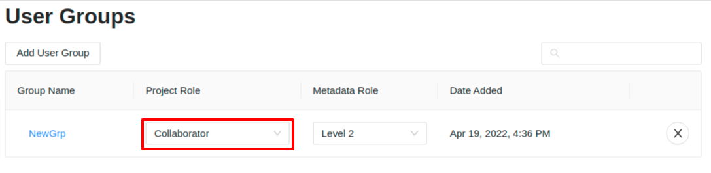

The project role is saved as soon as you make a selection -- you **do not** need to click a "Save" button.

#### Changing a project user group's metadata role

You may want to change a project user group's metadata role if you wish to restrict the members of the group from viewing certain metadata on the project. You can only change a project user group's metadata role if you have the **Manager** role on the project and the user group is also not a **Manager** on the project.

Start by [viewing the project user groups](#project-usergroups).

To change the metadata role of a project member, click on the metadata role drop-down menu of the user that you would like to change:

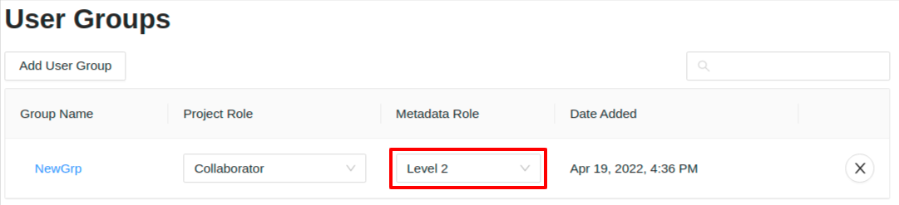

The metadata role is saved as soon as you make a selection -- you **do not** need to click a "Save" button.

#### Removing a user from a project

You may want to completely remove all permissions for a user to access data in a project. To remove those permissions, you must remove the user account from the project members list.

Start by [viewing the project members](#project-members).

To remove a project member, click on the remove button on the right-hand side of the table:

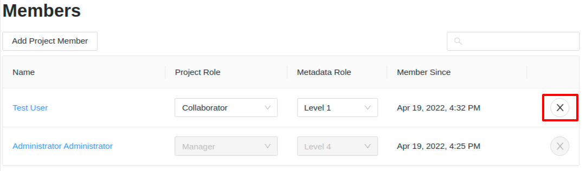

When you click the remove button, you will be asked to confirm the project member removal:

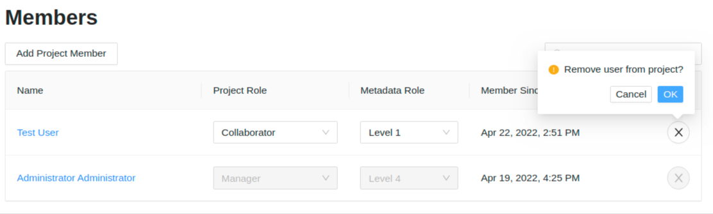

To confirm, click the "Ok" button.

#### Removing a user group from a project

You may want to completely remove all permissions for a user group to access data in a project. To remove those permissions, you must remove the user group from the project user groups list.

Start by [viewing the project user groups](#project-user-groups).

To remove a project user group, click on the remove button on the right-hand side of the table:

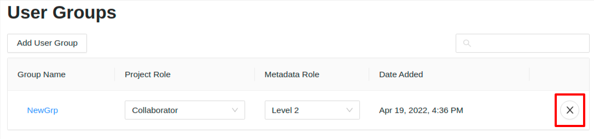

When you click the remove button, you will be asked to confirm the project member removal:

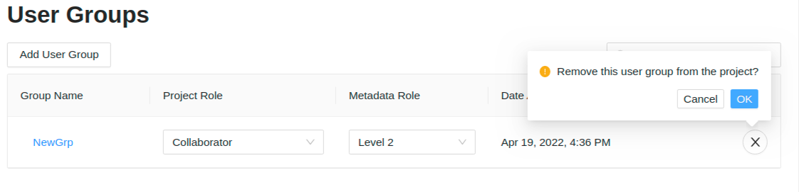

To confirm, click the "Ok" button.

### Metadata

Metadata associated with the project can be viewed from the **Metadata** tab. A project **Manager** can view **all** the metadata fields associated with the project, and view/modify the metadata restriction levels for each of these fields.

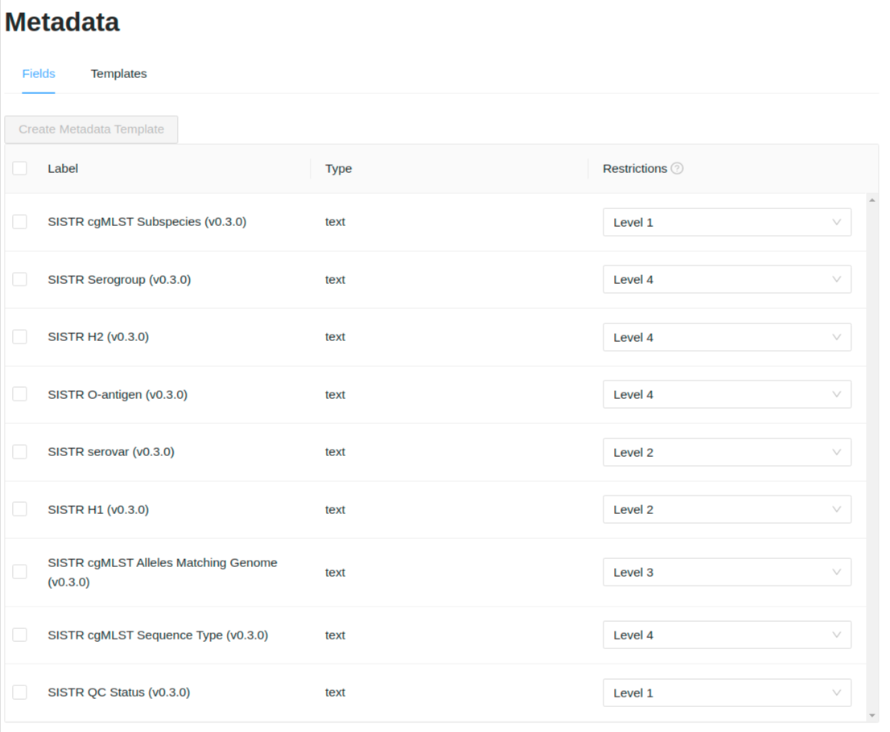

The **Manager** also has the ability to select metadata fields, create templates, and set a default template which members of the project can use to view data on the Linelist page.

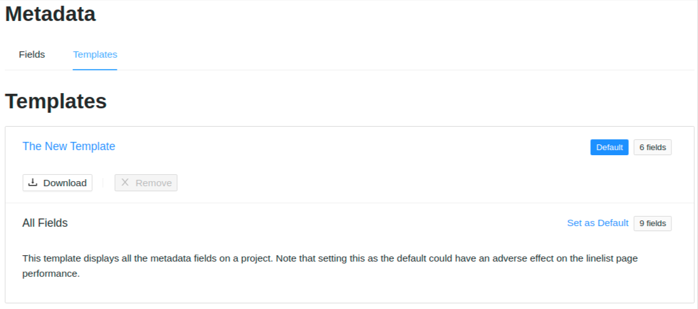

Clicking on the name of the template takes you to a page where you can modify template details. Note that the field restriction levels must be modified from the **Fields** tab and cannot be modified within a template.

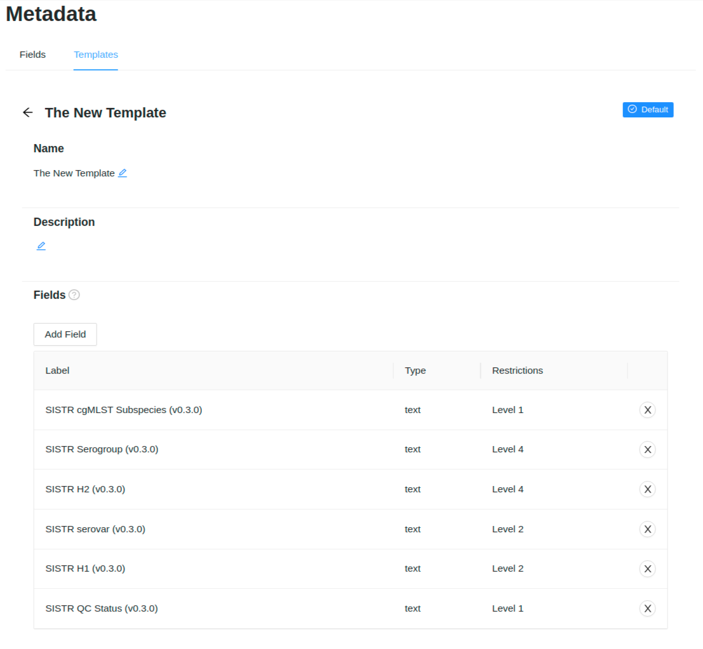

A collaborator can only view a subset of the metadata fields which are at their metadata restriction level and below. For example the user below has a project metadata role of Level 2, so they can only view metadata fields which have a restriction Level 1 or Level 2:

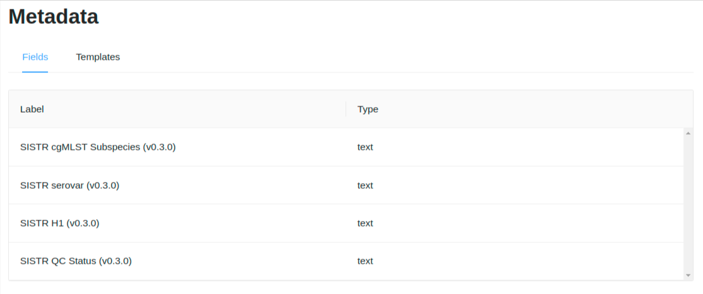

A project collaborator can only view/download the templates that exist and the fields that makes up those templates:

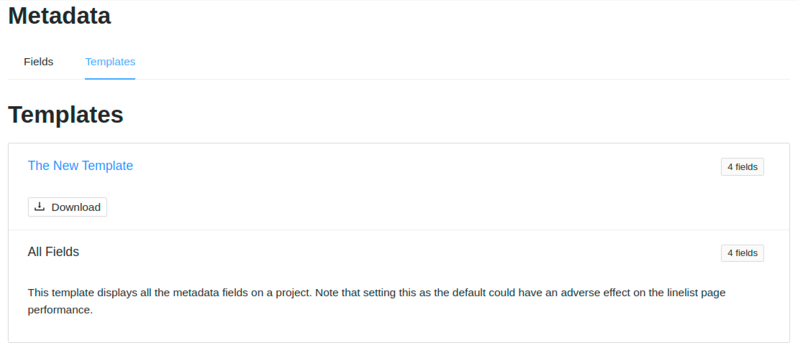

Clicking on the name of the template takes you to a page where you can view template details.

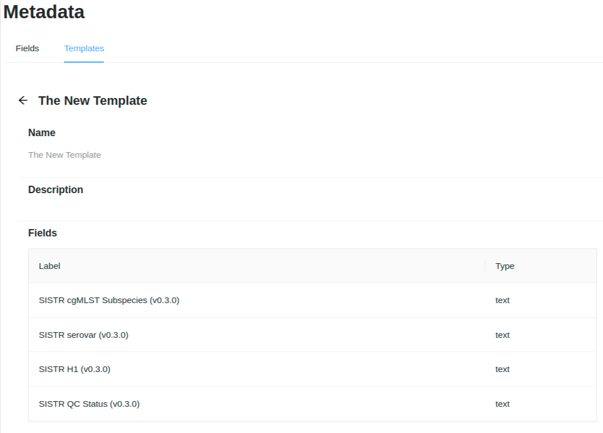

### Associated Projects

Associated projects can be used to help manage related sample data across multiple projects.  Samples from associated projects can be viewed seamlessly with samples from the local project and used together in analysis pipelines.  

To view associated projects click the **Associated Projects** tab in the project settings page.

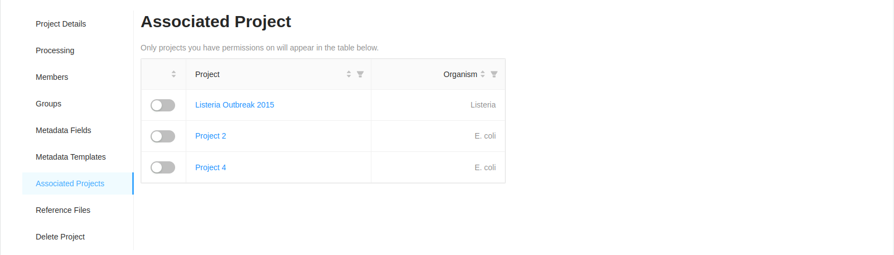

*This is how the table will look for a Collaborator on the project*

#### Viewing associated projects

The "Associated Projects" list will display the projects associated with this project.  Projects in this view will be available in the ["Associated Projects" view on the project samples listing](../samples/#viewing-associated-samples).

#### Adding or removing associated projects

Project Managers can add or remove associated projects for a project.  When going to the associated projects tab, managers will see the currently associated projects selected, as well as all projects they have access to.  Using the toggle 

**Note:** To add or remove a project to the list of associated projects, the manager must *at least* be able to read the data in the project to be added in the associated projects list.

Adding or removing an associated project can be accomplished by clicking on the toggle box in the first column of the table.  If the toggle is "On" (blue) then the project is associated.

### Reference files

Reference files are required by at least one of the workflows that are installed in IRIDA by default. Reference files are stored on a project-by-project basis.

You can view or add reference files by clicking on the "Reference Files" tab in the project settings page.

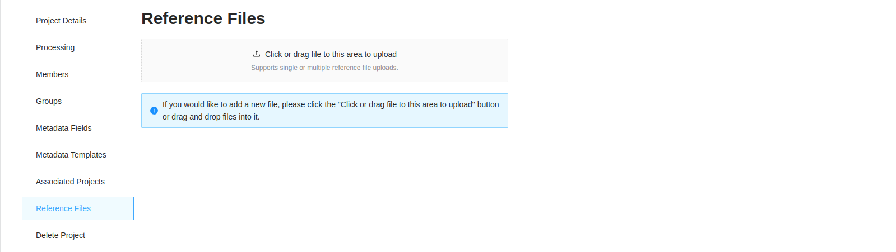

You can upload a new reference file to the project by clicking on the "Upload Reference File" button or by dragging and dropping files onto it:

Reference files **must** be in `fasta` format. Files containing **ambiguous base calls** will be rejected.

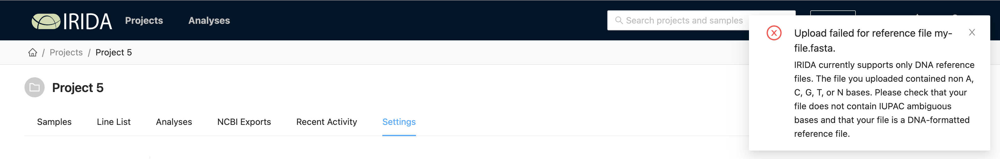

Once you've uploaded a reference file, you can optionally download the reference file (useful if someone else uploaded the reference file for the project) by clicking on the  download icon in the list of reference files.

### Remote project settings

Settings for remote synchronized projects can also be managed from the project settings page.  **Note:** these settings will only appear for synchronized projects, and will be available within the 'Remote' menu item.  

* **Last Synchronization** - The time the project was last synchronized or checked for updates.  
* **Check For Changes** - Click to get IRIDA to check for changes to the remote project.  If it finds changes, it will synchronize them to the project.
* **Force Full Project Sync** - Click here to force IRIDA to start a full synchronization of the project.
* **Remote API** - Displays the remote IRIDA installation the project is hosted on and your connection status with that API.
* **Synchronization Frequency** - How often the project will be synchronized.  You can update this setting here.
* **Synchronization User** - The account which will be used to request project updates from the remote IRIDA installation.  This user account must have access to the project on the remote IRIDA instance in order for synchronization to proceed.  Click **Become Synchronization User** to set this to be your user account.

Synchronizing a remote project
------------------------------

IRIDA allows you to synchronize projects between different IRIDA installations.  A remote project appears similar to a local project, but users are not allowed to add samples or sequencing data to a remote project.  Instead data associated with a remote project will be updated from a remote IRIDA instance on a regular schedule.  The only data that can be managed for a remote project is the members that are allowed to view the project and associated sample data.

The following data will be synchronized:
* Basic project metadata
* FASTQ sequencing data associated with samples
* Assemblies associated with samples (including both assemblies created by pipelines within IRIDA, and uploaded assemblies)
* FAST5 sequencing data associated with samples
* Sample metadata

The following data **will not** be synchronized:
* Analysis pipeline results
* Users & groups on a project
* Analysis automation settings
* Reference files

Some of the above items that are not currently synchronized are expected to be available in future IRIDA versions.

#### Connecting to a remote instance of IRIDA

Before a remote project can be synchronized a connection must be set up between the IRIDA project host installation and the receiving IRIDA installation.  The connection between installations is handled by the IRIDA client and the remote instance of IRIDA.

First the IRIDA installation hosting the project must create a client which will be used to connect to the remote instance of IRIDA.  The client must be created with a grant type of `authorization_code` and scope of `read`.  It is also recommended to enable refresh tokens for clients which will be involved in project synchronization.  Documentation on creating system clients can be found in the administrator guide's [managing system clients section](../../administrator/#managing-system-clients) and it must be performed by a system administrator.

Next the receiving IRIDA installation must set up a remote connection to the hosting IRIDA site.  Information on adding a remote instance of IRIDA connection can be found in the administrator guide's [adding a remote connections section](../../administrator/#adding-a-remote-irida-installation) and must also be perfomed by an administrator.

#### Creating a remote synchronized project

Once the client and remote instance of IRIDA have been created a user can create a synchronized project.  Note that in order to synchronize a remote project, a user must have login credentials to the host IRIDA installation and be a project member on the project they wish to synchronize.

To begin creating a synchronized project, click the **Synchronize Remote Project** option in the **Projects** menu. 

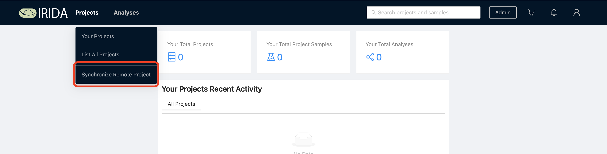 

Once on the **Synchronize New Remote Project** page, you must select the required remote instance of IRIDA and verify your connection status.  If you don't have a valid connection to the remote instance, you must click the `Connect` button and follow the instructions to connect in order to proceed.  For more information on connecting to remote instance of IRIDA see the [remote instance of IRIDA documentation](../dashboard/#remote-instances-of-irida).

Once you have connected to the remote instance of IRIDA, you can select the project you wish to synchronize from the **Project** dropdown.  Here you wil be given a listing of all the projects you have access to on the remote IRIDA installation.  

After you have selected your project, you can select a synchronization frequency.  You should select a frequency that matches how often data will be added to the project.  This option can be updated later in the project settings panel.

If you know the URL of the project you want to synchronize, you can directly add the url by checking the `Set URL Manually` and entering it into the input field.

Once your project and an appropriate synchronization frequency have been selected, click the **Synchronize Project** button to create your project.

After the synchronized project has been created, you can view it's synchronization status at the top of the project's landing page.

The status section will be one of the following messages:

* `Marked for synchronization` - This project will check for changes and be synchronized when the next project synchronization job runs.
* `Updating` - This project is currently being synchronized.
* `Synchronized` - This project is up to date since the last project synchronization job has been run.
* `Unauthorized` - The user who has created the synchronized project can no longer read the project on the host IRIDA installation.
* `Error` - An error occurred during the last project synchronization job.
* `Unsynchronized` - This project will no longer be synchronized. 
* `Marked for full project synchronization` - The project will perform a full synchronization on the next synchronization job.  This will check for changes in all samples within the project to ensure it's up to date.

#### Reconnecting after token expiry

Occasionally the token used for synchronizing a remote project may expire at which point the project will need to be reconnected.  When this token expires, the synchronization user for the project (usually the person who created the project) will receive an email notifying them that the connection has expired and they must reconnect.

To re-connect after an expired token:
* Go to the project/settings/remote page. [Docs about this page are above](#remote-project-settings).
* Check the "Synchronization User" field.  If you are not this user, you should stop and inform them that they must perform this task.
* Check the "Remote Connection" section.  If the token is invalid, it should say "Expired/invalid token" and have a "Connect" button.
* Click the "Connect" button and follow the prompts to re-connect to the remote IRIDA installation.
* After the token is refreshed, click the "Sync Now" button at the top of the page.  This will re-initialize the sync job and it will be added to the queue to refresh.

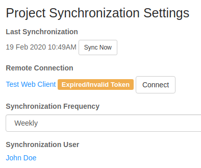

Deleting a project
------------------

Projects can be deleted from the **Delete Project** tab in the settings panel.

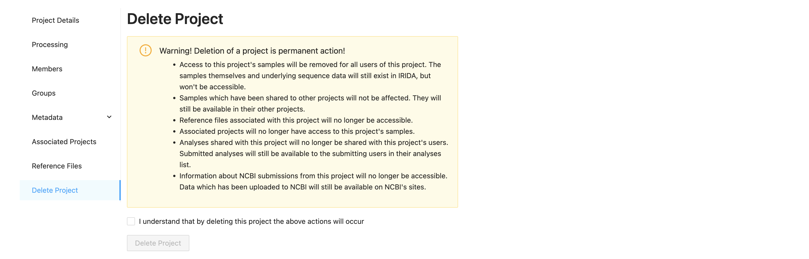

To delete a project, first read and understand the warning on the deletion page.  **Deleting a project is a permanent action!  Deleted projects and samples may not be able to be recovered.**  If you are sure you want to delete the project, check the confirmation box, then click **Delete Project**.  Once the project has been successfully deleted you will be redirected to your list of projects.

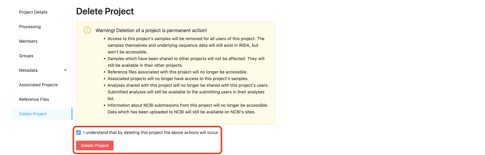

<a href="../user-groups/">Previous: Managing user groups</a><a href="../samples/" style="float: right;">Next: Managing samples</a>
