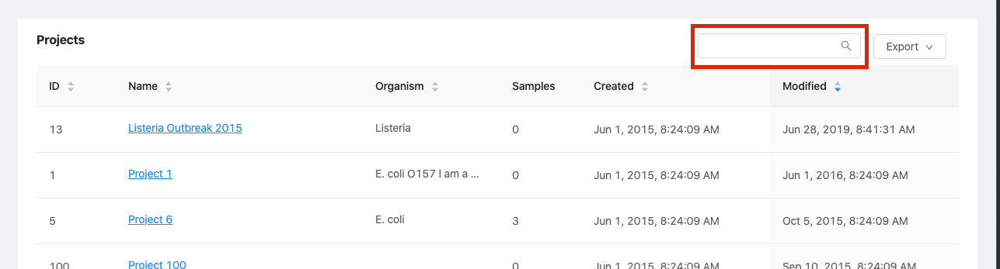
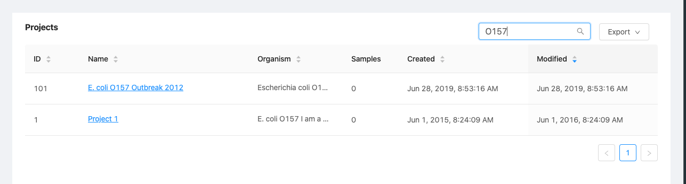
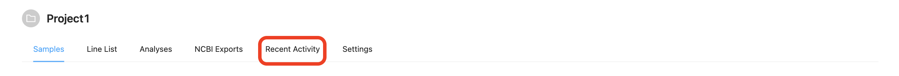

Managing Projects
=================
{:.no_toc}

The main organizational tool in IRIDA is the project. This section of the user guide descibes how you can view projects, edit project metadata (including uploading reference files), search for projects by name, and create new projects.

* This comment becomes the toc
{:toc}

Viewing existing projects
-------------------------

You can access the list of projects that you have permission to view and modify by clicking on the "Projects" menu at the top of the dashboard and selecting "Your Projects":

The projects list shows all projects that you are permitted to view or modify:

The projects list provides a high-level overview of project details, including:

* The IRIDA-generated identifier for the project,
* The name of the project,
* The project organism,
* The number of samples created in the project,
* The number of other user accounts with permissions to view or edit the project,
* The date that the project was created in IRIDA,
* The time that the project was last modified.

Filtering and Searching the Projects Table
------------------------------------------

There are two ways to find a specific project in the projects table - filtering and searching.

### Searching

Search is always available in the text field directly above and to the right of the table.  This search across the project's id, name, and organism.

### Filtering

Pressing the Filter button opens a dialogue that allows you to filter on specific items within the project - the name and the organism.  Each filter only applies to its specific part of a project.

Example: filtering the name by "outbreak" and organism by "listeria" gives the following results:

You can see which filters are currently applied to the table under the filter button:

Clicking on the filters will clear that specific filter.

Creating a new project
----------------------



Viewing project details
-----------------------

To view project details, start from the [projects list](#viewing-existing-projects) and click on the **Name** of the project:

The project details page shows a summary of the project details and provides a view of the samples that belong to the project. You can find out more about managing samples in a project by navigating to the [managing samples](../samples) section.

More detailed project information can be found by clicking the tabs at the top of the project details page.

Editing project details
-----------------------

To edit project details, start by [viewing the project details](#viewing-project-details), then click on the "Metadata" tab:

On the project metadata page, click on the "Edit" button in the top, right-hand corner of the page:

The project details editing page provides the same form as when you [created the project](#creating-a-new-project), and all of the same descriptions apply. When you've finished editing the project details, you can click on the "Update" button at the bottom of the form.

Project members
---------------

Project members are users who have permissions to view or edit project metadata. Project members can also view, download, and submit pipelines using sequencing data that's contained in a project. Project members can have two different roles: a project collaborator (*read-only* permissions), and a project manager (*read* and *modify* permissions).

If you are a project **Manager**, you can add new members to the project. Start by clicking on the "Members" tab, above the [project details panel](#viewing-project-details):

A project **Collaborator** will only be able to *view* the project members:

A project **Manager** will be able to *modify* the project members:

### Adding a project member

#### Adding an individual project member



#### Adding a group project member



### Changing a project member role

You may want to change a project member role if you wish to remove permissions for an individual user account to modify project details, but still want to allow that user account to view the project data. You can only change a project member role if you have the **Manager** role on the project.

Start by [viewing the project members](#project-members).

To change the role of a project member, click on the role drop-down menu of the user that you would like to change:

The project role is saved as soon as you make a selection -- you **do not** need to click a "Save" button.

### Removing a user from a project

You may want to completely remove all permissions for a user to access data in a project. To remove those permissions, you must remove the user account from the project members list.

Start by [viewing the project members](#project-members).

To remove a project member, click on the remove button on the right-hand side of the table:

When you click the remove button, you will be asked to confirm the project member removal:

To confirm, click the "Ok" button.

Associated Projects
-------------------

Associated projects can be used to help manage related sample data across multiple projects.  Samples from associated projects can be viewed seamlessly with samples from the local project and used together in analysis pipelines.  Associated projects can also be added from projects from remote IRIDA installations.

### Viewing associated projects

Click the "Associated Projects" tab at the top of the project page.

The "Projects" list will display the projects associated with this project. The associated projects list will also display whether the project is on the local installation or if the project exists on a remote IRIDA installation.

The "Remote APIs" section displays your connection status to remote IRIDA installations that have projects associated to this project.

### Adding or removing associated projects

Project Managers can add or remove associated projects for a project.  From the "Associated Projects" page, click the "Edit" button.

**Note:** To add or remove a project to the list of associated projects, the manager must *at least* be able to read the data in the project to be added in the associated projects list.

#### Local Projects

Click the "Local" tab on the edit associated projects page.  You will be presented with a list of all projects you have access to in the local installation.  To add or remove an associated project, click the "On/Off" switch.

#### Remote Projects

To add or remove remote associated projects, click the "Remote" tab. You can choose the remote instance of IRIDA that you want to list projects from by selecting an entry in the dropdown menu. If you are not connected to the API, you must click the "Connect" button before you will see the list of projects on the remote site.

To add or remove an associated project from the API, click the "On/Off" switch next to the project name.

Adding reference files to a project
-----------------------------------

Reference files are required by at least one of the workflows that are installed in IRIDA by default. Reference files are stored on a project-by-project basis.

Starting from [viewing project details](#viewing-project-details), you can add a reference file to a project by clicking on the "Reference Files" tab at the top of the projects page:

You can upload a new reference file to the project by clicking on the "Upload Reference File" button:

Reference files **must** be in `fasta` format. Files containing **ambiguous base calls** will be rejected.

Once you've uploaded a reference file, you can optionally download the reference file (useful if someone else uploaded the reference file for the project) by clicking on the  download icon in the list of reference files.

Viewing recent project activity
-------------------------------

Project data and metadata is changed over time. You can see a list of recent changes that have taken place by viewing the recent activity for a project.

Starting from [viewing project details](#viewing-project-details), you can view recent project activity by clicking on the "Recent Activity" tab at the top of the projects page:

Recent activities include adding or modifying project members and adding new samples to a project:

Managing automated assemblies
-----------------------------

Data that is uploaded to a project in IRIDA can be automatically assembled using IRIDA's assembly and annotation pipeline.  This setting is enabled on a project-by-project basis and must be enabled by a project **manager**.

From the project page, click the **Settings** tab at the top.

To enable automated assemblies, check the *Automatically assemble data uploaded to project* box.  Any new data uploaded to the project will now be automatically assembled.

Synchronizing a remote project
------------------------------

IRIDA allows you to synchronize projects between different IRIDA installations.  A remote project appears similar to a local project, but users are not allowed to add samples or sequencing data to a remote project.  Instead all data associated with a remote project will be pulled from a remote IRIDA API on a regular schedule.  The only data that can be managed for a remote project is the members that are allowed to view the project and associated sample data.

#### Connecting to a remote API

Before a remote project can be synchronized a connection must be set up between the IRIDA project host installation and the receiving IRIDA installation.  The connection between installations is handled by the IRIDA client and remote api connections.

First the IRIDA installation hosting the project must create a client which will be used to connect to the REST API.  The client must be created with a grant type of `authorization_code` and scope of `read`.  It is also recommended to enable refresh tokens for clients which will be involved in project synchornization.  Documentation on creating system clients can be found in the adminstrator guide's [managing system clients section](/user/administrator/#managing-system-clients) and it must be performed by a system administrator.

Next the receiving IRIDA installation must set up a remote API connection to the hosting IRIDA site.  Information on adding a remote API connection can be found in the administrator guide's [adding a remote api section](/user/administrator/#adding-a-remote-api) and must also be perfomed by an administrator.

#### Creating a remote synchronized project

Once the client and remote APIs have been created a user create a synchronized project.  Note that in order to synchronize a remote project, a user must have login credentials to the host IRIDA installation and be a project member on the project they wish to synchronize.

To begin creating a synchronized project, click the `Synchronize Remote Project` option in the `Projects` menu. 

 

Once on the `Synchronize New Remote Project` page, you must select the required remote API and verify your connection status.  If you don't have a valid connection to the remote API you must click the `Connect` button and follow the instructions to connect to the remote API to proceed.  For more information on connecting to remote APIs see the [remote APIs documentation](/user/user/dashboard/#remote-apis).

Once you have connected to the remote API, you can select the project you wish to synchronize from the `project` dropdown.  Here you wil be given a listing of all the projects you have access to on the remote IRIDA installation.  

After you have selected your project, you can select a synchronization frequency.  You should select a frequency that matches how often data will be added to the project.  This option can be updated later in the project settings panel.

The advanced section allows you to manually paste in an IRIDA project's REST URL rather than selecting it from the projects dropdown.  This option should only be used by advanced IRIDA users.

Once your project and an appropriate synchronization frequency have been selected, click the `Synchronize Project` button to create your project.

After the synchronized project has been created, you can view it's synchronization status at the top of the project's landing page.

The status section will be one of the following messages:

* `Marked for synchronization` - This project will be synchronized when the next project synchornization job runs.
* `Updating` - This project is currently being synchronized.
* `Synchronized` - This project is up to date since the last project synchronization job has been run.
* `Unauthorized` - The user who has created the synchronized project can no longer read the project on the host IRIDA installation.
* `Error` - An error occurred during the last project synchronization job.
* `Unsynchronized` - This project will no longer be synchronized.

<a href="../user-groups/">Previous: Managing user groups</a><a href="../samples/" style="float: right;">Next: Managing samples</a>