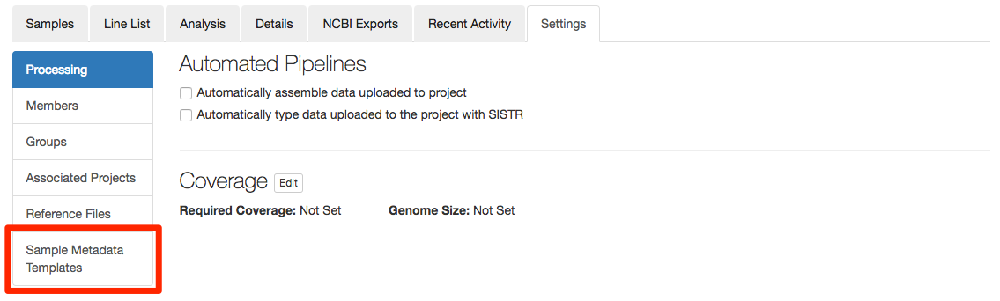
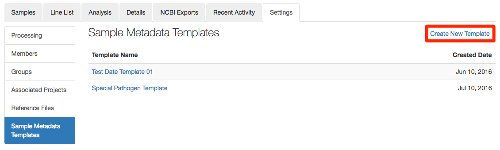
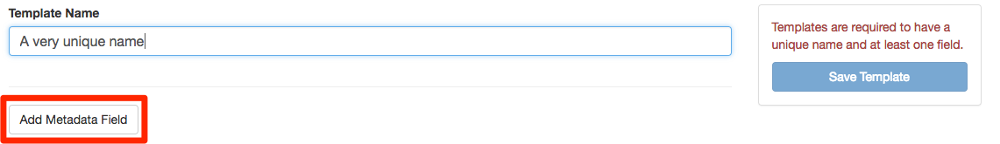
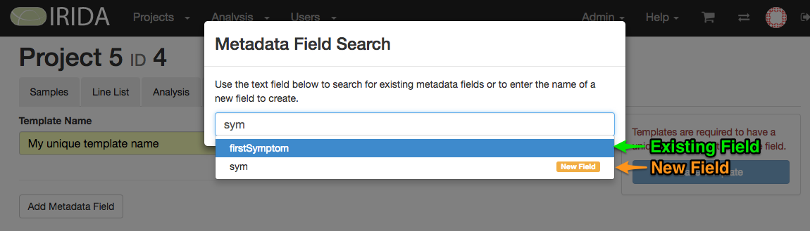
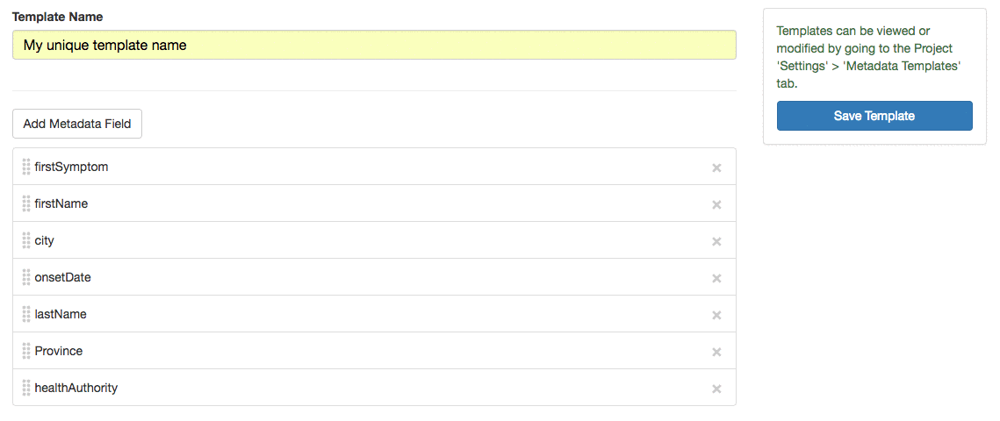
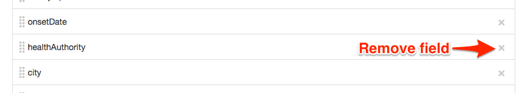
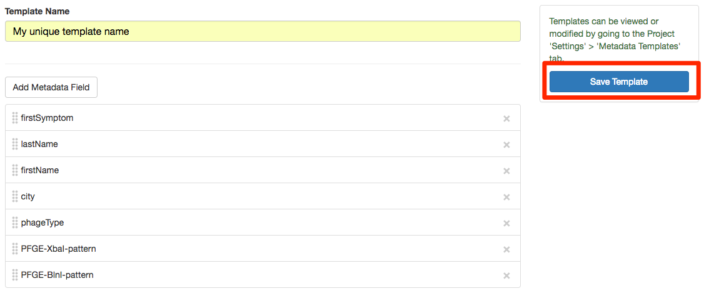
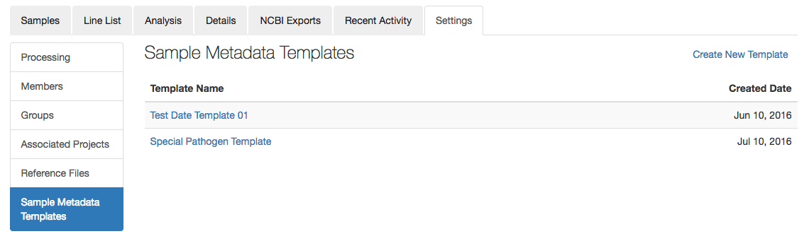
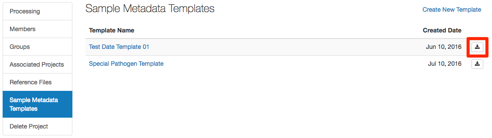
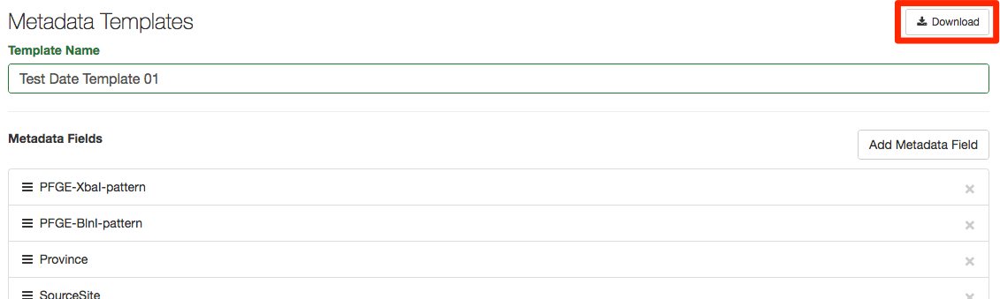

Managing Sample Metadata Templates
==================================
{:.no_toc}

Samples metadata templates can be created, modified, or deleted within project settings.

## Creating a metadata template

To create a metadata template, click on the`Create New Template` link in the top right corner of the page.

Every template required 2 items:

1. Template name.
    - Name must be at least 5 characters long.
    - Name cannot already be used as a template name within the current project.
1. At least one metadata field.

If the template name selected already exists in the current project or the name is not long enough a warning is displayed.

To add a metadata field to the template click on the `Add Metadata Field` button, which will open up a dialog window.

A metadata field might already exist within this project.  As you type, existing metadata field names will be presented as options to select.

When entering the name of a metadata field, options will be presented to either used an existing metadata field or create a new field (see image above).  To select the field that you want, just type the full name and press `enter` or select the option from the drop down.

Once fields have been added they can be rearranged by dragging and dropping to their required location.  This is good when related fields should be next to each other.

A field can be removed from the template by clicking on the &times; button at the end of the field row.

Once the template is ready, click the `Save Template Button`, this saves the template.  You will know the template is saved when a `Template ID` is displayed at the top of the page, and there is an option to delete the template at the bottom of the page.

## Modifying existing metadata templates

From the Sample Metadata Template page within project settings, click on the name of the template you want to modify.  Fields can be modified as explained in the above section on creating a template.

## Deleting metadata templates

Clicking on the delete template button will open a warning about deleting the template.  Clicking the `Delete this template` button in the modal will delete this template **this cannot be undone**.

## Downloading metadata templates

An existing template can be downloaded directly on the Settings page by clicking on the <i class="fa fa-download fa-fw"></i> button on the right side of the table row.  This will download an excel file containing a header row with all the metadata fields in the template.

Templates can also be downloaded on their individual details page by clicking on the <i class="fa fa-download fa-fw"></i> button at the top of the page.

