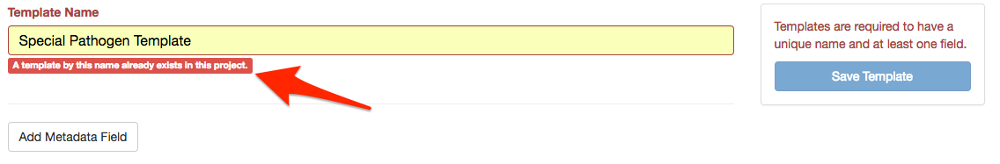
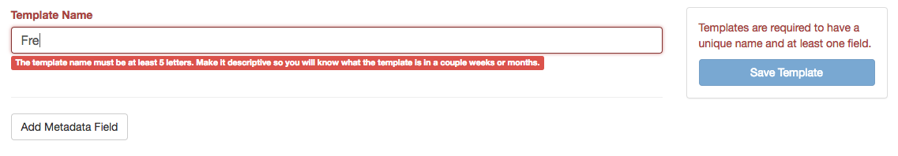

Managing Sample Metadata Templates
==================================
{:.no_toc}

Samples metadata templates can be created, modified, or deleted within project settings.

### Creating a metadata template

To create a metadata template, click on the`Create New TEmplate` link in the top right corner of the page.

Every template required 2 items:

1. Template name.
    - Names must be at least 5 characters long.
    - Name cannot already be used as a template name within the current project.
1. At least one metadata field.

If the template name selected already exists in the current project a warning is displayed:

If the template name is too short a warning is displayed:

To add a metadata field to the template click on the `Add Metadata Field` button, which will open up a dialog window.

// ADD FIELDS HERE.

## Modifying existing metadata templates

From the Sample Metadata Template page within project settings, click on the name of the template you want to modify.
