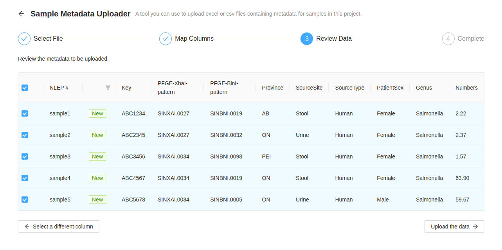
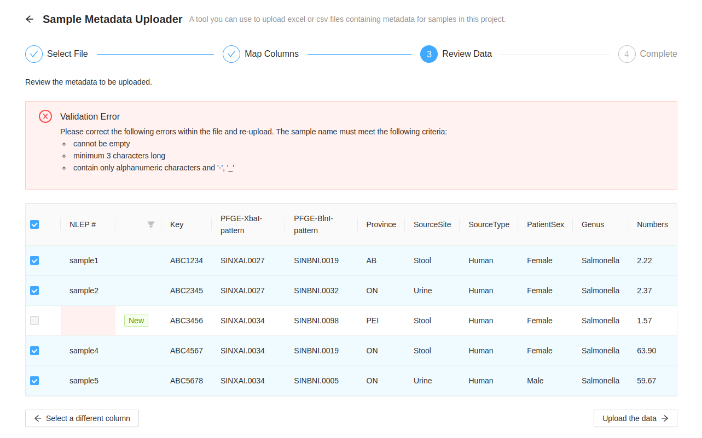
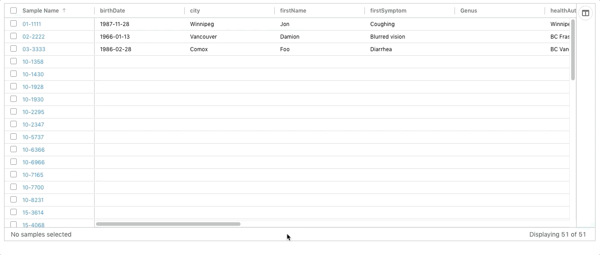

Managing Sample Metadata
========================
{:.no_toc}

Each [project](../project) in IRIDA may contain a collection of samples that corresponds to an isolate. Each sample can contain an indefinite number of metadata terms.

* This comment becomes the toc
{:toc}

Viewing and modifying metadata on a sample
------------------------------------------

Metadata can be [viewed and modified]({{site.baseurl}}/user/user/samples/#viewing-individual-sample-details) on the individual sample.

Bulk import of metadata for samples within a project
----------------------------------------------------

Administrators and project managers can directly upload Excel spreadsheets of metadata directly to a project.  It is expected that one of the columns in the spreadsheet will map to the sample **name** within IRIDA, this can be selected at upload time.

Links to the upload page can be found:
 
1. On the `Project` > `Samples` page, under the `Sample Tools` dropdown menu:

2. On the `Project` > `Linelist` page:

<strong style="background-color: rgba(240, 173, 78, 1.00); padding: 5px; font-weight: bold">Please note that this feature is still under development.</strong>

Any excel spreadsheet containing metadata for samples in a project can be uploaded through the IRIDA web interface.  One of the column in the table __must__ correspond to the sample name within the project.  In this example spreadsheet, the `NLEP #` column is the sample name.

THe first step is to select the Excel file containing the data.  Either click on the square label `Click or drop Excel file containing metadata for samples in this project.` or drag and drop the file from your file browser.

After uploading a spreadsheet, the column corresponding to the sample name must be selected.  After selecting the column heading, press the `Preivew metadata to be uploaded` button.

Before the metadata upload is completed, metadata that matches sample names and ones that don't are presented.

Metadata that has a matching sample name are listed in the table `Rows matcthings samples` with the number of matching samples.  Clicking on the `Save valid metadata` button will add the metadata to it's sample and redirect to the linelist page.

Metadata that do not have matching sample names are listed in the table `Rows not matching samples` with the number of non-matching samples.  Currently nothing can be done about these.  Try to check the sample names and re-importing the spreadsheet.

### Example Upload

Project Metadata Line List
--------------------------

A Metadata Line List is a table that summarizes all metadata associated with samples in a project.  

### Sorting Columns

The initial sort is on the `Sample Name` column in ascending order. 

Columns can be sorted by clicking on the column headers and the sort direction is indicated by an arrow next to the label.   Multiple columns can be sorted simultaneously by holding down the `Shift` key while clicking on the column header. 

### Column Filtering

Data within individual columns can be filtered.  Hovering the cursor over the column header displays a menu icon that, when clicked, displays filtering options.

Filters can be set to be:
- Equals: the text entered must exactly match the value in the column
- Not equal: if the text entered matches the value in the column, the sample will be hidden
- Start with: column value must start with the value entered
- Ends with: column value must end with the value entered
- Contains: the text entered can be found anywhere in the value in the column
- Not contains: the text entered cannot ve found anywhere in the value in the column.

Up to 2 separate filters can be applied to a column at a time.

### Reorder Columns

To make it easier to see related information, columns can be re-ordered by dragging the the column header to the required position.

### Toggle Metadata Columns

Some columns might not have information that is useful in a particular analysis.  Columns can be toggled on and off in the right hand side panel of the table.  If the panel is closed, or needs to be opened, click the `Columns` button on the right hand side of the table.

Columns can be toggled on and off by selecting the checkbox with the column name in it.  If the checkbox is checked, the column will be visible.

### Saving Column Order and Visible Metadata

Updating the column order and which metadata is visible can be saved as a **Template** so that the next time the line list is viewed the same settings can be applied quickly.  Click the `Save Template` button which will open a dialog window.  Add a name for the template (this cannot match the name of another template within the project).

A template can up updated by selecting its name in the dropdown.  The checkbox must be selected stating that the existing template will be overwritten.

After a template is created it can me modified or deleted under [Project Settings > Sample Metadata Templates](../sample-metadata-templates)

### Exporting Data from Metadata Table

Data can be exported as either Excel or CSV formats.  Ony the fields currently in the table will be exported.

Hovering over the `Export` button which will reveal a dropdown where you can select from either `Export as Excel` or `Export as CSV`, the download will begin automatically.

### Editing Metadata

#### Inline Editing

Values within the metadata table can be updated by double clicking on the cell you want to modify, enter the new value and press enter.  The new value will be automatically saved.  Once a cell has been edited, a notification will display with a "undo" button, that will revert the value back to the original.

