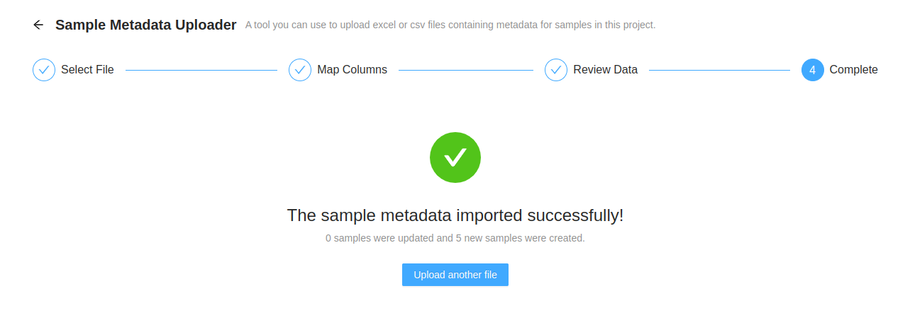
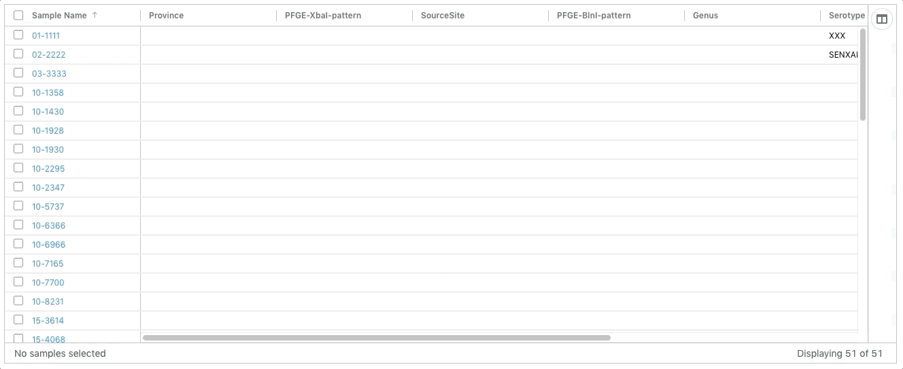
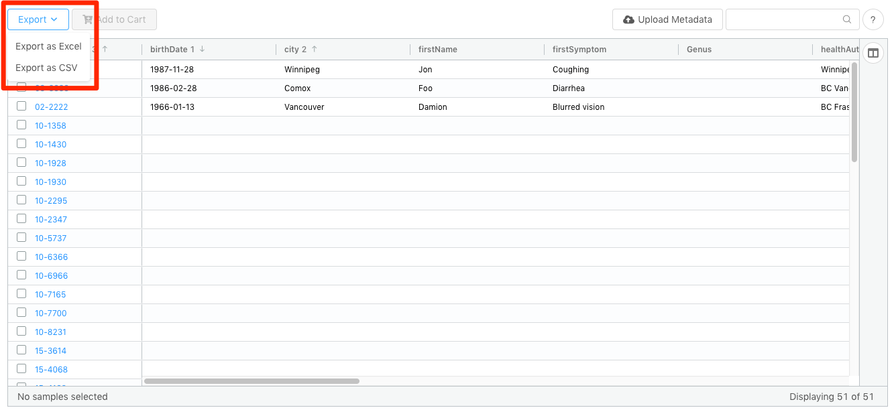
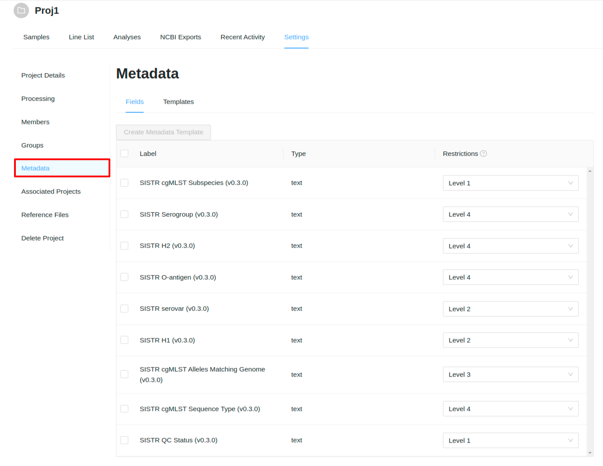
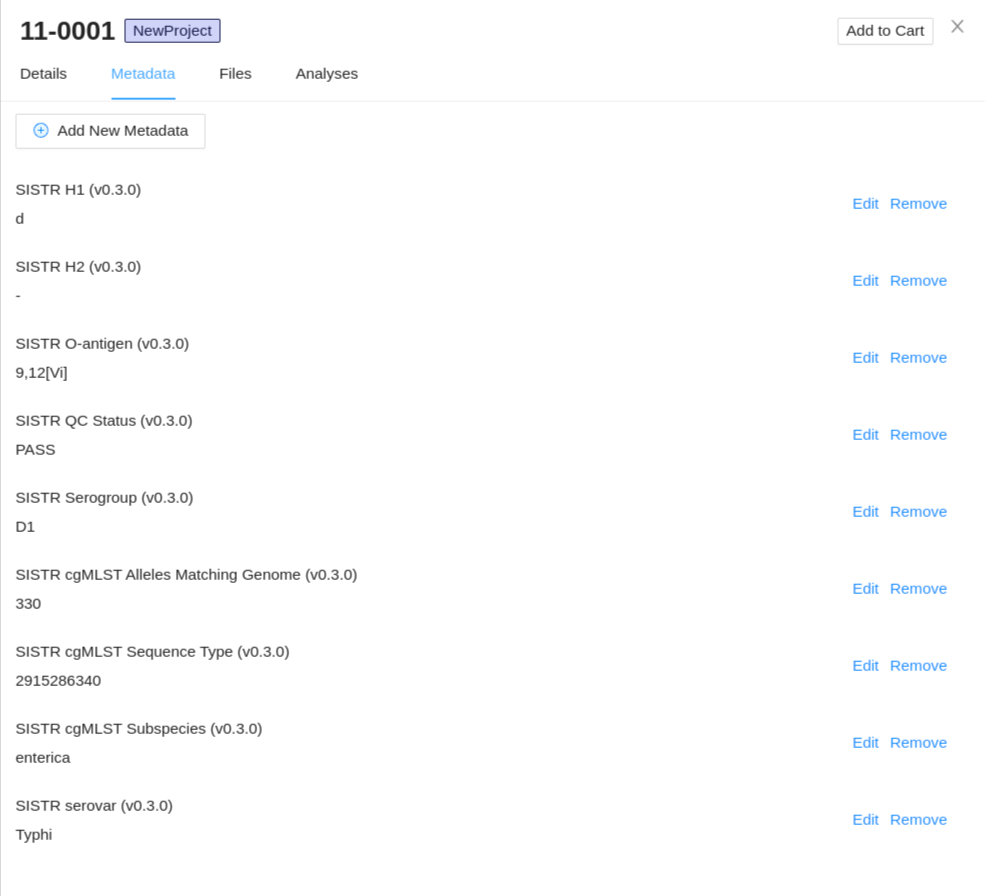
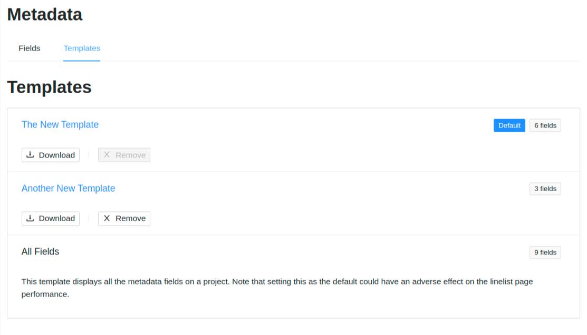
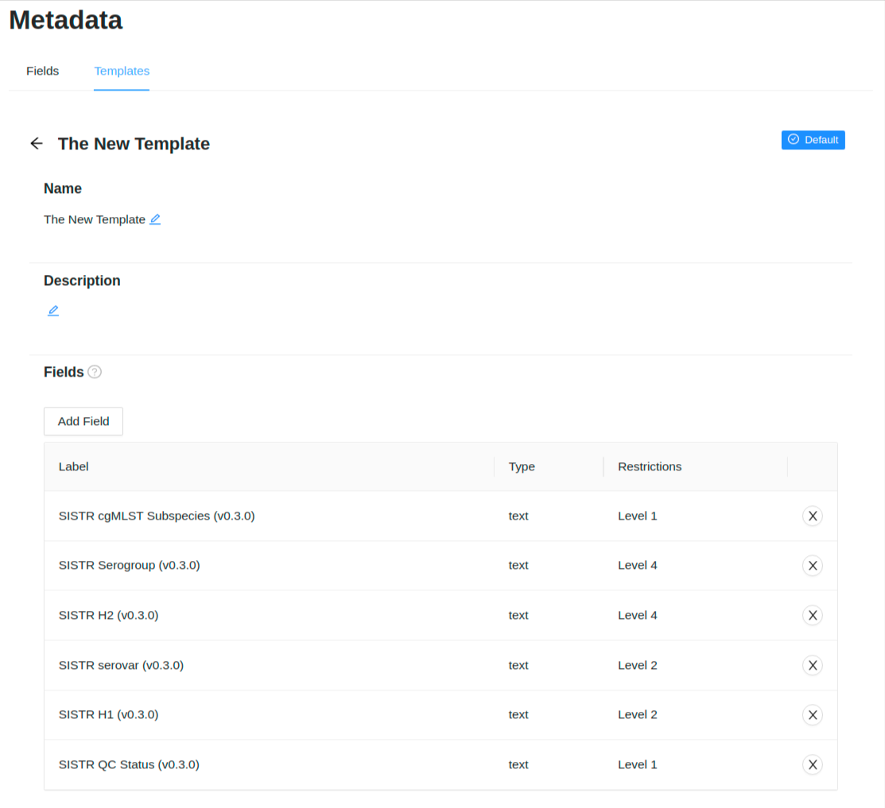

Managing Sample Metadata
========================
{:.no_toc}

Each [project](../project) in IRIDA may contain a collection of samples that corresponds to an isolate. Each sample can contain an indefinite number of metadata terms.

* This comment becomes the toc
{:toc}

Viewing and modifying metadata on a sample
------------------------------------------

Metadata can be [viewed and modified]({{site.baseurl}}/user/user/samples/#viewing-individual-sample-details) on the individual sample.

Bulk import of metadata for samples within a project
----------------------------------------------------

Administrators and project managers can directly upload Excel spreadsheets of metadata directly to a project.  It is expected that one of the columns in the spreadsheet will map to the sample **name** within IRIDA, this can be selected at upload time.

Links to the upload page can be found:
 
1. On the `Project` > `Samples` page, under the `Sample Tools` dropdown menu:

2. On the `Project` > `Linelist` page:

<strong style="background-color: rgba(240, 173, 78, 1.00); padding: 5px; font-weight: bold">Please note that this feature is still under development.</strong>

Any CSV or Excel spreadsheet containing metadata for samples in a project can be uploaded through the IRIDA web interface.  One of the column in the table __must__ correspond to the sample name within the project.  In this example spreadsheet, the `NLEP #` column is the sample name.

The first step is to select the CSV or Excel file containing the data.  Either click or drag the file into the drop zone from your file browser.

After uploading a spreadsheet, you will be brought to the `Map Columns` step.  The column corresponding to the sample name must be selected. 

Once the sample name column is selected, a table will be displayed listing all the metadata fields.  You can review the existing and target metadata field restrictions here.  Press the `Review the data` button to continue.

You may select the rows that are to be uploaded on the `Review Data` step. Rows that do not match an existing sample name are identified with the `New` tag.  If selected, these samples will automatically be created.  Rows that match an existing sample name will be updated.

Rows that have an invalid sample name will be highlighted in red.  These errors should be fixed within the spreadsheet and re-imported.  Press the `Upload the data` button to continue.

Progress will be displayed while uploading.  Please be patient while uploading large data sets.  Do not close the window or leave the page.

On a successful upload, you will be brought to the `Complete` step.  Clicking on the `Upload another file` button will redirect to the beginning of a new upload.

Project Metadata Line List
--------------------------

A Metadata Line List is a table that summarizes all metadata associated with samples in a project.

### Sorting Columns

The initial sort is on the `Sample Name` column in ascending order. 

Columns can be sorted by clicking on the column headers and the sort direction is indicated by an arrow next to the label.   Multiple columns can be sorted simultaneously by holding down the `Shift` key while clicking on the column header. 

### Column Filtering

Data within individual columns can be filtered.  Hovering the cursor over the column header displays a menu icon that, when clicked, displays filtering options.

Filters can be set to be:
- Equals: the text entered must exactly match the value in the column
- Not equal: if the text entered matches the value in the column, the sample will be hidden
- Start with: column value must start with the value entered
- Ends with: column value must end with the value entered
- Contains: the text entered can be found anywhere in the value in the column
- Not contains: the text entered cannot ve found anywhere in the value in the column.

Up to 2 separate filters can be applied to a column at a time.

### Reorder Columns

To make it easier to see related information, columns can be re-ordered by dragging the the column header to the required position.

### Toggle Metadata Columns

Some columns might not have information that is useful in a particular analysis.  Columns can be toggled on and off in the right hand side panel of the table.  If the panel is closed, or needs to be opened, click the `Columns` button on the right hand side of the table.

Columns can be toggled on and off by selecting the checkbox with the column name in it.  If the checkbox is checked, the column will be visible.

### Saving Column Order and Visible Metadata

Updating the column order and which metadata is visible can be saved as a **Template** so that the next time the line list is viewed the same settings can be applied quickly.  Click the `Save Template` button which will open a dialog window.  Add a name for the template (this cannot match the name of another template within the project).

A template can up updated by selecting its name in the dropdown.  The checkbox must be selected stating that the existing template will be overwritten.

After a template is created it can me modified or deleted under [Project Settings > Sample Metadata Templates](../sample-metadata-templates)

### Exporting Data from Metadata Table

Data can be exported as either Excel or CSV formats.  Ony the fields currently in the table will be exported.

Hovering over the `Export` button which will reveal a dropdown where you can select from either `Export as Excel` or `Export as CSV`, the download will begin automatically.

### Editing Metadata

#### Inline Editing

Values within the metadata table can be updated by double clicking on the cell you want to modify, enter the new value and press enter.  The new value will be automatically saved.  Once a cell has been edited, a notification will display with a "undo" button, that will revert the value back to the original.

Project Sample Metadata
-----------------------

Each sample can contain it's own metadata.  IRIDA uses the terms:
* **Metadata Field** as the label for a piece of metadata (e.g. Organism).
* **Metadata Entry** for the value associated with it (e.g. _Salmonella enterica_).

All metadata fields associated with samples in a project can be viewed on the metadata fields page. This is accessed by clicking on the 'Metadata' tab within the **Project Settings**. Once on the Sample Metadata page, you will see a listing of all *Metadata Fields* associated with samples in this project and their restriction levels:

Metadata Fields have:
* **Type**: Indicates the type of data that the field can be.  Usually this will be just "text".
* **Restrictions**: Indicates the metadata role required to view that field and any fields with levels below this restriction level.

#### Individual Sample Metadata

You can view the metadata for a sample from the **Metadata** tab of the sample details viewer which can be launched from anywhere the sample is listed by clicking the sample name. Only a user with a project **Manager** role can add/edit sample metadata.

#### Metadata Field Security

Metadata Fields can be restricted at the project level by metadata role. There are 4 restriction levels which can be applied to a field (Level 1, Level 2, Level 3, Level 4 (with Level 4 being the highest restriction level and Level 1 the lowest)). A project **Manager** has a default metadata role of `Level 4` and can view all the project sample metadata. A **Collaborator** can have any of the metadata roles applied to them and will only be able to view fields with their metadata role and lower.

On the metadata fields page, the project **Manager** can set the restriction levels for each of the metadata fields associated with the project:

For this example we have the Test User set to **Collaborator** with a metadata role of **Level 2**:

Visiting the line list page, this user will only see the metadata fields which have a restriction level of 2 or below. In this case there are only 4 fields this user can view:

* **SISTR cgMLST Subspecies (v0.3.0)**: Level 1
* **SISTR QC Status (v0.3.0)**: Level 1
* **SISTR serovar (v0.3.0)**: Level 2
* **SISTR H1 (v0.3.0)**: Level 2

Visiting the metadata fields page, this user will only be able to see the 4 fields above:

### Metadata Templates

Metadata Templates provide a pre-defined collection and order of metadata fields used for displaying sample metadata on the line list page.

To create a new metadata template (**project managers only**) select the fields from the metadata fields table and click the "Create Template" button:

 * **Name**: Must be unique within the project (required)
 * **Description**: Any information that will help to understand why this template should be used.
 * **Fields**: Fields can be dragged and dropped into any order.

A list of all metadata templates for the project can be viewed by selecting the "Templates" from the menu along the top:

Each template listing contains:
  * Template name; clicking this will redirect to the template details page. 
  * Template description, the number of fields in the template.
  * Template actions, including (download Excel file of template fields, and remove template (managers only))
  * `Set as Default` button to set the template as the default for the project (displays if hovering on a template (managers only)) or a `Default` tag if template is already set as default for the project.

Template Details Page
---------------------

Clicking on a template name will redirect you to the template details page.

Project manager can edit/update the template name, description and fields on this page. They can also set the template as the default for the project.
