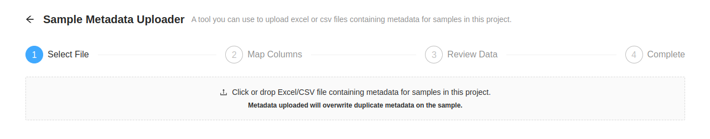

Managing Sample Metadata
========================
{:.no_toc}

Each [project](../project) in IRIDA may contain a collection of samples that corresponds to an isolate. Each sample can contain an indefinite number of metadata terms.

* This comment becomes the toc
{:toc}

Viewing and modifying metadata on a sample
------------------------------------------

Metadata can be [viewed and modified]({{site.baseurl}}/user/user/samples/#viewing-individual-sample-details) on the individual sample.

Bulk import of metadata for samples within a project
----------------------------------------------------

Administrators and project managers can directly upload Excel spreadsheets of metadata directly to a project.  It is expected that one of the columns in the spreadsheet will map to the sample **name** within IRIDA, this can be selected at upload time.

Links to the upload page can be found:
 
1. On the `Project` > `Samples` page, under the `Sample Tools` dropdown menu:

2. On the `Project` > `Linelist` page:

<strong style="background-color: rgba(240, 173, 78, 1.00); padding: 5px; font-weight: bold">Please not that this feature is still under development.</strong>

Any excel spreadsheet containing metadata for samples in a project can be uploaded through the IRIDA web interface.  One of the column in the table __must__ correspond to the sample name within the project.  In this example spreadsheet, the `NLEP #` column is the sample name.

THe first step is to select the Excel file containing the data.  Either click on the square label `Click or drop Excel file containing metadata for samples in this project.` or drag and drop the file from your file browser.

After uploading a spreadsheet, the column corresponding to the sample name must be selected.  After selecting the column heading, press the `Preivew metadata to be uploaded` button.

Before the metadata upload is completed, metadata that matches sample names and ones that don't are presented.

Metadata that has a matching sample name are listed in the table `Rows matcthings samples` with the number of matching samples.  Clicking on the `Save valid metadata` button will add the metadata to it's sample and redirect to the linelist page.

Metadata that do not have matching sample names are listed in the table `Rows not matching samples` with the number of non-matching samples.  Currently nothing can be done about these.  Try to check the sample names and re-importing the spreadsheet.

### Example Upload

Project Metadata Line List
--------------------------

Line lists are tables that summarize the available metadata for samples within a project.  Only samples **that have associated metadata** will not be shown in this table.

### Reorder Columns

To make it easier to see related information, columns can be re-ordered by dragging the the column header to the required position.

### Toggle Metadata Columns

Some columns might not have information that is useful in a particular analysis.  You can toggle any metadata field by clicking the `Toggle Metadata Columns` button, which will open a side panel where metadata fields can be toggled on and off.

**Note:** the first column cannot be toggled off directly.  If that field needs to be hidden, drag it to a different column and then toggle the field.

Once all the column visibility has been set, click the close button at the top of the side panel to hide these options.

### Saving Column Order and Visible Metadata

Updating the column order and which metadata is visible can be saved as a **Template** so that the next time the line list is viewed the same settings can be applied quickly.  Click the `Save Template` button which will open a dialog window.  Add a name for the template (this cannot match the name of another template within the project).

The name given to the template should be descriptive and must be more than 5 letters.  The name must also not be used for another template within the project.

A warning is displayed if the name given for the template is too short or if the name is already used for a template within the current project.

After a unique name with more than 5 letters is provided the `Save` button will become enabled.  Clicking it will save the template to the project.

After a template is created it can me modified or deleted under [Project Settings > Sample Metadata Templates](../sample-metadata-templates)

### Exporting Data from Metadata Table

Data can be exported as either Excel or CSV formats.  Ony the fields currently in the table will be exported.

Clicking on the `Export` button which will reveal a dropdown where you can select from either `CSV` or `Excel`, the download will begin automatically.

