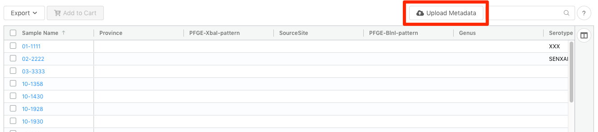

Managing Sample Metadata
========================
{:.no_toc}

Each [project](../project) in IRIDA may contain a collection of samples that corresponds to an isolate. Each sample can contain an indefinite number of metadata terms.

* This comment becomes the toc
{:toc}

Viewing and modifying metadata on a sample
------------------------------------------

Metadata can be [viewed and modified]({{site.baseurl}}/user/user/samples/#viewing-individual-sample-details) on the individual sample.

Bulk import of metadata for samples within a project
----------------------------------------------------

Administrators and project managers can directly upload Excel spreadsheets of metadata directly to a project.  It is expected that one of the columns in the spreadsheet will map to the sample **name** within IRIDA, this can be selected at upload time.

Links to the upload page can be found:
 
1. On the `Project` > `Samples` page, under the `Sample Tools` dropdown menu:

2. On the `Project` > `Linelist` page:

Uploading Excel Spreadsheet
===========================

