Managing Samples
================
{:.no_toc}

Each [project](../project) in IRIDA may contain a collection of samples that corresponds to an isolate. Each sample may contain several sequencing files, either paired-end, single-end, or both. This section of the user guide describes how you can view samples, manage samples (merging, copying, renaming, exporting), and search for samples by name.

* This comment becomes the toc
{:toc}

Viewing samples in a project
----------------------------

Start by [viewing the project details](../project/#viewing-project-details) of a project. The list of samples in the project is shown in the middle of the 
project details screen:

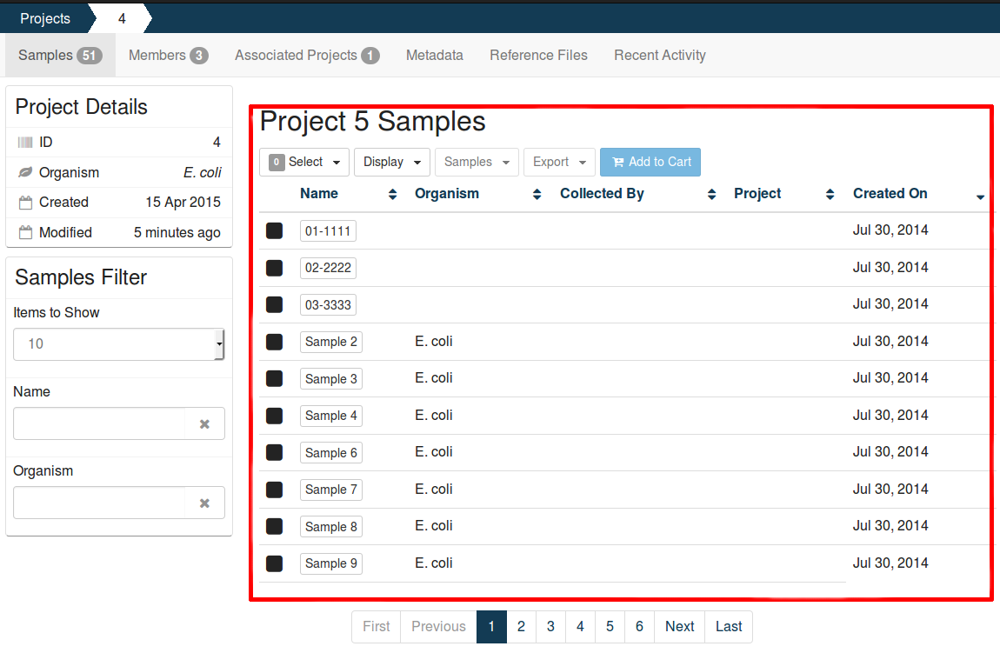

The samples listing shows high-level sample details, such as:

* The name of the sample,
* The user-defined organism of the sample (if provided),
* The name of the person who collected the sample (if provided),
* The project that the sample belongs to (if from a related project),
* The date that the sample was created in IRIDA.

### Viewing individual sample details

All of the sample details that are in IRIDA are currently provided by a user with the project  **Manager** role. To view details about an individual sample, start by [viewing the samples in a project](#viewing-samples-in-a-project), then click on the sample name in the samples table:

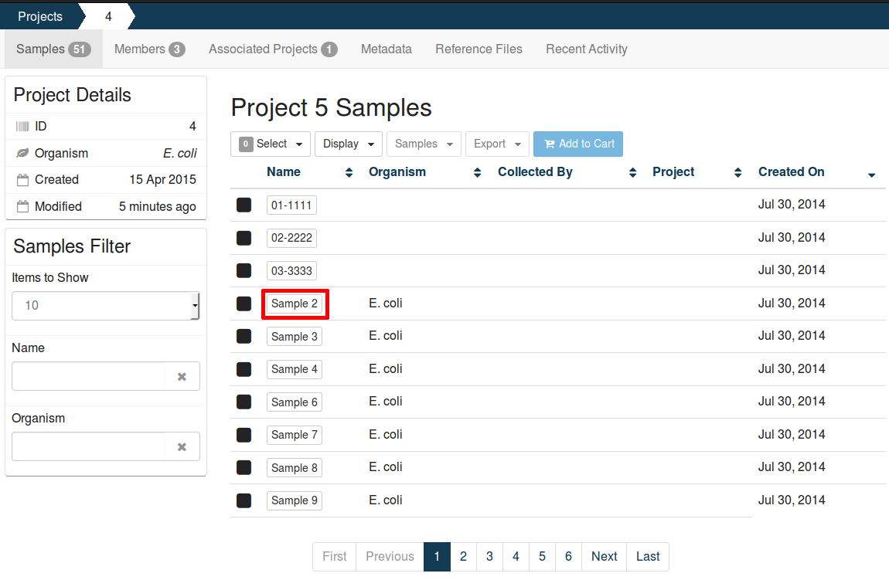

The sample details page shows all of the details that are currently known about a sample:


### Editing sample details

Start by [viewing the details of an individual sample](#viewing-individual-sample-details). On the samples details page, click on the "Edit" button in the top, right-hand corner:


You can provide as many or as few sample details that you want -- the sample details are not used by any workflows in IRIDA (except the sample name in the SNVPhyl workflow), and (with the exception of the sample name) none of the sample details are required fields. When you've finished updating the sample details, you can click on the "Update" button at the bottom, right-hand side of the page.

### Viewing sequence files

Start by [viewing the details of an individual sample](#viewing-individual-sample-details). On the sample details page, click on the "Files" tab, just above the sample details panel:


Sequence files may have been uploaded as paired-end files or as single-end files, depending on how the isolate was sequenced.

Single-end files will appear in the sample alone:


Paired-end files will appear in a pair:

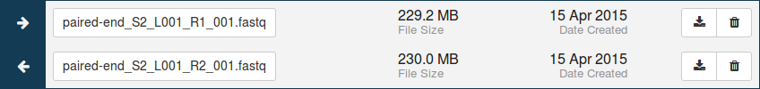

#### Upload a sequence file

Sequence files can be uploaded by clicking on the "Upload new files" button at the top, right hand side of the sequence file table.  Files must have the extension <code>.fastq</code>, all other formats will be ignored.

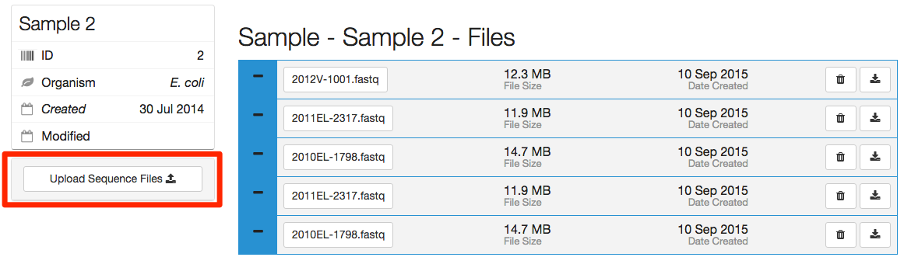

You can upload a collection of sequencing data to IRIDA by dragging the files in a directory to the drop area in the pop-up window:

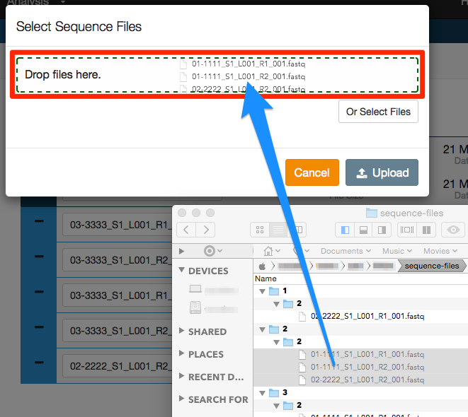

You may also upload files by clicking on the "Or Select Files" button:


The added files will be displayed in the pop-up window, and can be removed before upload by clicking the trash can button to the right of the file size.

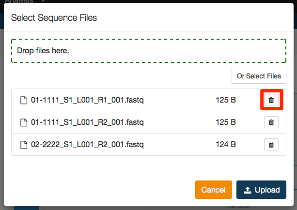

To complete the upload press the Upload button.

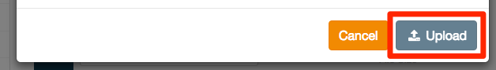

#### Downloading a sequence file

You can download a sequence file by clicking on the  icon, on the right-hand side of the row for the sequence file.

You can download all sequence files in a sample by following the instructions in the [exporting samples](#exporting-samples) section about [downloading samples](#downloading-samples).

#### Deleting a sequence file

If you need to delete a sequence file from IRIDA, you can do so by clicking on the  icon, on the right-hand side of the row for the sequence file.

You can only delete a sequence file from a sample if you have the project  **Manager** role on the project.

Adding a new sample
-------------------

You can add a new sample to the project if you have the project Manager role on the project. To add a new sample to the project, click on the "Add New Sample" button in the "Samples" menu:

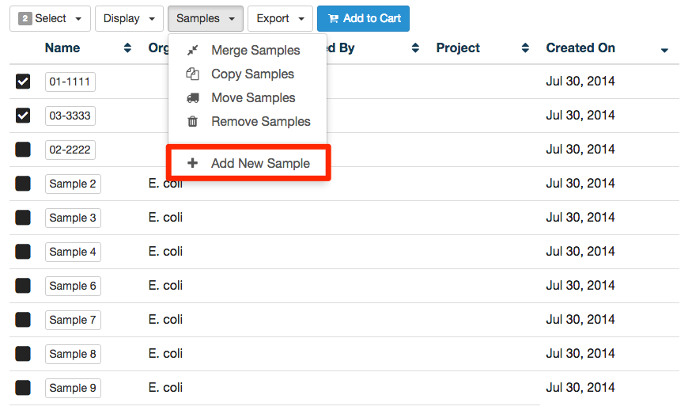

Clicking this button will take you to the Create New Sample page.  When creating a sample, you must define the sample name (only upper and lowercase letters, numbers, and the special characters <code>!, @, #, $, %, _, -</code>, and <code>`</code> are allowed) and optionally choose an organism for the sample:

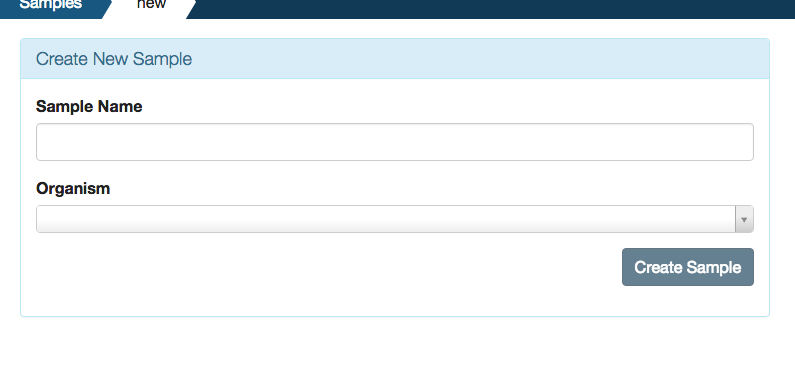

If you choose to set a sample organism, click on the "Organism" drop-down menu and begin typing the name of the organism. For example, if you wanted to specify a sample organism of “Escherichia coli O26:NM”, you would begin to type "Esc" and the menu would allow you to choose from a set of well-defined organism names:

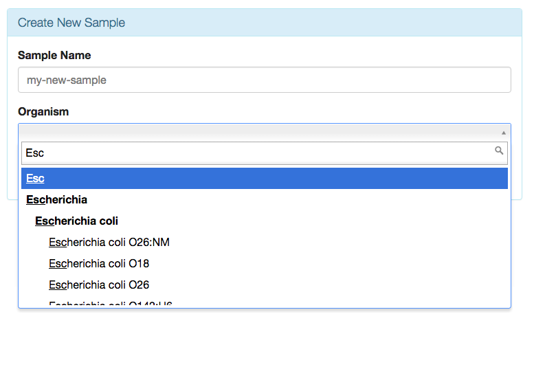

When you've finished choosing the name and organism for the sample, click on the "Create Sample" button.


Searching and filtering samples
-------------------------------

You can search and filter samples in a project in IRIDA by sample name and organism using the filter fields in the bottom, left-hand side of the [samples list](#viewing-samples-in-a-project):


The filters work by only showing samples that have the search string *anywhere* in the name or organism field. So, for example, if you're searching for a sample that has the numeral 2 in its name, enter `2` into the sample name filter, and you would find samples with names like:

* Sample_2
* Sample_293
* 2nd_Sample

To remove a filter from your view, either click the  icon, or delete the text in your filter.

Modifying samples
-----------------

Only user accounts that have the  **Manager** role on a project can modify the samples in a project.

### Selecting samples

All sample modification actions require that samples be selected. You can select individual samples by clicking on the checkbox beside the sample:


You may also select many samples using the "Select" drop-down that appears above the samples list on the right-hand side:

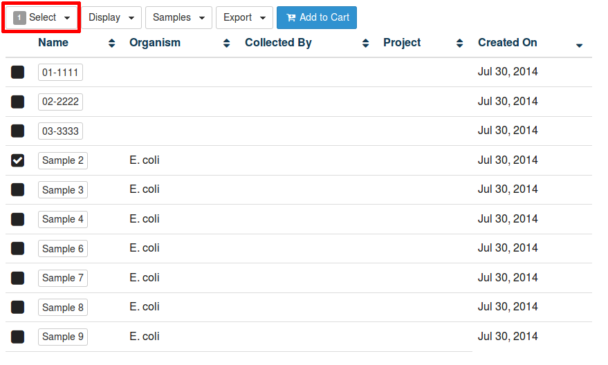

The select button will always indicate the total number of selected samples in the project as a numeral with a gray background.

When you click on the select button, you have the option to select samples by:

* Page (selects all of the samples visible on your screen)
* All (selects **all** samples in the project)
* None (delesects all samples)

### Copying samples between projects

Samples may be copied between projects. A sample that is copied into multiple projects is effectively *linked* between those projects -- the files contained within the sample are not physically duplicated, and any sample metadata changes in one project are reproduced in the sample in the copied project.

You must be a project  **Manager** on **both** the project that you are copying the sample *from*, and the project that you are copying the sample *to*.

Start by [selecting the samples](#selecting-samples) that you want to copy to the other project. When you've selected the samples that you want to copy, click on the "Samples" button just above the samples list, and select "Copy Samples":

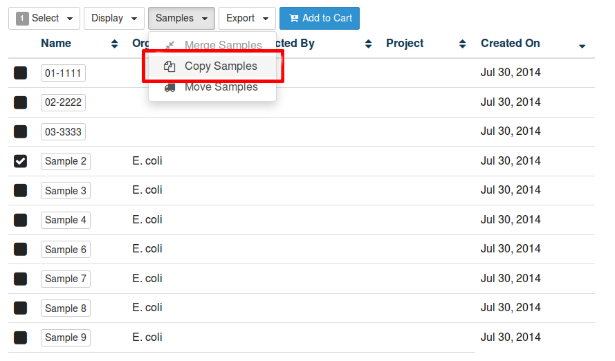

In the dialog that appears you will be presented with a list of the samples that are going to be copied, and an option to choose the project that the samples should be copied to:

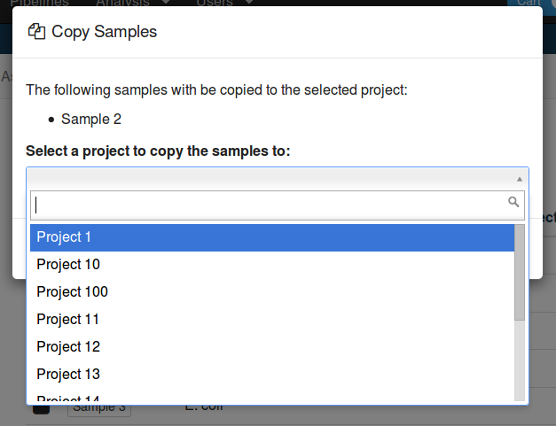

When you click on the drop-down box to select a project, you can either visually find the project that you want, or you can filter the projects by their name by typing into the text field.

Once you've selected the project that you want to copy the samples to, click on the "Copy Samples" button.

### Moving samples between projects

An alternative to [copying samples between projects](#copying-samples-between-projects) is to **move** a sample between projects. Unlike copying, when a sample is moved, the original sample is removed.

Like copying samples, you must be a project  **Manager** on **both** the project that you are moving the sample *from*, and the project that you are moving the sample *to*.

Start by [selecting the samples](#selecting-samples) that you want to move to the other project. When you've selected the samples that you want to move, click on the "Samples" button just above the samples list and select "Move Samples":


In the dialog that appears you will be presented with a list of the samples that are going to be moved, and an option to choose the project that the samples should be moved to:


When you click on the drop-down box to select a project, you can either visually find the project that you want, or you can filter the projects by their name by typing into the text field.

Once you've selected the project that you want to move the samples to, click on the "Move Samples" button.

### Merging samples within a project

If a sample was created when sequencing data was uploaded with an incorrect name, you may want to merge two samples together. When you merge two samples, you will move all of the **sequencing files** from one sample to another, then **delete the original sample**. **None** of the sample metadata will be copied between the merged samples, instead you will select one sample as the target for the sample merge. Only users with the project  **Manager** role can merge samples in a project.

Start by [selecting the samples](#selecting-samples) that you want to merge. You **must** select more than one sample to enable the merge samples button. Once you've selected the two or more samples that you would like to merge, click on the "Samples" button just above the samples list and select "Merge Samples":


In the dialog that appears you will be presented with a list of the samples that are going to be merged, and an option to choose the target sample of the merge:


Click on the sample name under "**Select a sample to merge into**" to choose which sample will be used as the target for all of the sequencing data.

You may also (optionally) rename the target sample by entering a new sample name under "**Rename sample**". The sample name must be **at least** 3 characters long, and **must not** contain white space characters (tab or space) or any of the following characters: `? ( ) [ ] / \ = + < > : ; " , * ^ | & ' .`. If you do not want to rename the target sample, leave this field blank.

Once you've finished choosing the sample to merge into, click on the "Complete Merge" button at the bottom of the dialog.

Exporting samples
-----------------

The [pipelines](../pipelines) available in IRIDA may not be enough for the types of analysis that you want to run on your sequencing data. You can export your sample data from IRIDA in three different ways:

1. [Downloading samples](#downloading-samples),
2. [To the command-line](#command-line-export), or
3. [Directly to Galaxy](#galaxy-export)

All export options require that you [select the samples for export](#selecting-samples) before you are able to export the samples.

<blockquote>
<b>Tip</b>: For all types of export, you can export <b>all</b> of the data in a project using the <b>Select All</b> feature.
</blockquote>

#### Downloading samples

You can download an individual sequence file from a sample by [navigating to the file](#viewing-sequence-files), then clicking on the  icon (see: [Downloading a sequence file](#downloading-a-sequence-file)).

You may also download **all** of the files in a sample, or even download the files from multiple samples, by [selecting the samples](#selecting-samples) that you want to download, clicking on the "Export" button just above the samples list and clicking on "Download":

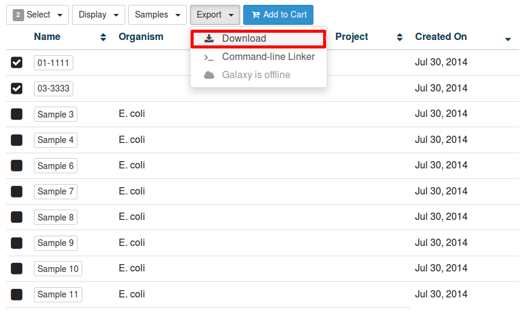

IRIDA will provide you with a `zip` file containing the sequencing data for all of the selected samples. You can extract the files from the zip archive using the command-line program `unzip`, using the built-in Windows extractor tool, or using a program like [7-zip](http://7-zip.org)

<blockquote>
<b>WARNING</b>: sequencing data can make for a very large download, especially when downloading <i>all</i> of the sequencing data for a project. We strongly recommend that you <i>do not</i> download data to your PC, especially if you are going to be using Linux command-line tools and the <a href="#command-line-export">command-line export tool</a> option is available.
</blockquote>

#### Command-line export

The IRIDA package comes with a Linux command-line utility for *linking* to files in your current working directory. If you are working on a Linux workstation, we **strongly** encourage you to use the command-line utility for working with the sequencing data stored in IRIDA.

Start by [selecting the samples](#selecting-samples) that you want to export to the command-line, clicking on the "Export" button just above the samples list and clicking "Command-line Linker":

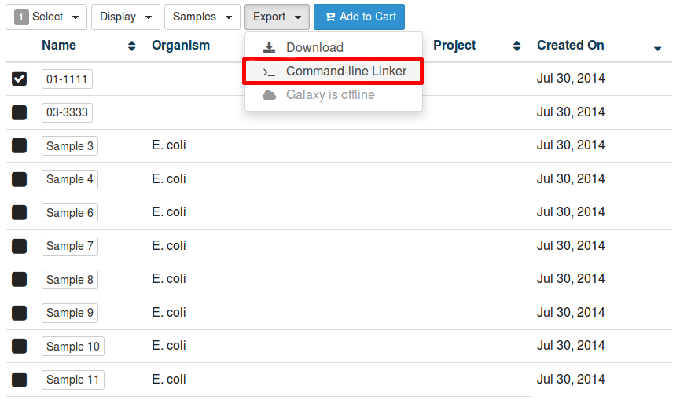

The dialog that appears will provide you with a command that you can **copy** and **paste** into a terminal window:


Copy and paste the command into a terminal window and use the username and password that you use to log in to IRIDA:

```bash
[user@waffles ~]$ ngsArchive.pl -p 4 -s 51
Writing files to /home/user
Enter username: user
Enter password: 
Reading samples 1 from project 4
Created 2 files for 1 samples in /home/user/Project
[user@waffles ~]$ 
```

The folder structure that will be created in the current working directory will match the structure present in IRIDA:

```bash
[user@waffles ~]$ tree Project/
Project/
└── sample-1
    ├── sample-1_S1_L001_R1_001.fastq -> /opt/irida/sequence-files/1/sample-1_S1_L001_R1_001.fastq
    └── sample-1_S1_L001_R2_001.fastq -> /opt/irida/sequence-files/2/sample-2_S1_L001_R2_001.fastq

1 directory, 2 files

```

Importantly, the files that are stored in your directory structure are *links* and not copies of the files. The purpose of links is to reduce the use of disk space on shared resources. An unfortunate side effect of the link structure is that you **cannot** change the contents of the files.

#### Galaxy export

Samples can also be exported directly to Galaxy. Samples exported from IRIDA into Galaxy are loaded into a [Galaxy data library](https://wiki.galaxyproject.org/Admin/DataLibraries/Libraries) that can be easily shared with multiple Galaxy users.

To export data from IRIDA to Galaxy, start in Galaxy and find the "IRIDA server" tool under the "Get Data" section:

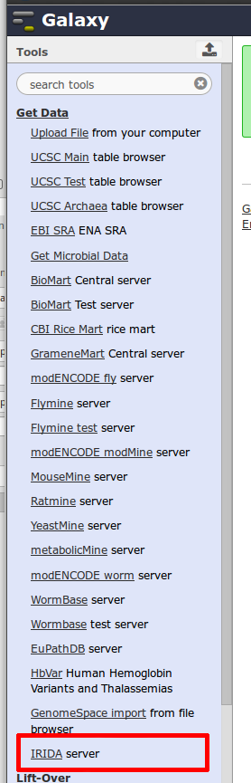

If you are not already logged into IRIDA, you will be required to log in using your IRIDA username and password:


After you log in to IRIDA (or if you were already logged in), you will be directed to the list of projects that you have permission to view:

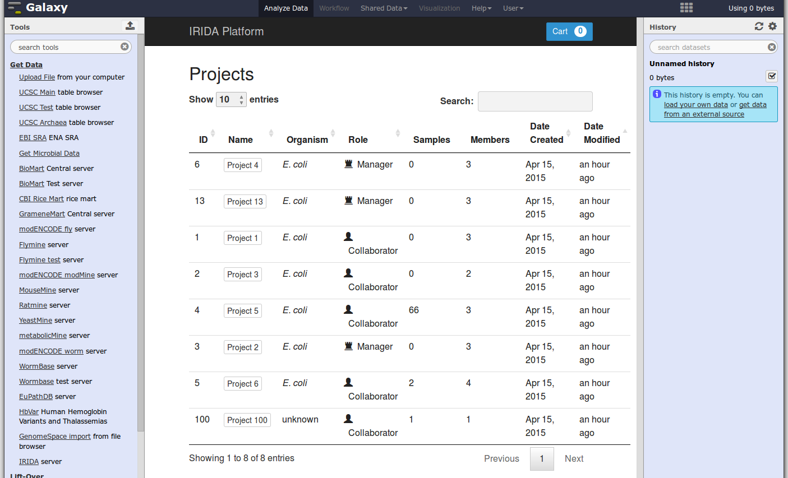

Navigate to the list of samples that you're interested in exporting by clicking on the project name. Then, [select the samples](#selecting-samples) that you want to export, click on the "Export" button just above the samples list and click "Send to Galaxy":

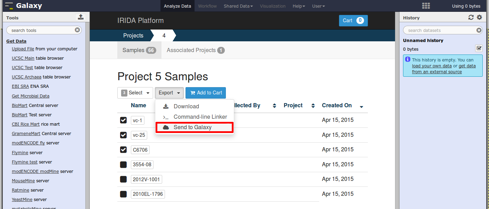

The dialog that appears will allow you to choose the e-mail address that should be assigned ownership of the data library. The e-mail address should be the e-mail address that you use as your username in Galaxy. You may also choose the name of the data library that the sequencing data should be exported to:


After you've entered your e-mail address and the name of the data library, click the "Upload Samples" button. You will be redirected back into Galaxy and a new history item will appear:


You can view a report of the exported samples by clicking on the name of the history item. You can find your data library by clicking on "Shared Data" at the top of Galaxy and clicking on "Data Libraries":

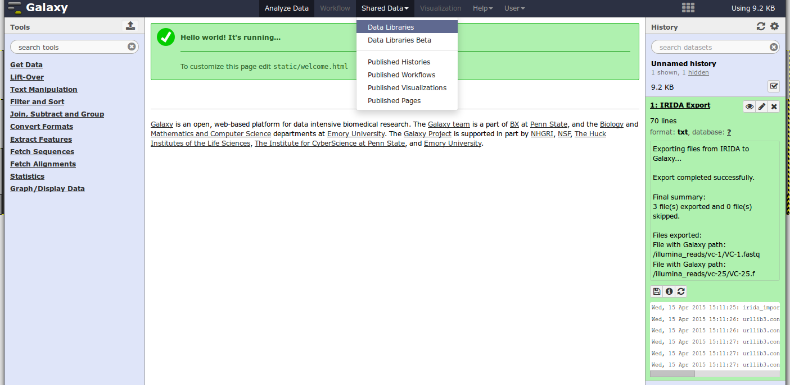
