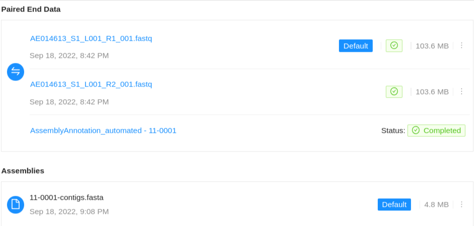
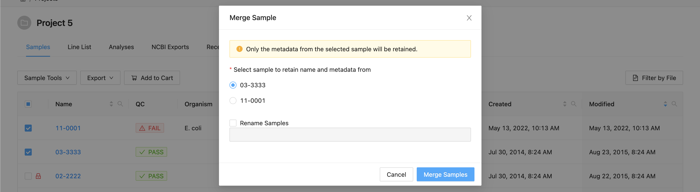

Managing Samples
================
{:.no_toc}

Each [project](../project) in IRIDA may contain a collection of samples that corresponds to an isolate. Each sample may contain one or more of the following types of files: sequencing files in paired-end or single-end format, or assembled genomes. This section of the user guide describes how you can view samples, manage samples (merging, copying, renaming, exporting), and search for samples by name.

* This comment becomes the toc
{:toc}

Viewing samples in a project
----------------------------



The samples listing shows high-level sample details, such as:

* The name of the sample,
* The user-defined organism of the sample (if provided),
* The name of the person who collected the sample (if provided),
* The project that the sample belongs to (if from a related project),
* The date that the sample was created in IRIDA.
* Whether the sample failed IRIDA's quality control checks.  If a sample has failed QC, the cell will have a red background and warning icon <i class="fa fa-exclamation-triangle" aria-hidden="true"></i>.  Note if you are displaying [associated project samples](#viewing-associated-samples) QC information will come from the sample's parent project.
* Whether the sample can be modified in this project.  If the project does not have modification access, a lock icon will be displayed <i class="fa fa-lock" aria-hidden="true"></i>.

### Viewing individual sample details

All of the sample details that are in IRIDA are currently provided by a user with the project **Manager** role. To view details about an individual sample, start by [viewing the samples in a project](#viewing-samples-in-a-project), then click on the sample name in the samples table:

The sample details page shows all of the details that are currently known about a sample:

### Editing sample details

Start by [viewing the details of an individual sample](#viewing-individual-sample-details). On the samples details page, click on the "Edit" button in the top, right-hand corner:

You can provide as many or as few sample details that you want -- the sample details are not used by any workflows in IRIDA (except the sample name in the SNVPhyl workflow), and (with the exception of the sample name) none of the sample details are required fields. When you've finished updating the sample details, you can click on the "Update" button at the bottom, right-hand side of the page.

### Viewing contained files

Samples can contain different types of files, either **Sequence Files** which are produced by a sequencing instrument, or **Assemblies** which consist of the re-constructed genome from the sequence reads.

#### Viewing Sequence Files



#### Uploading Sequence Files



#### Downloading a sequence file



You can download all sequence files in a sample by following the instructions in the [exporting samples](#exporting-samples) section about [downloading samples](#downloading-samples).

#### Deleting a sequence file

If you need to delete a sequence file from IRIDA, you can do so by clicking on the  icon, on the right-hand side of the row for the sequence file.

You can only delete a sequence file from a sample if you have the project  **Manager** role on the project.

#### Concatenating sequence files

In cases where a top-up run or any other additional data is added to a sample, you may want to combine the sequence files into a single *concatenated* file.  IRIDA allows you to do this under the *Concatenate Files* page.

In the concatenation page you must select 2 or more sequence file objects **of the same type** to concatenate.  If you have selected a collection of files which cannot be concatenated, a warning will be displayed.

Once you have selected your files to concatenate, you have the following options:

* *New filename* - This will set the base name of the new concatenated files.  For paired-end data a modifier will be appended to determine the forward and reverse files.
* *Remove originals* - This will remove the original files from the sample, leaving only the new concatenated file.

Once you have selected your files and selected your options, click *Submit* to begin the concatenation.  This may take a while, so you should stay on this page until the process is complete.  Once your files are concatenated, you will be redirected back to the sample-files page.

#### Viewing genome assemblies

Samples can also contain assembled genomes.

Genome assemblies can be linked to samples in two ways:

1. By enabling the assembly pipeline as an [automated pipeline](../project/#automated-pipelines), which will be triggered on upload of sequencing files in the appropriate project.
2. Or by selecting the option to save assemblies back to a sample from the [Launch Pipelines](../pipelines/#saving-pipeline-results-to-a-sample) page.

The assembled genome file can be downloaded by clicking the  icon.

#### Deleting genome assemblies

Assembled genomes may be deleted from a sample by selecting the  icon.

#### Viewing automated assemblies

If the project manager has enabled automated assemblies for uploaded data an assembly will be shown associated with the particular sequence files used to generate the assembled genome.

The assembly status will be displayed along with a link to view the assembly results page.  On completion, the assembled genome will be saved back to the Sample.  For more information on viewing pipeline results see the [pipeline documentation](../pipelines/#viewing-pipeline-results)  

See the [project documentation](../project#automated-pipelines) for information on enabling automated assembly.

Adding a new sample
-------------------



Searching and filtering samples
-------------------------------

You can search and filter samples in a project in IRIDA by sample name, organism, and/or date range using the filters at the top of the [samples list](#viewing-samples-in-a-project):

### Search Field

You can perform a general search on sample names using the search field.  This will filter samples that have the search string *anywhere* in the name or organism field.  So, for example, if you're searching for a sample that has the numeral 2 in its name, enter `2` into the search input, and you would find samples with names like:

* Sample_2
* Sample_293
* 02-2222

### Advanced Filtering

Clicking the filter button  opens a dialog where you can filter by sample name and / or  date modified.

Filtering by sample name will match the same as the search field, so the filter name will match *anywhere* in the sample name.

To search sample by a date range, click on the date range field.  A drop down will be displayed with pre-determine ranges:

* Last 30 Days
* Last 60 Days
* Last 120 Days

Or you can enter a custom date range by selecting the dates in the calendar.

To apply the selected filters click the 'Filter' button.

Once the filter is applied, the samples table will be updated with the filtered samples.  When an advanced filter is applied, a tag is created below the filter button to allow the user to know what filters are currently applied.  To remove a specific filter click on the tag itself.

### Clearing Filters

To clear all currently applied filters and search, click on the clear button to the right of the filter area.

Filtering and Selecting by File
-------------------------------

As projects become larger, it becomes unwieldy to select a large subset of samples.  To facilitate this, there is the 'Filter by File' option.

* Create a `.txt` file that contains the name of each sample you want to select on a new line.  You can either:
    - Use a text editor like Windows Notepad or TextEdit on Mac (note: when creating a new text document in TextEdit, press cmd + shift + t to change to the `.txt` format)
    - Or create a spreadsheet in Excel with a single column and save the file as a 'Text (Tab Delimited) (*.txt)' file.

Example (`project_5_filter.txt`):

<pre>
03-3333
10-6966
15-7569
</pre>

* On the project samples page, click the  button from the filter menu.

* Select the file you created.  The samples will be filtered by these names.

If all sample names are found, a green success notification will appear in the upper right corner of the window.  This notification will disappear after 2 seconds.

If sample names are not found, the samples will be filtered by the available names and a notification will appear telling you which samples could not be found.  This notification will not go away until it is clicked.

Example.  If my file contained and additional sample name `12-4598_a`  which does not exist the following will be displayed.

Viewing associated samples
--------------------------

You can quickly create an aggregated view of all of the samples in this project with all of the samples from both local and associated projects. To view associated samples, click the "Associated Projects" button.  All projects associated with the current project will be displayed here.  Select the projects you would also like to see in the view. Project managers may choose which samples will appear here by [adding or removing associated projects](../../user/project/#associated-projects).

Associated samples will be displayed in the project samples table designated with the same colours.

Modifying samples
-----------------

Only user accounts that have the **Manager** role on a project can modify the samples in a project.

### Selecting samples

All sample modification actions require that samples be selected. You can select individual samples by clicking anywhere on the row (except on the sample name itself):

#### Multiple Sample Selection

You can also select multiple samples at once by selecting a sample, pressing the shift key, and than selecting the last sample that you want selected.

You can always see how many samples are selected at the top left of the samples table.

#### Selecting Groupings of Samples

All samples in the project can be selected at once using the checkbox in the table header.

Alternatively, there is a dropdown next to the select all checkbox that allows you to select/deselect samples in the entire project, or on the current page of the sample table.

### Sharing samples between projects



### Moving samples between projects

An alternative to [sharing samples between projects](#sharing-samples-between-projects) is to **move** a sample between projects. Unlike sharing, when a sample is moved, the original sample is removed.

Like sharing samples, you must be a project  **Manager** on **both** the project that you are moving the sample *from*, and the project that you are moving the sample *to*.  In addition, the source project you are sharing *from* must **not** be a remote project.

Start by [selecting the samples](#selecting-samples) that you want to move to the other project. When you've selected the samples that you want to move, click on the "Samples" button just above the samples list and select "Move Samples":

In the dialog that appears you will be presented with a list of the samples that are going to be moved, and an option to choose the project that the samples should be moved to:

When you click on the drop-down box to select a project, you can either visually find the project that you want, or you can filter the projects by their name by typing into the text field.

If you have selected samples that are non-modifiable in your current project, you will be shown a warning that the samples you are moving will also be non-modifiable in the new project.

Once you've selected the project that you want to move the samples to, click on the "Move Samples" button.

### Merging samples within a project

If a sample was created when sequencing data was uploaded with an incorrect name, you may want to merge two samples together. When you merge two samples, you will move all of the **sequencing files** and **assembled genomes** from one sample to another, then **delete the original sample**. **None** of the sample metadata will be copied between the merged samples, instead you will select one sample as the target for the sample merge. Only users with the project  **Manager** role can merge samples in a project and samples cannot be merged within **remote** projects.

Start by [selecting the samples](#selecting-samples) that you want to merge. You **must** select more than one sample to enable the merge samples button. Once you've selected the two or more samples that you would like to merge, click on the "Samples" button just above the samples list and select "Merge Samples":

In the dialog that appears you will be presented with a list of the samples that are going to be merged, and an option to choose the target sample of the merge:

Click on the sample name under "**Select a sample to merge into**" to choose which sample will be used as the target for all of the sequencing data.

You may also (optionally) rename the target sample by entering a new sample name under "**Rename sample**". The sample name must be **at least** 3 characters long, and **must not** contain white space characters (tab or space) or any of the following characters: `? ( ) [ ] / \ = + < > : ; " , * ^ | & ' .`. If you do not want to rename the target sample, leave this field blank.

Once you've finished choosing the sample to merge into, click on the "Complete Merge" button at the bottom of the dialog.

Note if you select samples that are non-modifiable, a warning will be displayed that you cannot merge the selected samples.

Exporting samples
-----------------

The [pipelines](../pipelines) available in IRIDA may not be enough for the types of analysis that you want to run on your sequencing data. You can export your sample data from IRIDA in a number of different ways:

1. [Downloading samples](#downloading-samples),
2. [To the command-line](#command-line-export), or
3. [Directly to Galaxy](#galaxy-export)
4. [Upload to NCBI](#ncbi-upload)

All export options require that you [select the samples for export](#selecting-samples) before you are able to export the samples.

<blockquote>
<b>Tip</b>: For all types of export, you can export <b>all</b> of the data in a project using the <b>Select All</b> feature.
</blockquote>

#### Downloading samples

You can download an individual sequence file from a sample by [navigating to the file](#viewing-sequence-files), then clicking on the  icon (see: [Downloading a sequence file](#downloading-a-sequence-file)).



#### Command-line export



#### Galaxy export



#### NCBI Upload



<a href="../project/">Previous: Managing Projects</a><a href="../pipelines/" style="float: right;">Next: Launching Pipelines</a>
