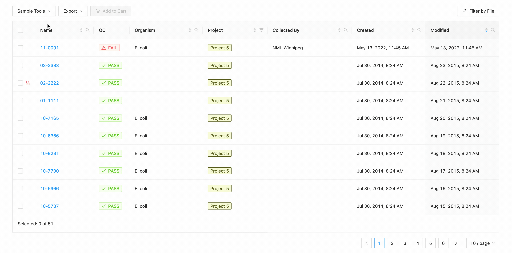
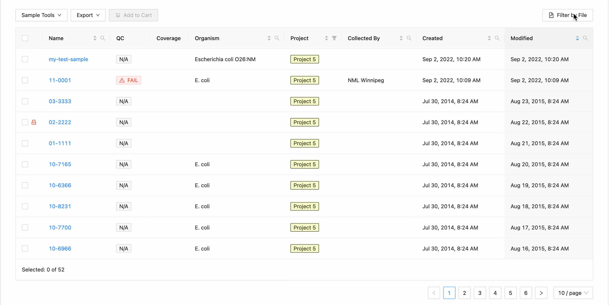
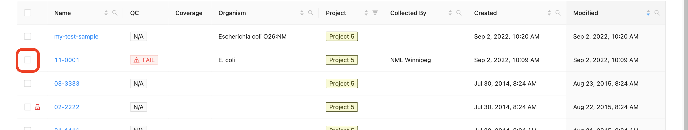
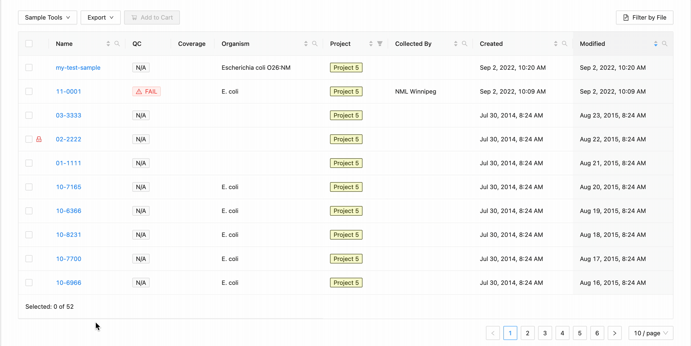
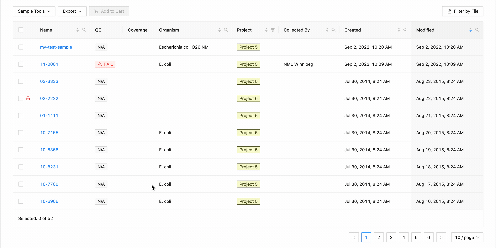
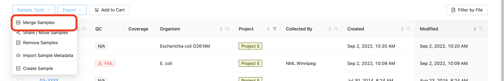

Managing Samples
================
{:.no_toc}

Each [project](../project) in IRIDA may contain a collection of samples that corresponds to an isolate. Each sample may contain one or more of the following types of files: sequencing files in paired-end or single-end format, or assembled genomes. This section of the user guide describes how you can view samples, manage samples (merging, copying, renaming, exporting), and search for samples by name.

* This comment becomes the toc
{:toc}

Viewing samples in a project
----------------------------



The samples listing shows high-level sample details, such as:

* The name of the sample,
* The user-defined organism of the sample (if provided),
* The name of the person who collected the sample (if provided),
* The project that the sample belongs to (if from a related project),
* The date that the sample was created in IRIDA.
* Whether the sample failed IRIDA's quality control checks.  If a sample has failed QC, the cell will have a red background and warning icon <i class="fa fa-exclamation-triangle" aria-hidden="true"></i>.  Note if you are displaying [associated project samples](#viewing-associated-samples) QC information will come from the sample's parent project.
* Whether the sample can be modified in this project.  If the project does not have modification access, a lock icon will be displayed <i class="fa fa-lock" aria-hidden="true"></i>.

### Viewing individual sample details

All of the sample details that are in IRIDA are currently provided by a user with the project **Manager** role. To view details about an individual sample, start by [viewing the samples in a project](#viewing-samples-in-a-project), then click on the sample name in the samples table:

The sample details page shows all of the details that are currently known about a sample:

### Editing sample details

Start by [viewing the details of an individual sample](#viewing-individual-sample-details). On the samples details page, click on the "Edit" button in the top, right-hand corner:

You can provide as many or as few sample details that you want -- the sample details are not used by any workflows in IRIDA (except the sample name in the SNVPhyl workflow), and (with the exception of the sample name) none of the sample details are required fields. When you've finished updating the sample details, you can click on the "Update" button at the bottom, right-hand side of the page.

### Viewing contained files

Samples can contain different types of files, either **Sequence Files** which are produced by a sequencing instrument, or **Assemblies** which consist of the re-constructed genome from the sequence reads.

#### Viewing Sequence Files



#### Uploading Sequence Files



#### Downloading a sequence file



You can download all sequence files in a sample by following the instructions in the [exporting samples](#exporting-samples) section about [downloading samples](#downloading-samples).

#### Viewing sequence file quality control (FastQC) results



#### Deleting a sequence file

If you need to delete a sequence file from IRIDA, you can do so by clicking on the  icon, on the right-hand side of the row for the sequence file.

You can only delete a sequence file from a sample if you have the project  **Manager** role on the project.

#### Concatenating sequence files

In cases where a top-up run or any other additional data is added to a sample, you may want to combine the sequence files into a single *concatenated* file.  IRIDA allows you to do this under the *Concatenate Files* page.

In the concatenation page you must select 2 or more sequence file objects **of the same type** to concatenate.  If you have selected a collection of files which cannot be concatenated, a warning will be displayed.

Once you have selected your files to concatenate, you have the following options:

* *New filename* - This will set the base name of the new concatenated files.  For paired-end data a modifier will be appended to determine the forward and reverse files.
* *Remove originals* - This will remove the original files from the sample, leaving only the new concatenated file.

Once you have selected your files and selected your options, click *Submit* to begin the concatenation.  This may take a while, so you should stay on this page until the process is complete.  Once your files are concatenated, you will be redirected back to the sample-files page.

#### Viewing genome assemblies

Samples can also contain assembled genomes.

Genome assemblies can be linked to samples in the following ways:

1. By uploading assemblies to the sample through the [file upload interface](#sequence-files--assemblies)
2. By enabling the assembly pipeline as an [automated pipeline](../project/#automated-pipelines), which will be triggered on upload of sequencing files in the appropriate project.
3. Or by selecting the option to save assemblies back to a sample from the [Launch Pipelines](../pipelines/#saving-pipeline-results-to-a-sample) page.

The assembled genome file can be downloaded by clicking the  icon.

If the project manager has enabled automated assemblies for uploaded data an assembly will also be shown associated with the particular sequence files used to generate the assembled genome.

The assembly status will be displayed along with a link to view the assembly results page.  On completion, the assembled genome will be saved back to the Sample.  For more information on viewing pipeline results see the [pipeline documentation](../pipelines/#viewing-pipeline-results)  

See the [project documentation](../project#automated-pipelines) for information on enabling automated assembly.

#### Deleting genome assemblies

Assembled genomes may be deleted from a sample by selecting the  icon.

Adding a new sample
-------------------



Filtering samples
------------------------

Each column in the projects' samples table, (except the quality control column) can be filtered by typing in the filter
box. The filter box is located in the right corner of the column header.

### Sample name, organism, and collected by filtering:

Opening the filter on these columns allows access to a search that allows for multiple search terms.

In this example, the table is being filtered by sample name. Here the user is looking for all samples that contain the
characters `10-` or the characters `11-`. Typing `10-` and then  <kbd>Enter</kbd> does the initial filtering to get all
samples containing those characters. Typing `11-` and then <kbd>Enter</kbd> adds this as an additional search and the
table is filtered to only show samples that either contain the `10-` or `11-`.

### Filtering by created and modified dates

Quickly finding samples based on either their created or modified dates can be done using the date range pickers
available in the column header filter. In this example, a modified date filter is being applied to search for all
samples that were modified between Aug 15, 2015 and Aug 16, 2015 inclusively (meaning samples modified on those dates
will be included).

### Projects filtering

Projects filtering works slightly different from the other filters. Samples from the current project are always
available (excluding filtered ones) in the table, but associated projects (these can be added through
the [project settings page](../../user/project/#associated-projects)) can have their sample displayed in the table as
well by selecting the project name within the filter
dropdown. These samples will be included in all filtering.

### Filter by File

Filtering by file allows you to quickly filter the table by use a text (<pr>.txt</pre>) file containing the sample names
you are looking for. Each sample name must be on its own line.

E.g.

<pre>
10-8231
02-2222
01-1111
11-11-1
11-0002
</pre>

To filter the table by file click the "Filter by File" button at the top of the table. This will open a modal window
which will allow you to select the file containing the list of names to filter by. Once selected, IRIDA will if the
sample names are within the projects currently visible in the table (you can add other project's samples to the table
using the projects filter). Once validated, you will see a summary:

Here you can see that 3 samples where found in the current project and 2 samples were not. The sample names that were
not found will be shown.

Clicking the "Filter" button at the bottom of the modal will filter the table with these sample names, while maintaining
any existing filters that were in place.

Modifying samples
-----------------

Only user accounts that have the **Manager** role on a project can modify the samples in a project.

### Selecting samples

All sample modification actions require that samples be selected. You can select individual samples by clicking the
checkbox at the start of the row    :

#### Selecting Groupings of Samples

All samples in the project can be selected at once using the checkbox in the table header.

This will work during filtering as well. Just apply the necessary filters, and click the select all checkbox. Only the
filtered samples will be selected.

### Sharing samples between projects



### Merging samples within a project

If a sample was created when sequencing data was uploaded with an incorrect name, you may want to merge two samples
together. When you merge two samples, you will move all the **sequencing files** and **assembled genomes** from one
sample to another, then **delete the original sample**. **None** of the sample metadata will be copied between the
merged samples, instead you will select one sample as the target for the sample merge. Only users with the
project **Manager** role can merge samples in a project and samples cannot be merged within **remote** projects.

Start by [selecting the samples](#selecting-samples) that you want to merge. You **must** select more than one sample to
enable the merge samples button. Once you've selected the two or more samples that you would like to merge, click on
the "Samples" button just above the samples list and select "Merge Samples":

In the dialog that appears you will be presented with a list of the samples that are going to be merged, and an option
to choose the target sample of the merge:

A list of the samples selected is displayed. You must select the sample that you want to retain the metadata from. All
others will be overwritten by this sample.

If you want to rename the sample, click the checkbox "Rename Sample", and enter a new name. The sample name must be at
least 3 characters long, and must not contain white space characters (tab or space) or any of the following characters:
<pre> ? ( ) [ ] / \ = + < > : ; " , * ^ | & ' </pre>. If you do not want to rename the target sample, leave this field blank.

Exporting samples
-----------------

The [pipelines](../pipelines) available in IRIDA may not be enough for the types of analysis that you want to run on
your sequencing data. You can export your sample data from IRIDA in a number of different ways:

1. [Downloading samples](#downloading-samples),
2. [To the command-line](#command-line-export), or
3. [Directly to Galaxy](#galaxy-export)
4. [Upload to NCBI](#ncbi-upload)

All export options require that you [select the samples for export](#selecting-samples) before you are able to export the samples.

<blockquote>
<b>Tip</b>: For all types of export, you can export <b>all</b> of the data in a project using the <b>Select All</b> feature.
</blockquote>

#### Downloading samples

You can download an individual sequence file from a sample by [navigating to the file](#viewing-sequence-files), then clicking on the  icon (see: [Downloading a sequence file](#downloading-a-sequence-file)).



#### Command-line export



#### Galaxy export



#### NCBI Upload



<a href="../project/">Previous: Managing Projects</a><a href="../pipelines/" style="float: right;">Next: Launching Pipelines</a>
