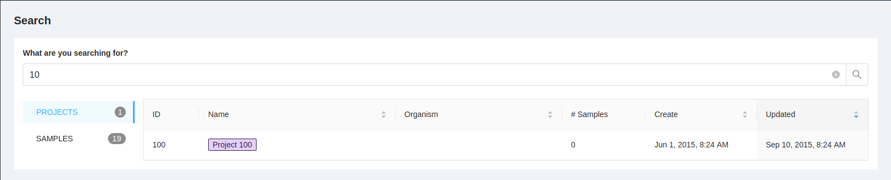
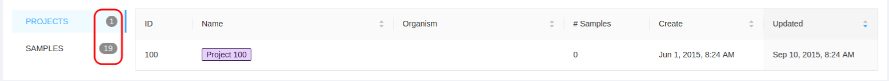

IRIDA Global Search Overview
============================
{:.no_toc}

The IRIDA global search is designed to quickly find projects and samples that you have access to anywhere in IRIDA.

Starting a Search
===

A search can be started from any page be entering a search in the global search box in the main menu at the top of the page.

Once entering a search term and pressing `enter` you are will redirected to the global search results page.  Here you will see results for both Projects and Samples, Projects are displayed by default.

The numbers on the tabs indicates the total amount of either Projects or Samples containing the search query in either their identifier or name that you have access.

