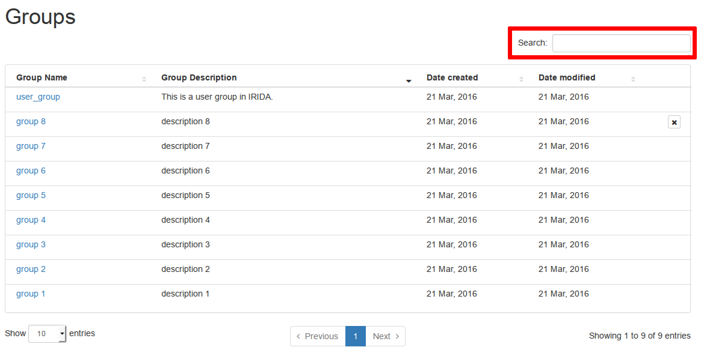
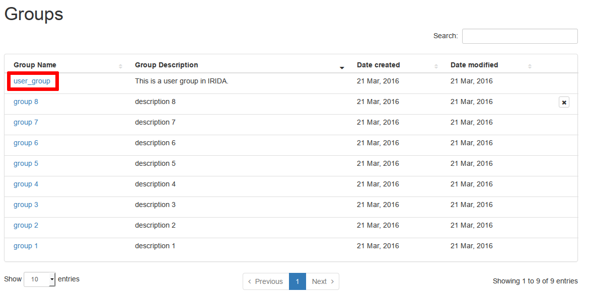
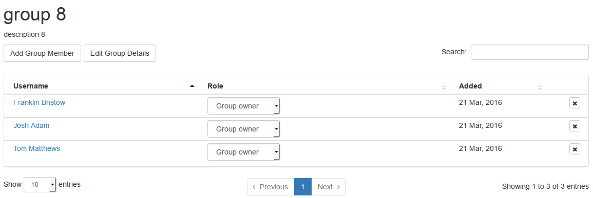
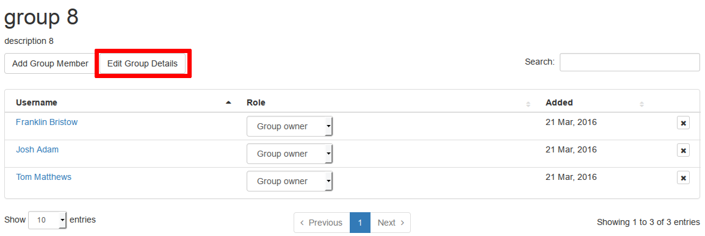
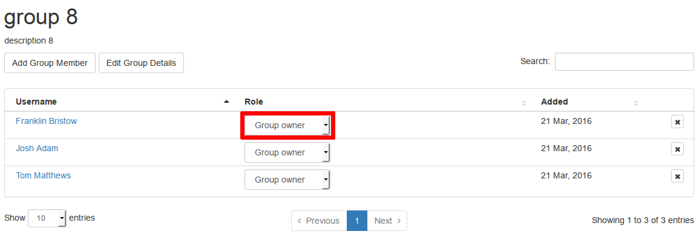
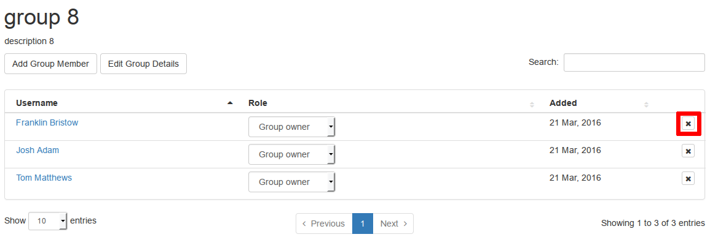
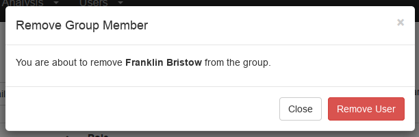

Managing User Groups
====================
{:.no_toc}

User accounts can be organized into a collection called a user group. User groups can be used to assign [project permissions](../project/#project-members) to collections of user accounts. This section of the user guide descibes how you can view projects, edit project metadata (including uploading reference files), search for projects by name, and create new projects.

* This comment becomes the toc
{:toc}

Viewing existing user groups
----------------------------

You can access the list of user groups that have already been created by clicking on the "Settings" menu at the top of the dashboard and selecting "Groups":

The user groups list shows all user groups in IRIDA:

The projects list provides a high-level overview of project details, including:

* The name of the group,
* The group description,
* The date that the group was created,
* The date that the group was last modified, and
* (if you are permitted) group deletion buttons.

Searching the Groups Table
--------------------------

You can filter the user groups in IRIDA using the text-field at the top of the groups table:

Creating a new User Group
-------------------------



Viewing user group details
--------------------------

To view user group details, start from the [user groups list](#viewing-existing-user-groups) and click on the **Name** of the user group:

The user group details page shows a summary of the user group details and provides a view of the user accounts that have membership in the group:

Editing user group details
--------------------------

If you are a group owner, you can edit the details of a user group. To edit user group details, start by [viewing the user group details](#viewing-user-group-details), then click on the "Edit Group Details" button:

The user group details editing page provides the same form as when you [created the user group](#creating-a-new-user-group), and all of the same descriptions apply. When you've finished editing the user group details, you can click on the "Update" button at the bottom of the form.

User group members
------------------

All users in IRIDA can see all user groups. A user can have one of two different roles in a user group: a group member (used only for project membership permissions) and a group owner (used for project membership permissions *and* group editing permissions).

### Adding a project member

If you are a group **owner**, you can add new members to the group.



### Changing a user group member role

You may want to change a user group member role if you wish to remove permissions for an individual user account to modify user group details, but still want to allow that user account to view the project data that the user group is assigned to. You can only change a user group member role if you have the group **owner** role on the user group.

Start by [viewing the user group details](#viewing-user-group-details).

To change the role of a project member, click on the drop-down menu in the "Role" column on the table for the user you would like to change:

The user group role is saved as soon as you make a selection -- you **do not** need to click a "Save" button.

### Removing a user from a user group

You may want to completely remove all permissions for a user to access data in any project that the group is assigned to. To remove those permissions, you must remove the user account from the user group.

Start by [viewing the user group details](#viewing-user-group-details).

To remove a user group member, click on the button on the right-hand side of the table:

When you click the remove button, you will be asked to confirm the user group member removal:

To confirm, click the "Remove User" button.

<a href="../dashboard/">Previous: Dashboard overview</a><a href="../project/" style="float: right;">Next: Managing projects</a>
