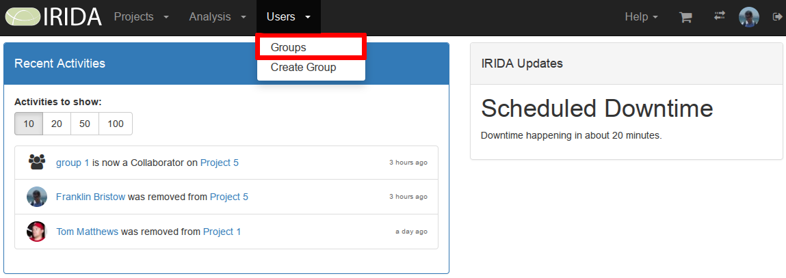

Managing User Groups
====================
{:.no_toc}

User accounts can be organized into a collection called a user group. User groups can be used to assign [project permissions](../project/#project-members) to collections of user accounts. This section of the user guide descibes how you can view projects, edit project metadata (including uploading reference files), search for projects by name, and create new projects.

* This comment becomes the toc
{:toc}

Viewing existing user groups
----------------------------

You can access the list of user groups that have already been created by clicking on the "Settings" menu at the top of the dashboard and selecting "Groups":

The user groups list shows all user groups in IRIDA:

The projects list provides a high-level overview of project details, including:

* The name of the group,
* The group description,
* The date that the group was created,
* The date that the group was last modified, and
* (if you are permitted) group deletion buttons.



<a href="../dashboard/">Previous: Dashboard overview</a><a href="../project/" style="float: right;">Next: Managing projects</a>